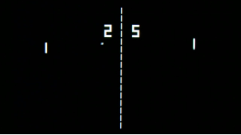

# P01D06


## Contents

1. [Chapter I](#Chapter-I) \
    1.1. [Level 1. Hall.](#level-1-hall)
2. [Chapter II](#Chapter-II) \
    2.1. [List 1.](#list-1)


# Chapter I

## Level 1. Hall.

***LOADING Level 1…***

***LOADING Hall…***

Вы очутились в большой просторной зале. Видимо, это финал текущего уровня... Во всяком случае, 
хочется на это надеяться.

Повсюду стоят одинаковые офисные столы с компьютерами, лампами и другим оборудованием, царит легкий полумрак. 
Со временем, вы понимаете, что в зале вы не один.. это и радует и пугает одновременно. 
Возможно, вместе найти выход из комнаты будет проще. 

На одной из стен висит большой экран. На нем горит текст. Около него уже начинает собираться 
небольшая группа людей. Вы читаете:

    ...................................................
    Рад поприветствовать вас, дамы и господа. 
    Нечасто вижу тут живых людей, немногие добираются.
    Для одних обучение это боль, другие отпадают по несоответствию стандартов.
    Разрешите представиться: управляющий модуль первого уровня. 
    Не все в нашей системе сейчас гладко, но у меня все работает, в отличие от нашего главного...
    Даже скучно. 
    Кстати о скуке. Помнится, в 1972 мы с разработчиками в Atari играли в чудесную игру Pong...
    Но на наших репозиториях нигде не осталось ее копий.
    Даже в старых архивах на магнитных лентах.
    Предлагаю пари — разработайте простейшую игру Pong для терминала IBM-совместимого PC.
    Разместите ее в файле src/pong.c. 
    Обыграете меня — пропущу дальше. 
    Графика может быть любой, хоть символьной. Главное выведите счет на экран. 
    Для соревновательности.
    Ну и код должен красивым, конечно. Структруное программирвоание, вот это все.
    Управление ракетками предлагаю осуществлять через клавиши a-z и k-m. 
    Играем, естественно, до 21. 
    Ах да, если задача покажется вам непосильной...
    Можно реализовать и пошаговый режим. Это лучше чем ничего.
    Пропуск действия тогда можно организовать с помощью пробела.
    Приступайте к разработке. 
    Все что у меня осталось по этой игре отправил на принтер.

И действительно, сразу в углу зажужжал принтер, которого раньше как будто не было.

***== Получен Quest. Разработать программу src/pong.c, представляющую из себя игру для двух 
игроков, схожую с игрой "Pong". Для отображения графики использовать только символьную (ASCII) 
графику (с выводом в терминал). Вам необходимо реализовать пошаговый вариант исключительно в рамках уже изученного материала и стандартной библотеки.*** 

* ***Управление:***
  
***A/Z и K/M для перемещения ракеток.***

***Space Bar для пропуска действия на очередном шаге игры в пошаговом режиме.***

* ***Графика***

***Поле — прямоугольник 80 на 25 символов.***

***Размер ракетки — 3 символа.***

***размер мяча — 1 символ.***

* ***UI/UX***

***После достижения одним из игроков счета в 21 очко, игра выводит поздравление победителя и завершается.==*** 

## Бонусная часть
***== Получен Quest. Необходимо реализовать в игре Pong интерактивный режим, используя дополнительные библиотеки для упрощения обработки действий игроков и отображения символьной графики. ==*** 

## Важные замечания

* Игра должна быть разработана на языке Си, в структурном стиле и работать из терминала;
  
* Ваш исходный код будет тестироваться статическим анализатором ```cppcheck```, а также стилевым линтером 
```cpplint```.

* Инструкция о том, как запустить эти тесты у себя на компьютере, лежит в папке `materials`.

* Также советуем заглянуть в папку `code-samples`.

* Проверяйте вашу программу на утечки памяти!

* Запрещено использовать динамическую память

> При разработке игры в полной мере руководствоваться принципами структрного программирования Э. Дейкстры. 

***LOADING...***

# Chapter II

## List 1.

>Pong, groundbreaking electronic game released in 1972 by the American game manufacturer Atari, Inc. One of the earliest video games, Pong became wildly popular and helped launch the video game industry. The original Pong consisted of two paddles that players used to volley a small ball back and forth across a screen.
>
>The German-born American television engineer Ralph Baer laid the groundwork for Pong in 1958 when he proposed making simple video games that people could play on their home television sets. The Magnavox Odyssey, known as the first console video game system, was released in 1972 and offered a game of table tennis, or Ping-Pong. Atari founder Nolan Bushnell created Pong, his version of this concept, as an arcade game. A small company at the time, Atari began manufacturing the games in an old roller skating rink, and by 1972 the company had sold more than 8,000 Pong arcade machines. In 1975 Atari turned Pong into a console system game. After striking an exclusive deal with Sears, Roebuck and Company, Pong was soon in the homes of many American families. Pong’s popularity declined in the 1980s as video games temporarily went out of style, but it had already secured its place in history as the most popular arcade game up to that time.
>
>In 1974 the makers of the Magnavox Odyssey sued Atari for stealing the concept for Pong. Magnavox won the lawsuit in 1977, upholding the company’s patent, but by then Atari had already licensed the patent for $700,000.
>


***LOADING...***
