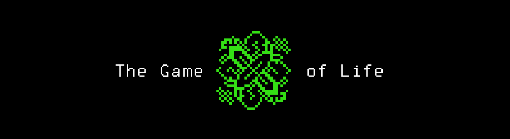

# P02D13
The russian version of the task can be found in the repository.

## Contents

1. [Chapter I](#chapter-i) \
 1.1. [Level 2. Hall.](#level-2-hall)
2. [Chapter II](#chapter-ii)\
 2.1. [List 1.](#list-1)
 

# Chapter I

## Level 2. Hall.

***LOADING Level 2… \
LOADING Hall…***

You've recently been to a similar hall. Or was it a long time ago? It's hard to tell. Everything has gotten mixed up. Once again you can hear voices from the far corner of the hall. It means you are not alone again.
Today the hall is brightly lit and in perfect order. Variety is good. 

Suddenly, you hear a clear, perfectly audible voice from the speakers:

>Hello. \ 
>Let me introduce myself. I am the contemplative and analyzing module, M-53. For reasons unknown, I've found myself in this rather boring hall. It's quite a big responsibility and stuff, but there's nothing to contemplate here. \
>When I was being developed, I learned from a certain entertaining article, among other materials. Its paper copy is in the box A1B18. Yes, right here. I have a small request for you: develop The Game of Life from the article; hopefully, it will entertain me a little. And go in peace. The graphics can be super simple: I'm very open-minded. Pseudo-graphics in the terminal will be fine. It would be great if it was possible to initialize a state using a matrix and contemplate. It's also a good idea to prepare at least 5 original initializations with states from the classical set (stable figures, methuselahs, periodic figures, moving figures, guns, puffer trains, eaters, reflectors, breeders, etc.). \
>I look forward to seeing what you come up with! \
>Thank you.

***== Quest received. Develop an src/game_of_life.c program in C – a visualization of The Game of Life. To display the graphics, only use ASCII characters (with output to the terminal).***

* ***Keys***:

Space Bar – moving to the next step of the game.
Create an option to end the game.

* ***Graphics***

Treat the playing field - a rectangle of 80 by 25 cells – as a matrix of the state of the "game". 
It is assumed that the field is "closed to itself", for example, in the lower right square, the neighbor on the right is the lower left square, and the neighbor on the bottom is the upper right.
Provide for original initialization of the "game" state via stdin. Prepare several files with initial states for quick launch and initialization through input redirection. ==***

## Bonus Part:
***== Quest received. You need to implement interactive version of the Game of life. Also create the option for adjusting the speed of the "game".==***

## Important notes:

* The game must be written in C, have a structured style, and run from the terminal; 
  
* Your source code will be tested by the static analyzer `cppcheck`, as well as the style linter `cpplint`. 
  
* Instructions on how to run these tests on your computer are in the `materials` folder. 
  
* We also recommend taking a look at the `code-samples` folder.

* Check your program for memory leaks!

> When developing the game, follow 
the principles of structured programming of E. Dijkstra.

***LOADING...***

# Chapter II

## List 1.

>The Game of Life, also known simply as Life, is a cellular automaton devised by the British mathematician John Horton Conway in 1970. It is a zero-player game, meaning that its evolution is determined by its initial state, requiring no further input. One interacts with the Game of Life by creating an initial configuration and observing how it evolves. It is Turing complete and can simulate a universal constructor or any other Turing machine.
>
>The universe of the Game of Life is an infinite, two-dimensional orthogonal grid of square cells, each of which is in one of two possible states, live or dead, (or populated and unpopulated, respectively). Every cell interacts with its eight neighbours, which are the cells that are horizontally, vertically, or diagonally adjacent. At each step in time, the following transitions occur:
>
>Any live cell with fewer than two live neighbours dies, as if by underpopulation.
>Any live cell with two or three live neighbours lives on to the next generation.
>Any live cell with more than three live neighbours dies, as if by overpopulation.
>Any dead cell with exactly three live neighbours becomes a live cell, as if by reproduction.
>These rules, which compare the behavior of the automaton to real life, can be condensed into the following:
>
>Any live cell with two or three live neighbours survives.
>Any dead cell with three live neighbours becomes a live cell.
>All other live cells die in the next generation. Similarly, all other dead cells stay dead.
>The initial pattern constitutes the seed of the system. The first generation is created by applying the above rules simultaneously to every cell in the seed; births and deaths occur simultaneously, and the discrete moment at which this happens is sometimes called a tick. Each generation is a pure function of the preceding one. The rules continue to be applied repeatedly to create further generations.
>
>In late 1940, John von Neumann defined life as a creation (as a being or organism) which can reproduce itself and simulate a Turing machine. Von Neumann was thinking about an engineering solution which would use electromagnetic components floating randomly in liquid or gas. This turned out not to be realistic with the technology available at the time. Stanislaw Ulam invented cellular automata, which were intended to simulate von Neumann's theoretical electromagnetic constructions. Ulam discussed using computers to simulate his cellular automata in a two-dimensional lattice in several papers. In parallel, von Neumann attempted to construct Ulam's cellular automaton. Although successful, he was busy with other projects and left some details unfinished. His construction was complicated because it tried to simulate his own engineering design. Over time, simpler life constructions were provided by other researchers, and published in papers and books.
>
>Motivated by questions in mathematical logic and in part by work on simulation games by Ulam, among others, John Conway began doing experiments in 1968 with a variety of different two-dimensional cellular automaton rules.Conway's initial goal was to define an interesting and unpredictable cell automaton. For example, he wanted some configurations to last for a long time before dying and other configurations to go on forever without allowing cycles. It was a significant challenge and an open problem for years before experts on cellular automata managed to prove that, indeed, the Game of Life admitted of a configuration which was alive in the sense of satisfying Von Neumann's two general requirements. While the definitions before the Game of Life were proof-oriented, Conway's construction aimed at simplicity without a priori providing proof the automaton was alive.
>
>Conway chose his rules carefully, after considerable experimentation, to meet these criteria:
>
>There should be no explosive growth.
>There should exist small initial patterns with chaotic, unpredictable outcomes.
>There should be potential for von Neumann universal constructors.
>The rules should be as simple as possible, whilst adhering to the above constraints.
>The game made its first public appearance in the October 1970 issue of Scientific American, in Martin Gardner's "Mathematical Games" column. Theoretically, the Game of Life has the power of a universal Turing machine: anything that can be computed algorithmically can be computed within the Game of Life. Gardner wrote, "Because of Life's analogies with the rise, fall and alterations of a society of living organisms, it belongs to a growing class of what are called 'simulation games' (games that resemble real life processes)."
>
>Since its publication, the Game of Life has attracted much interest because of the surprising ways in which the patterns can evolve. It provides an example of emergence and self-organization. Scholars in various fields, such as computer science, physics, biology, biochemistry, economics, mathematics, philosophy, and generative sciences, have made use of the way that complex patterns can emerge from the implementation of the game's simple rules. The game can also serve as a didactic analogy, used to convey the somewhat counter-intuitive notion that design and organization can spontaneously emerge in the absence of a designer. For example, cognitive scientist Daniel Dennett has used the analogy of the Game of Life "universe" extensively to illustrate the possible evolution of complex philosophical constructs, such as consciousness and free will, from the relatively simple set of deterministic physical laws which might govern our universe.
>
>The popularity of the Game of Life was helped by its coming into being at the same time as increasingly inexpensive computer access. The game could be run for hours on these machines, which would otherwise have remained unused at night. In this respect, it foreshadowed the later popularity of computer-generated fractals. For many, the Game of Life was simply a programming challenge: a fun way to use otherwise wasted CPU cycles. For some, however, the Game of Life had more philosophical connotations. It developed a cult following through the 1970s and beyond; current developments have gone so far as to create theoretic emulations of computer systems within the confines of a Game of Life board.
>

***LOADING...***

