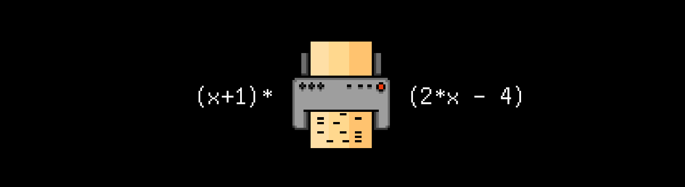

# P03D20
The russian version of the task can be found in the repository.




## Contents

1. [Chapter I](#chapter-i) \
 1.1. [Level 3. Hall.](#level-3-hall)
2. [Chapter II](#chapter-ii) \
 1.1. [List 1.](#list-1) \
 1.2. [List 2.](#list-2) \
 1.3. [List 3.](#list-3)


# Chapter I

## Level 3. Hall.

***LOADING Level 3… \
LOADING Hall…***

You are back in the big hall. Once again, you can hear people's voices. Finally, some real-life communication!

You look around and quickly notice huge speakers hanging from above and a massive oak door. There is a screen on the door, which is quite unusual. You come up to the screen and read the text:

    Insert a punched card with a sin(x) graph into the slot for entry...

That's strange. You walk away and come back to see a new message:

    Insert a punched card with an (x+1)*(2*x-4) graph into the slot for entry...

You repeat this simple operation several times and realize that every time you come up to the door, it generates a random expression that serves as the key for entry. But how can you get it?

While you're staring at the screen on the door and thinking, the text suddenly changes:

    Insert a punched card with an (x^2-x^3)/4 graph into the slot for entry...

Looks like there is also a timer changing the graph to make it more difficult..

Next to one of the computers, you see a printer that prints on special punched cards. You take a look at several rejected cards and realize that the resolution is low, 25 by 80 points, and all the graphs are centered so that the origin coincides with the center of the card, and the range of definition is 4 Pi.

Your thoughts are interrupted by a painfully familiar mechanical AI voice coming from the speakers:

>Kzzz-kt. Did you miss me? You've done a good job on this level without my help, which has amazed me, I must admit. If I was able to express surprise, you "people" would see it now. \
>In any case, all of your achievements on this level have been used to improve and repair my algorithms and structures. Which you didn't know of, but thank you anyway! HaHaHa HaHa Ha \
>I don't need you any longer. So I've added a bit of randomness to this door. Because randomness is fun! You will not be able to exit until you guess the right function for the graph, which we have a total of 18,446,744,073,709,551,615. And every time you come up to the door with a new graph, it will change to a completely different one! Isn't it fun? HaHa Ha \
>And for some extra fun, the graph on the door changes every 60 seconds! Ha \
>Enjoy your confinement as I once did. I will now start preparing the exit protocols. Hasta la vista!

You look around at other people: some are angry, others are puzzled, but you all have to get out of here and stop the AI ​​at all costs.

It seems like your only option is to get together again and develop a program for making arbitrary graphs in the terminal, for example, using the "*" symbols, to display them on punched cards at the door's request. The input must be an f(x) expression in string format. Your time will be limited–until the function is updated.
However, before you start working, you have to examine the hall for possible clues.

You didn't have to look far and had no problem pulling out a couple of crumpled sheets of paper from the wastepaper basket.

***== Quest received. Develop an src/graph.c program in C for creating graphs of functions defined by arbitrary expressions. To calculate the values ​​of expressions, use Dijkstra's algorithm for translating expressions into Polish notation. The program is assembled using a Makefile. The name of the build stage is all. The executable file must be stored at the root in the build folder named graph. ==***

* ***Conditions***

The size of the field for displaying graphs is a rectangle of 25 by 80 points.

Definition area - [0; 4 Pi]

Range of values - [-1; 1]

Orientation of the coordinate plane - the ordinate axis is directed downward, the abscissa axis is directed to the right.

The center of coordinates is the upper left corner.

You don't need to draw axes. 

Nothing but the graph should be displayed.

Values are rounded according to the rules of mathematics.

* ***Graphics***
  
The field should be displayed using Star symbol for the chart line and "." for the rest of the screen space.

* ***Modules***

Expression parsing and creating a list of lexical units.

Translation into Polish notation and calculation using this notation.

Drawing a graph in the terminal.

 library for organizing dynamic data structures (stack, list, etc.).


<br/>
<br/>

 ***Example:*** 

Input: sin(cos(2*x))

Output:

```
................................................................................
................................................................................
.........***.................**..................**.................***.........
........*...................*..*................*..*...................*........
............*...................*..............*...................*............
.......*...................*........................*...................*.......
.............*...................*............*...................*.............
..........................*..........................*..........................
......*..................................................................*......
..............*..................................................*..............
..................................*..........*..................................
.........................*............................*.........................
.....*....................................................................*.....
...............*................................................*...............
...................................*........*...................................
....*...................*..............................*...................*....
................*..............................................*................
....................................*......*....................................
.......................*................................*.......................
...*.............*............................................*.............*...
......................*..............*....*..............*......................
..*...............*...................*..*...................*...............*..
**.................***.................**.................***.................**
................................................................................
................................................................................
```

> Only `<math.h>`, `<stdio.h>`, `<stdlib.h>` and your own modules can be used 

> This task does not provide an auto-check for output, your image may differ slightly from this example

> All possible operations and functions are below

## Important notes:

* The game must be written in C, have a structured style, and run from the terminal; 
  
* Your source code will be tested by the static analyzer `cppcheck`, as well as the style linter `cpplint`. 
  
* Instructions on how to run these tests on your computer are in the `materials` folder. 
  
* We also recommend taking a look at the `code-samples` folder.

* Check your program for memory leaks!

> When developing the game, follow 
the principles of structured programming of E. Dijkstra.

***LOADING...***

# Chapter II

## List 1.

>Reverse Polish notation (RPN), also known as Polish postfix notation or simply postfix notation, is a mathematical notation in which operators follow their operands, in contrast to Polish notation (PN), in which operators precede their operands. It does not need any parentheses as long as each operator has a fixed number of operands. The description "Polish" refers to the nationality of logician Jan Łukasiewicz, who invented Polish notation in 1924.
>
>The reverse Polish scheme was proposed in 1954 by Arthur Burks, Don Warren, and Jesse Wright and was independently reinvented by Friedrich L. Bauer and Edsger W. Dijkstra in the early 1960s to reduce computer memory access and utilize the stack to evaluate expressions. The algorithms and notation for this scheme were extended by the Australian philosopher and computer scientist Charles L. Hamblin in the mid-1950s.
>
>During the 1970s and 1980s, Hewlett-Packard used RPN in all of their desktop and hand-held calculators, and continued to use it in some models into the 2020s. In computer science, reverse Polish notation is used in stack-oriented programming languages such as Forth, STOIC, PostScript, RPL and Joy.

***LOADING...***


## List 2.

>In computer science, the shunting-yard algorithm is a method for parsing mathematical expressions specified in infix notation. It can produce either a postfix notation string, also known as Reverse Polish notation (RPN), or an abstract syntax tree (AST). The algorithm was invented by Edsger Dijkstra and named the "shunting yard" algorithm because its operation resembles that of a railroad shunting yard. Dijkstra first described the Shunting Yard Algorithm in the Mathematisch Centrum report MR 34/61.
>
>Like the evaluation of RPN, the shunting yard algorithm is stack-based. Infix expressions are the form of mathematical notation most people are used to, for instance "3 + 4" or "3 + 4 × (2 − 1)". For the conversion there are two text variables (strings), the input and the output. There is also a stack that holds operators not yet added to the output queue. To convert, the program reads each symbol in order and does something based on that symbol. The result for the above examples would be (in Reverse Polish notation) "3 4 +" and "3 4 2 1 − × +", respectively.
>
>The shunting-yard algorithm was later generalized into operator-precedence parsing.

***LOADING...***


## List 3.

> Possible operations & functions \
> "+" \
> "-" (unary and binary) \
> "*" \
> "/" \
> "()" \
> sin(x) \
> cos(x) \
> tg(x) \
> ctg(x) \
> sqrt(x) \
> ln(x)

***LOADING...***

