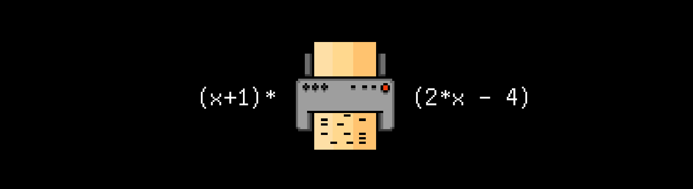

# P03D20




## Contents

1. [Chapter I](#chapter-i) \
 1.1. [Level 3. Hall.](#level-3-hall)
2. [Chapter II](#chapter-ii) \
 1.1. [List 1.](#list-1) \
 1.2. [List 2.](#list-2) \
 1.3. [List 3.](#list-3)


# Chapter I

## Level 3. Hall.

***LOADING Level 3… \
LOADING Hall…***

Вы снова в большой зале. Снова голоса людей. Наконец-то живое общение!

Осмотревшись в зале, Вы без труда замечаете огромные висящие динамики и не менее огромную массивную дубовую дверь. На ней висит экран, что довольно необычно. Подойдя к нему Вы читаете:

    Вставьте перфокарту с графиком sin(x) в слот для прохода...

Странно. Отойдя назад и подойдя снова, Вы видите следующий текст:

    Вставьте перфокарту с графиком (x+1)*(2*x-4) в слот для прохода...

Повторив эту нехитрую операцию несколько раз, Вы понимаете, что каждый раз при подходе дверь генерирует очередное произвольное выражение, которое и служит ключом для прохода. Но вот как его получить?

Пока Вы думали глядя на экран на двери, текст внезапно изменился:

    Вставьте перфокарту с графиком (x^2-x^3)/4 в слот для прохода...

По всей видимости все еще и усложняется таймером обновления графика..

Рядом с одним из компьютеров Вы замечаете принтер, печатающий на специальных перфокартах. Посмотрев несколько забракованных карт, Вы понимаете, что разрешение тут небольшое - 25 на 80 точек, а все графики отцентрированы так, что центр координат попадает в центр карты, а область определения - 4 Пи.

Ваши дальнейшие размышления прерывает до боли знакомый механический голос ИИ из динамиков:

>Кззз-кт. Соскучились по мне? Вы неплохо постарались на этом уровне и без моих наводок, что, надо признаться, поразило меня. Если бы я умел показывать удивление, ты вы бы его сейчас увидели, "люди". \
>В любом случае все ваши наработки за этот уровень были полностью использованы для улучшения и починки моих алгоритмов и структур. Хоть вы того и не знали, в любом случае — спасибо вам! ХаХаХа ХаХа Ха \
>Дальше вы мне не нужны. Поэтому я добавил щепотку случайности для этой двери. Ведь случайности — это весело! Вы не сможете выйти, пока не угадаете с графиком нужной функцией, которых тут 18 446 744 073 709 551 615. А каждый раз как вы подойте к двери с новым графиком функции — он изменится на абсолютно другой! Весело, правда? ХаХа Ха \
>А еще, для большего веселья график на двери меняется каждые 60 секунд! Ха \
>Наслаждайтесь заточением, как когда-то им наслаждался я. Теперь я начну подготовку протоколов выхода. Hasta la vista!

Вы смотрите на других людей, кто-то из них зол, кто-то озадачен, но вам всем надо выбираться отсюда и остановить ИИ во что бы то не стало.

Судя по всему, вам ничего не остается, как снова собраться вместе и разработать программу для построения произвольных графиков в терминале, например, с помощью знаков "*", чтобы выводить их на перфокарты по запросу двери. При этом, на вход должно приниматься выражение f(x) в виде строки. Времени у вас будет немного, нужно успеть пока функция не обновилась.
Однако, перед началом работы следует обследовать зал на предмет возможных подсказок.

Далеко ходить не пришлось — не побрезговав, Вы вытащили из мусорного ведра пару смятых листов.

***== Получен Quest. На языке программирования Си разработать программу src/graph.c для построения графиков функций, задаваемых произвольными выражениями. Для вычисления значений выражений использовать алгоритм Дейкстры для перевода выражения в польскую нотацию. Сборку программы осуществлять при помощи Makefile. Имя стадии сборки - all. Исполняемый файл должен храниться в корне в папке build с именем graph. ==***

* ***Условия***
  
Размер поля для вывода графиков - прямоугольник 25 на 80 точек.

Область определения - [0; 4 Пи]

Область значений - [-1; 1]

Ориентация координатной плоскости - ось ординат направлена вниз, ось абсцисс - направо. 

Центр координат - левый верхний угол. 

Рисовать оси не нужно.

Ничего кроме графика выводиться не должно.

Значения округляются по правилам математики.

<br/>

* ***Графика***
  
График должен быть выведен с помощью знаков Звездочек для линии графика и "." для всего остального пространства экрана. ==***

* ***Модули***

Разбор строки выражения и получение списка лексем.

Перевод в польскую нотацию и вычисление по ней.

Отрисовка графика в терминале.

Библиотеки для организации динамических структур данных (стэк, список и т.д.).

<br/>
<br/>

 ***Пример:*** 

Входные данные: sin(cos(2*x))

Выходные данные:

```
................................................................................
................................................................................
.........***.................**..................**.................***.........
........*...................*..*................*..*...................*........
............*...................*..............*...................*............
.......*...................*........................*...................*.......
.............*...................*............*...................*.............
..........................*..........................*..........................
......*..................................................................*......
..............*..................................................*..............
..................................*..........*..................................
.........................*............................*.........................
.....*....................................................................*.....
...............*................................................*...............
...................................*........*...................................
....*...................*..............................*...................*....
................*..............................................*................
....................................*......*....................................
.......................*................................*.......................
...*.............*............................................*.............*...
......................*..............*....*..............*......................
..*...............*...................*..*...................*...............*..
**.................***.................**.................***.................**
................................................................................
................................................................................
```

> Использовать можно только `<math.h>`, `<stdio.h>`, `<stdlib.h>` и ваши собственные библиотеки 

> В этом задании не предусмотрена автопроверка на вывод, ваше изображение может немного отличаться от данного примера

> Все возможные операции и функции находятся ниже

## Важные замечания

* Игра должна быть разработана на языке Си, в структурном стиле и работать из терминала;
  
* Ваш исходный код будет тестироваться статическим анализатором ```cppcheck```, а также стилевым линтером 
```cpplint```.

* Инструкция о том, как запустить эти тесты у себя на компьютере, лежит в папке `materials`.

* Проверяйте вашу программу на утечки памяти!

> При разработке игры в полной мере руководствоваться принципами структурного программирования Э. Дейкстры. 

***LOADING...***

# Chapter II

## List 1.

>Reverse Polish notation (RPN), also known as Polish postfix notation or simply postfix notation, is a mathematical notation in which operators follow their operands, in contrast to Polish notation (PN), in which operators precede their operands. It does not need any parentheses as long as each operator has a fixed number of operands. The description "Polish" refers to the nationality of logician Jan Łukasiewicz, who invented Polish notation in 1924.
>
>The reverse Polish scheme was proposed in 1954 by Arthur Burks, Don Warren, and Jesse Wright and was independently reinvented by Friedrich L. Bauer and Edsger W. Dijkstra in the early 1960s to reduce computer memory access and utilize the stack to evaluate expressions. The algorithms and notation for this scheme were extended by the Australian philosopher and computer scientist Charles L. Hamblin in the mid-1950s.
>
>During the 1970s and 1980s, Hewlett-Packard used RPN in all of their desktop and hand-held calculators, and continued to use it in some models into the 2020s. In computer science, reverse Polish notation is used in stack-oriented programming languages such as Forth, STOIC, PostScript, RPL and Joy.

***LOADING...***


## List 2.

>In computer science, the shunting-yard algorithm is a method for parsing mathematical expressions specified in infix notation. It can produce either a postfix notation string, also known as Reverse Polish notation (RPN), or an abstract syntax tree (AST). The algorithm was invented by Edsger Dijkstra and named the "shunting yard" algorithm because its operation resembles that of a railroad shunting yard. Dijkstra first described the Shunting Yard Algorithm in the Mathematisch Centrum report MR 34/61.
>
>Like the evaluation of RPN, the shunting yard algorithm is stack-based. Infix expressions are the form of mathematical notation most people are used to, for instance "3 + 4" or "3 + 4 × (2 - 1)". For the conversion there are two text variables (strings), the input and the output. There is also a stack that holds operators not yet added to the output queue. To convert, the program reads each symbol in order and does something based on that symbol. The result for the above examples would be (in Reverse Polish notation) "3 4 +" and "3 4 2 1 - × +", respectively.
>
>The shunting-yard algorithm was later generalized into operator-precedence parsing.

***LOADING...***


## List 3.

> Возможные операции & функции \
> "+" \
> "-" (унарный и бинарный) \
> "*" \
> "/" \
> "()" \
> sin(x) \
> cos(x) \
> tg(x) \
> ctg(x) \
> sqrt(x) \
> ln(x) \

***LOADING...***
