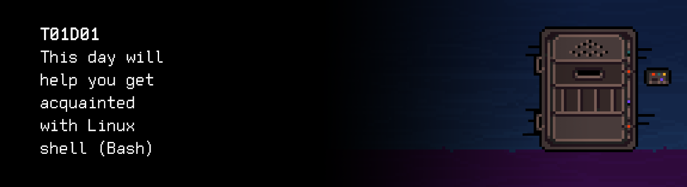

# T01D01 
The russian version of the task can be found in the repository.

You can find some useful video materials [here](https://edu.21-school.ru/video/selection/7fdda478-e087-4d60-91cb-cef679d409dd).

## Contents

1. [Chapter I](#chapter-i) \
    1.1. [Readme!](#readme)  
    1.2. [Level 1. Room 1.](#level-1-room-1)
2. [Chapter II](#chapter-ii) \
    2.1. [List 1.](#list-1)  
    2.2. [List 2.](#list-2)  
    2.3. [List 3.](#list-3)  
    2.4. [List 4.](#list-4)  
3. [Chapter III](#chapter-iii) \
    3.1. [Quest 1. Clone.](#quest-1-clone)  
    3.2. [Quest 2. Repo.](#quest-2-repo)  
    3.3. [Quest 3. Dirs & Files.](#quest-3-dirs-files)  
    3.4. [Quest 4. Kill him.](#quest-4-kill-him)  
    3.5. [Quest 5. Conf.](#quest-5-conf)  
    3.6. [Quest 6. Rm.](#quest-6-rm)  
    3.7. [Quest 7. Branches.](#quest-7-branches)  
4. [Chapter IV](#chapter-iv) 

# Chapter I

## Readme!

***LOADING… …***

***SUCCESS!***

\>

Message from developers: \
Hello, dear friend! \
Let's play a game. \
Something like the good old text-based adventure games with elements of a puzzle. \
Each Task is a challenge, usually some kind of a hurdle you need to overcome. \
Only those who tackle them all will be able to move further. 

Below are several tips to help you find your way: 
1. During the entire journey, you will be accompanied by the feeling of uncertainty and a severe shortage of information: THAT'S OK. It's a part of the game. Remember that the information in the repository and Google are always there for you. Just like other players. Communicate. Search. Collect. Do not be afraid to make a mistake. 
2. There may be a game inside the game, and another game inside it. That's normal. Just like in real life. Recursion is beautiful.
3. Levels can be very different from one another. That's normal. It's a part of the game. You can't just learn one recipe and apply it everywhere. The only way to achieve the goal is by continuously learning and adapting. 
4. It's a multiplayer game, even if it doesn't seem like it in the beginning.
5. You will, however, be able to get through most of it on your own.
6. Be careful with information sources. Check. Think. Analyze. Compare. Do not trust.
7. Pay attention to the text of the task. Think. Check.
8. If the task seems unclear or impossible–it only seems like it. Take your time, sit down in silence or with your favorite music. Get back to the task in 10–15 minutes and read the entire text once again. 
9. If tip #8 hasn't helped–search for a guide. You are surrounded by many wanderers just like you and they will be happy to help you find the exit.
10. Watch the time! It's deceitful. You have to complete at least one challenge a day!
11. Be attentive and do not miss important things. Check the repository carefully!
12. Always push only to the develop branch! The master branch will be ignored. Work in the src directory.
13. Remember that each task undergoes a series of checks: code style check, static analyzer check, check for correct work with memory, check with a set of autotests, check with a checklist. Be careful.
14. You will come across different tasks on your way. The tasks marked with the asterisk (*) are only for the most reckless ones. They are more difficult and not compulsory. But if you complete them, you will gain extra experience and knowledge.
15. Some things may seem important but they are actually not. 
16. Remember that ultimately the fact of completing the challenge is not as important as HOW you complete it.
17. The main goal of our journey is to understand what "HOW" means.
18. Separate the wheat from the chaff.
19. Divide and rule. Decompose. 
20. Think about the main thing (good code, obviously). Move from the general to the specific.
21. Do not cheat, do not try to deceive the system and others. First of all, you will deceive yourself.
22. Do not write off, but if you use help - always figure it out to the end. Otherwise, your journey will not make any sense.
23. Check "materials" folder often. There can be a lot of useful things there!
24. Reread these tips several times.

***PRESS ANY KEY TO CONTINUE………………***

## Level 1. Room 1.

***LOADING Level 1…***

***LOADING Room 1…***

\> *Look around*

You find yourself in an unfamiliar room. In front of you is a small desk with an old IBM PC compatible computer. The desk has a Pixar-compatible lamp with warm and cozy light, several yellowed sheets of paper, and a hot cup of coffee. \
You notice a closed door in the opposite wall. It must have an electronic lock because there is no door handle or keyhole.
 
\> *Pull the door*

There's no door handle. Nothing to pull.

\> *Break the door open*

It hurts. No other results.

\> *Sit down at the desk*

You are sitting down at the desk. What's next? \
At least this doesn't hurt.

\> *Drink the coffee*

Not so bad actually!

\> *Drink the coffee*

Not so bad actually!

\> *Drink the coffee*

Not so bad actually!

\> *Drink the coffee*

There's no coffee left.

\> *Look at the desk*

Sheets of paper, nothing unusual. Lots of text. \
One of the sheets has little text and it attracts your attention:

/***Turn on the computer***/

\> *Turn on the computer*

You find the start button rather quickly–it's a big analog switch. The machine starts buzzing and reveals the screen with a blinking cursor.

\> *Search for a mouse*

There's no mouse.

\> *Search for windows*

There are no windows. Just the door. The screen has no windows either...

\> *Press Enter*

The cursor jumps to the next line

\> *Wait*

Nothing is happening

\> *Wait*

Nothing is happening

\> *Look at the desk*

Sheets of paper, nothing unusual. Lots of text. \
There are other papers, below the one you've read.

\> *Read the papers*

***LOADING...***

# Chapter II

## List 1.

>The history of Linux started back in 1991, when a Finnish graduate developer Linus Torvalds started developing a kernel for his computer. 
>
>He posted his work on a public server, which became the key event in the history of Linux. Dozens, hundreds, and then thousands of developers supported his project and a full-fledged operating system was created through joint efforts.
>
>Linux has been heavily influenced by Unix, which is clear even from the name. The first official Linux 1.0 version was released in 1994. From the very start and to this day, Linux has been distributed as free software under the GPL. This means that any user can see the source code of the operating system–and not just see it, but modify it as well. The only condition is that the modified code must also be available to everyone and distributed under the GPL. This is important because it allows developers to use the code and not be afraid of copyright issues.

Next you see a large coffee stain.

\> *Read the next sheet of paper*

***LOADING...***

## List 2.

The printer has chewed it up. It must be a matrix one.

>3. Torvalds originally wanted to call his creation Freax (a portmanteau of "free", "freak", and "X" which marks it as one of Unix systems), but the system administrator who allocated the space on the server for Torvalds to distribute the operating system, named the catalog Linux;
>4. Choosing the Linux logo took a long time; a penguin named Tux was the final decision. In his book "Just for Fun" Torvalds says he chose it because he was once bitten by a penguin in the zoo (it happened in Australia in 1993);
>5. Linux is the absolute champion in the number of installations among general-purpose operating systems. You can find it almost everywhere: on all supercomputers from the TOP500 list, on Android phones, Chromebooks, all kinds of add-ins, e-books, smart TVs, and more;
>6. The Linux kernel is written in C;
>7. Linux kernel version 1.0.0 was released with 176,250 lines of code. The Linux kernel currently consists of over 10 million lines of code;

\> *Read the next sheet of paper*

***LOADING...***

## List 3.

>Bourne shell (often called "sh" after the name of the executable file) is an early UNIX shell developed by Stephen Bourne from Bell Labs and released as part of Version 7 Unix (1978). This shell is the de facto standard and is available in almost any *nix distribution. 
>
>The name "bash" is an acronym for "Bourne-Again shell" which is a play on words: the Bourne shell is a popular command-line shell for Unix, created by Stephen Bourne and improved by Brian Fox in 1987— that's when the shell was "Bourne" again.

\> *Read the next sheet of paper*

***LOADING…***

## List 4.

>Git is a distributed version control system. The project was created by Linus Torvalds for the development of the Linux kernel. The first version was released on April 7, 2005. He later made Junio Hamano its core maintainer.
>
>This is currently the de facto standard of all tools for coordinating work among programmers. 
>
>Git is free and distributed under GNU General Public License Version 2. TCP port 9418 is used by default.
>
>The Linux kernel was developed using the proprietary BitKeeper system, which was provided to the project under a free license by its author, Larry McVoy, a Linux developer himself. High-class developers created several utility programs, for one of which Andrew Tridgell reverse-engineered the BitKeeper data transfer format. In response, McVoy accused the developers of violating the agreement and withdrew the license, and Torvalds started working on a new system: none of the available free systems allowed thousands of programmers to cooperate (the same conflict also spurred the creation of Mercurial). The ideology was simple: take the CVS approach and make the exact opposite, while also adding reliability.
>
>The initial development took less than a week: it started on April 3, 2005, and on April 7, the Git code was already managed by the unfinished system. Linux was migrated to Git on June 16, and on July 25, Torvalds stepped down as lead developer of Git.
>
>Torvalds sarcastically said about the name "Git": "I'm an egotistical bastard, so I name all my projects after myself. First Linux, now git."

\> *Read the next sheet of paper*

***LOADING…***

# Chapter III

## Quest 1. Clone.

>The key to the door is in the repository, in the /src folder. Run git clone.

This is the last page.

\> *Look at the screen once again*

The same blinking cursor.

\> *git clone*

You must specify a repository to clone.

    usage: git clone [<options>] [--] <repo> [<dir>]
        -v, --verbose         be more verbose
        -q, --quiet           be more quiet
        --progress            force progress reporting
        -n, --no-checkout     don't create a checkout
        --bare                create a bare repository
        --mirror              create a mirror repository (implies bare)
        -l, --local           to clone from a local repository
        --no-hardlinks        don't use local hardlinks, always copy
        -s, --shared          setup as shared repository
        --recursive           initialize submodules in the clone
        --recurse-submodules  initialize submodules in the clone
        --template <template-directory>     directory from which templates will be used
        --reference <repo>    reference repository
        --dissociate          use --reference only while cloning
        -o, --origin <name>   use <name> instead of 'origin' to track upstream
        -b, --branch <branch>    checkout <branch> instead of the remote's HEAD
        -u, --upload-pack <path>     path to git-upload-pack on the remote
        --depth <depth>       create a shallow clone of that depth
        --single-branch               clone only one branch, HEAD or --branch
        --separate-git-dir <gitdir>   separate git dir from working tree
        -c, --config <key=value>    set config inside the new repository

\> *... Please enter an action ...*

_**== Quest 1 received. Clone the repository to the local terminal using the git terminal client. ==**_

***LOADING…***

## Quest 2. Repo.

\> *Look at the screen*

You are currently in the repository folder. You see a blinking cursor in the terminal.

\> *Go to /src*

Enter a terminal command...

\> *View the list of files*

Enter a terminal command...

\> *Start ai_initial_module.sh*

That's a good idea. Perhaps the AI can advise you on how to get out of here... Talk to it.

_**== Quest 2 received. Start the src/ai_initial_module.sh script in bash and follow the instructions. Fix the errors, if necessary. Put all changes under version control. Tip: you can use output stream redirection to create the file. ==**_

***LOADING…***

## Quest 3. Dirs & Files.

\> *Read the text in the terminal*

There is a lot of text. It seems like the launch of the modules has triggered a chain reaction—different parts of the AI connect each other, fall down, break, and happily report it to the terminal. It's difficult to extract valuable information from this stream.

\> *Ask a question "How do I get out of here"*

You manage to find a line in the pile of text: "Try talking to src/ai_door_managment_module.sh"

\> *Start src/ai_door_managment_module.sh*

The module tried to read some files for initialization and launch, and, most likely, failed.

\> *Start again*

Great job! That's the most universal approach. You should use it more often.

Unfortunately, it hasn't helped. And it's probably not going to. \
Looks like you'll have to figure out the structure of the configuration files required to start the module. \
Tip: save all the commands you use in quest3.sh, put it in the src folder, and do not forget to put it under version control. You never know when you might need to revive the module again. The easiest way to add an entry to a file is to redirect the echo command. But I didn't tell you that.

_**== Quest 3 received. Sort things out with src/ai_door_managment_module.sh configuration files. Fix the errors, if necessary. Record all the commands you use in quest3.sh and put it under version control. ==**_

***LOADING…***

## Quest 4. Kill him.

\> *Read the terminal*

After the successful start of src/ai_door_managment_module.sh, the ai_door_control submodule has activated. Whatever you do, its activity leaves annoying traces everywhere.

\> *What does it do?*

Seems like this module goes through all the locked doors. It checks how locked they are. It's definitely not what you wanted, is it?

\> *And now what?*

There is no information. It's your game. If I was playing it, I would try to end it with this dude. "End it", you know what I mean? 

\> *Not really.*

Kill it.

And don't forget to document all your actions in quest4.sh. Just in case. Who knows how many of these inconvenient modules you come across along the way. 

_**== Quest 4 received. Stop the activated src/ai_door_control.sh module. Record all the commands you use in quest4.sh. ==**_

***LOADING…***

## Quest 5. Conf.

\> *Task completed*

This trackman will no longer bother us. Silence. You can get back to configuring the door control module.

\> *Open the directory with door configuration*

It's open. It contains files. You have already viewed them. 

\> *Open the file with configuration for the first door*

The information is not very clear. Although one line does clearly imply that the search will complete soon: STATUS.

\> *Change to OPEN*

Looks like you'll have to do it manually. Search for the console text editor and correct it. Once you've corrected it, specify your actions in the terminal as a numbered list in quest5.txt and put it under version control together with the changed configuration.

_**== Quest 5 received. Fix the configuration of the first door using the console text editor (nano, vi, vim, etc.). Specify the selected editor and all the commands you use in quest5.txt. ==**_

***LOADING…***

## Quest 6. Rm.

\> *Restart the configuration module ai_door_managment_module.sh*

That would be too easy, right? You can see that the configuration has been read but the door is still locked.
 
\> *Restart the module*

That would be too easy, right? You can see that the configuration has been read but the door is still locked.
 
\> *Restart the module*

That would be too easy, right? You can see that the configuration has been read but the door is still locked.
 
\> *Restart the module*

Is this a test? Or are you playing Doctor Strange?
 
\> *Continue viewing the files and reading the terminal*

That's a good idea. What else can you do?

*All of a sudden, the old speaker of your IBM PC creaks, rustles, and starts making sound. After a while, you realize that it's a mechanical voice that must belong to some AI module started earlier. It's not the most pleasant sound.*  

The AI (mechanical voice): 

>I've been watching your pathetic attempts to get out of the room for a long time, "human!" You've come a long way and almost made it to the exit. *mimicking laughter*.

*Apparently, at that point, the voice generation algorithm fell into a loop and the last words, along with an unnatural laugh, were repeated 5 times or so.*

>The key to the door is generated by the src/ai_help/keygen.sh script. It's such a pity *mimicking sarcasm*... that the generator has been damaged. It's very likely that it was you who damaged it–when you were vile enough to "remove" the door checking module. Now you'll have to assemble the key from numerous files. On your own.

*A lot of unclear noise.* 

>Files with parts of the key will be different from the rest, you need to remove all the garbage. 
>Once you've collected parts of the key without the garbage run **src/ai_help/unifier.sh**, which I have kindly prepared. Good luck to you, organic intelligence. Don't let me down. I've bet on you. And the initialization module has not given a single CPU quantum.

*No matter how hard you listen, you can't hear anything else. The speaker is silent.*

\> *Output the list of files of the src/ai_help directory using the ls command*

*You see a couple of scripts, just like the AI has promised. Just reminding you to record all the commands you use (quest6.sh) and the results of their work in the repository.*

_**== Quest 6 received. Using scripts from the ai_help folder and bash commands, create the main.key file. Record all the commands you use in quest6.sh. ==**_

***LOADING…***

## Quest 7. Branches.

\> *Look at the screen*

Nothing has changed. Look or not look, the door is not going to open itself.

\> *Enter the code from the previous step*

You've already done this. Approximately one thousand two hundred and thirty-seven times.

\> *Study other directories* 

Maybe you should check the src/git_for_human directory once again?

\> *Study the src/git_for_human directory*

I'll leave you to this enjoyable task.

_**== Quest 7 received. Create branches in git according to the instructions from the src/git_for_human folder. ==**_

***LOADING...***

# Chapter IV

\> *Ready*

Not sure what you did there, but it worked. The door is open. \
Although I keep feeling like it's not you who should take credit for it... Be careful. You never know what the AI is up to. Especially a misconfigured one with half of the required modules missing.

***LOADING...***
