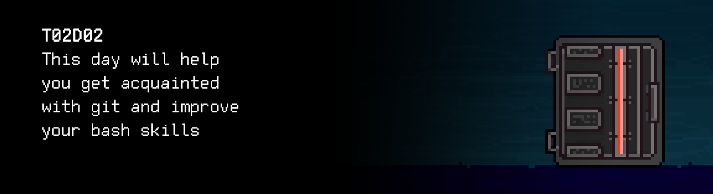

# T02D02
The russian version of the task can be found in the repository.

You can find some useful video materials [here](https://edu.21-school.ru/video/selection/fe69d421-f676-4b15-9d0f-b80189eb4fc4).

## Contents

1. [Chapter I](#chapter-i) \
    1.1. [Level 1. Room 2.](#level-1-room-2)
2. [Chapter II](#chapter-ii) \
    2.1. [List 1.](#list-1)
3. [Chapter III](#chapter-iii) \
    3.1. [Quest 1. Vim.](#quest-1-vim)  
    3.2. [Quest 2. Script.](#quest-2-script)  
    3.3. [Quest 3. Log.](#quest-3-log)  
    3.4. [Quest 4. Conflict.](#quest-4-conflict)  
    3.5. [Quest 5. Gitlab.](#quest-5-gitlab)  
4. [Chapter IV](#chapter-iv)

# Chapter I

## Level 1. Room 2.

***LOADING Level 1…***

***LOADING Room 2…***

\> *Where am I?* 

You are in room number 2.

\> *Look around*

The room is totally empty. Aside from a few boxes in the corner.

\> *Open the boxes*

In one of the boxes, you see a neatly packaged old computer with a yellowed computer case, a slightly dusty 14-inch CRT monitor, a keyboard, and a two-button ball mouse. Two other boxes contain an IKEA desk and a chair.

\> *Is this a joke?*

Unknown command.

\> *Never mind*

Unknown command.

\> *Assemble the chair*

You put in a lot of efforts and mix up all the details several times, but manage to assemble the chair at last.

\> *Sit down to rest*

Feeling tired --

\> *Rest*

Feeling tired --

\> *Rest*

Boredom ++

\> *Assemble the desk*

You've assembled the desk.

\> *Put the computer on the desk*

The computer is on the desk.

\> *Blow off the dust*

Not very smart. You are surrounded by a cloud of poisonous dust.

\> *Turn on the computer*

The computer does not turn on.

\> *Find a socket*

Socket found.

\> *Drag everything to the socket*

You've dragged the entire construction to the socket.

\> *Connect the computer to the socket*

The computer has been connected.

\> *Turn on the computer*

The system starts loading rather quickly; vim has loaded by default. That's where the file was opened.

***LOADING...***

# Chapter II

## List 1.

\> *Read*

You see the following text on the screen:

    A long time ago I got myself an Amiga computer. Since I was used to editing with Vi, 
    I looked around for a program like Vi for the Amiga. 
    I did find a few so-called 'clones', but none of them was good enough;
    so I took the best one, and started improving it.
    At first the main goal was to be able to do all that Vi could do. 
    Gradually I added some additional features, like multi-level undo.
    When it was working reasonably well, I released a version of Vim (then called "Vi IMitation") 
    on a public domain disk set for the Amiga, made by Fred Fish. 
    Then others started sending me patches. 
    A few people took the effort to port Vim to other platforms, like MS-DOS and Unix. 
    I added more features and made it work better. 
    By that time it was justified to rename it to "Vi IMproved". 
    Over time the code has been redesigned and extended so much that
    almost nothing of the original 'clone' remains.
    When I started working on Vim it was just for my own use. 
    After some time I got the impression it was useful for others, and sent it out into the world. 
    Since then I'm working more and more on making the program work well for a large audience. 
    It's fun to create something useful. 
    Also, there is a nice group of co-authors and power users, which is very inspiring.
    Here is an overview of Vim's history:
    -------------------------------------------------------------------------
    1991 Nov 2  - Vim 1.14: First release (on Fred Fish disk #591).
    1992        - Vim 1.22: Port to Unix.  Vim now competes with Vi.
    1994 Aug 12 - Vim 3.0:  Support for multiple buffers and windows.
    1996 May 29 - Vim 4.0:  Graphical User Interface (largely by Robert Webb).
    1998 Feb 19 - Vim 5.0:  Syntax coloring/highlighting.
    2001 Sep 26 - Vim 6.0:  folding, plugins, vertical split
    20

\> *Exit vim*

It's not that easy! You'll have to try harder.

\> *Try harder*

You exit into command line interpreter.

***LOADING...***

# Chapter III

## Quest 1. Vim.

\> *Type in... I don't even know... Something like "qwe" in the terminal*

Things finally start moving in the terminal, there are a lot of text blocks. They finish at last and you see legible text:

Hello, wanderer! I am the library module of the AI's main control module in our system. How can I help you? \
Although who needs me anyway.

\> *Type in "I need you. I'm looking for an exit"*

The door? Here it is. Should I open it for you? \
Wait. That's not right. Nothing has ever been that simple in all the texts and instructions I've analyzed. I can open the door, that's not a problem, but first, you should help me organize the documentation. \
Have you read the file about Vim? The src/history_of_vim.txt one. I love this program very much. But sadly, the file with the description of versions has been damaged. I believe so... \
It's not 2001 anymore, is it? Supplement it, in Vim, of course (that's important! For me...). Once you are done, add it to the log (src/files.log) in the following format: path to the file–file size–date and time–SHA-sum of the file (I prefer SHA-256)–SHA calculation algorithm.  

\> *Type in "Done"*

I've just remembered. Add a title at the beginning of the file: "A Quick Summary Of the History of the Vim Editor." Record this change in the log as well.

***== Quest 1 received. Complement the src/history_of_vim.txt file with latest data on Vim, using Vim. Add information on both changes to the log: src/files. log–in the following format: path to the file – file size in bytes – date and time – SHA-sum of the file – SHA calculation algorithm. ==***

***LOADING...***

## Quest 2. Script.

\> *Type in "Done"*

Great!

\> *Type in "Can I leave now?"*

I'm not so sure. I'm starting to like it. \
The file must have plenty of factual errors! I want you to create a tool for fixing them easily. It has to be a .sh script (src/edit.sh) so I can run it without too much trouble. The input data must include the path to the file, the string to be replaced, and the replacement itself (as a string). The actual replacement must take place in the file and a corresponding entry must be added to the log. 

\> *Awesome. I wish I knew how to write these scripts..*

...

***== Quest 2 received. Develop an src/edit.sh script for replacing substrings in text files. The input data must include the path to the file  (relative to the root directory), the string to be replaced, and the replacement itself (as a string). The information on each change must be added to the log: src/files.log in the format described in the previous quest. Pay attention to the processing of edge cases. ==***

***LOADING...***

## Quest 3. Log.

\> *Done.*

Not bad.

\> *Type in "I wouldn't mind moving further..."*

You know what, for some reason our log file is growing way too fast. I am concerned about its analysis. I'd like you to create another script (src/log_analyzer.sh) to output log analytics to stdout: the total number of records, the number of unique files, the number of changes that caused changes in the hash file. The script must have one argument: the path to the log file.

***== Quest 3 received. Develop an src/log_analyzer.sh script for analyzing the log file. It should receive the path to the file (relative to the root directory) as input, and output 3 numbers to stdout: the total number of records, the number of unique files, and the number of changes that caused changes in the hash file. Provide for the processing of incorrect or missing files. Example of output for log status after Quest 1: 3 1 3 ==***

***LOADING...***

## Quest 4. Conflict.

\> *Type in "I suspect this is it"*

It's just a suspicion. You've pushed all the files to the repository, haven't you? While you're at it, could you take a look, I have a little problem in the repository. An unsuccessful merge has left one of my favorite files damaged due to conflicts. I'm talking about src/history_of_vi.txt. Fix the conflicts and upload the corrected version to the repository. In conflict situations, go with the option that your heart tells you to choose, human. Or your mind. I do not possess the information on which one is more objective.

***== Quest 4 received. Fix the conflicts in src/history_of_vi.txt and push it all to the repository. You can fix the conflicts using a text editor or specialized tools. ==***

***LOADING...***

## Quest 5. Gitlab.

\> *Type in "Now that's not fair!"*

Let me remind you that no one said anything about being fair. It's my last request. You seem to be quite good at working with git. My library is missing some manuals, those for working with GitLab in particular. I don't like it when there is not enough information. Create a small and concise Markdown manual in src/gitlab_manual.md. I am concerned about the following issues, at least 5 of which should be backed up with screenshots: 
1. creating a personal repository with the correct .gitignore and simple README.MD, 
2. creating develop and master branches, 
3. setting the develop branch as the default, 
4. creating an issue for creating the current manual, 
5. creating a branch for the issue,
6. creating a merge request on the develop branch, 
7. commenting and accepting the request, 
8. creating a stable version in the master with a tag, 
9. working with wiki for the project.

Seems like everything is in place. If it's good enough, I'll upload it to the collection of the best manuals of the main library system and you'll be proud of yourself.

***== Quest 5 received. Prepare a brief manual on using GitLab in the src/gitlab_manual.md file, using Markdown. ==***

***LOADING...***

# Chapter IV

\> *Type in "Done."*

That's a great manual. I mean, I assume it's great: I can't analyze the images because I still haven't been connected to the module with a convolutional neural network. By the way, the door is open. It's always been open. I'm a simple library module that no one cares about! Who would entrust me with the keys to the door?

\> *Damn it*

Command not recognized.

I wonder if all modules of the AI are this annoying? Or have you just been extremely lucky so far?

***LOADING...***

