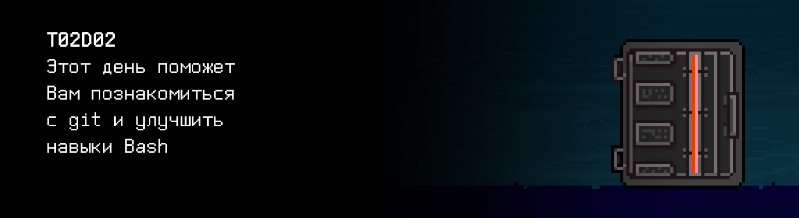

# T02D02

## Contents

1. [Chapter I](#chapter-i) \
    1.1. [Level 1. Room 2.](#level-1-room-2)
2. [Chapter II](#chapter-ii) \
    2.1. [List 1.](#list-1)
3. [Chapter III](#chapter-iii) \
    3.1. [Quest 1. Vim.](#quest-1-vim)  
    3.2. [Quest 2. Script.](#quest-2-script)  
    3.3. [Quest 3. Log.](#quest-3-log)  
    3.4. [Quest 4. Conflict.](#quest-4-conflict)  
    3.5. [Quest 5. Gitlab.](#quest-5-gitlab)  
4. [Chapter IV](#chapter-iv)

# Chapter I

## Level 1. Room 2.

***LOADING Level 1…***

***LOADING Room 2…***

\> *Где я?* 

Вы находитесь в комнате за номером 2.

\> *Осмотреться*

Абсолютно пустая комната. Если не считать пары коробок в углу.

\> *Открыть коробки*

В одной коробке вы видите аккуратно сложенный старый компьютер — пожелтевший системный блок, немного пыльный 14-дюймовый ЭЛТ-монитор, клавиатура, двухкнопочная шариковая мышь. В двух других — стул и стол из икеи.

\> *Это такая шутка?*

Неизвестная команда.

\> *Ладно, проехали*

Неизвестная команда.

\> *Собрать стул*

Изрядно потрудившись и перепутав все детали несколько раз, вы собрали стул.

\> *Сесть и отдохнуть*

Усталость --

\> *Отдохнуть*

Усталость --

\> *Отдохнуть*

Скука ++

\> *Собрать стол*

Вы собрали стол.

\> *Поставить компьютер на стол*

Компьютер водружен на стол.

\> *Сдуть пыль*

Не очень умно. Вы в облаке ядовитой пыли.

\> *Включить компьютер*

Компьютер не включается.

\> *Найти розетку*

Розетка найдена.

\> *Перетащить все к розетке*

Вы перетащили всю конструкцию к розетке.

\> *Подключить компьютер к розетке*

Компьютер подключен.

\> *Включить компьютер*

На экране довольно шустро прошла загрузка системы, и по умолчанию загрузилась программа vim. Там был открыт файл.

***LOADING...***

# Chapter II

## List 1.

\> *Читать*

На экране вы видите такой текст:

    A long time ago I got myself an Amiga computer. Since I was used to editing with Vi, 
    I looked around for a program like Vi for the Amiga. 
    I did find a few so-called 'clones', but none of them was good enough;
    so I took the best one, and started improving it.
    At first the main goal was to be able to do all that Vi could do. 
    Gradually I added some additional features, like multi-level undo.
    When it was working reasonably well, I released a version of Vim (then called "Vi IMitation") 
    on a public domain disk set for the Amiga, made by Fred Fish. 
    Then others started sending me patches. 
    A few people took the effort to port Vim to other platforms, like MS-DOS and Unix. 
    I added more features and made it work better. 
    By that time it was justified to rename it to "Vi IMproved". 
    Over time the code has been redesigned and extended so much that
    almost nothing of the original 'clone' remains.
    When I started working on Vim it was just for my own use. 
    After some time I got the impression it was useful for others, and sent it out into the world. 
    Since then I'm working more and more on making the program work well for a large audience. 
    It's fun to create something useful. 
    Also, there is a nice group of co-authors and power users, which is very inspiring.
    Here is an overview of Vim's history:
    -------------------------------------------------------------------------
    1991 Nov 2  - Vim 1.14: First release (on Fred Fish disk #591).
    1992        - Vim 1.22: Port to Unix.  Vim now competes with Vi.
    1994 Aug 12 - Vim 3.0:  Support for multiple buffers and windows.
    1996 May 29 - Vim 4.0:  Graphical User Interface (largely by Robert Webb).
    1998 Feb 19 - Vim 5.0:  Syntax coloring/highlighting.
    2001 Sep 26 - Vim 6.0:  folding, plugins, vertical split
    20

\> *Выйти из vim*

Это не так-то просто! Придется постараться.

\> *Постараться*

Вы вышли в командный интерпретатор.

***LOADING...***

# Chapter III

## Quest 1. Vim.

\> *Набрать ... даже не знаю... Просто какое-нибудь “qwe” в терминале*

В терминале пошло оживление, много текстовых блоков. Наконец, они кончились, и пошел читаемый текст:

Привет, путник! Я библиотечный модуль главного управляющего модуля ИИ в нашей системе. Чем могу помочь? \
А, впрочем, кому я нужен.

\> *Набрать “Мне нужен. Я ищу выход из этого места”*

Дверь? Так вот же она. Тебе открыть? \
Стоп. Так не пойдет. Во всех инструкциях и текстах, что я анализировал, никогда и ничего просто так не делается. Я открою дверь, это не проблема, но сначала помоги навести порядок с документацией. \
Ты читал файл про Vim? Который src/history_of_vim.txt. Я очень люблю эту программу. Но, увы, файл с описанием версий побился. Я так думаю... \
Сейчас же уже не 2001 год? Дополни его, конечно же в Vim-е (это важно! Для меня...). Как закончишь, внеси в журнал (файл src/files.log) в формате путь к файлу — размер файла — дата и время — sha-сумму файла (предпочитаю sha256) — алгоритм вычисления sha.  

\> *Набрать “Готово”*

Совсем забыл. Добавь заголовок в начале файла “A Quick Summary Of the History of the Vim Editor.”. И занеси это изменение также в журнал.

***== Получен Quest 1. Дополнить файл src/history_of_vim.txt свежими данными о Vim, используя Vim. Добавить сведения об обоих изменениях в журнал src/files.log в формате: путь к файлу — размер файла в байтах — дата и время — sha-сумма файла — алгоритм вычисления sha. ==***

***LOADING...***

## Quest 2. Script.

\> *Набрать “Готово”*

Отлично!

\> *Набрать “Теперь можно выйти?”*

Не уверен. Я вхожу во вкус. \
Наверняка в файле много фактологических ошибок! Подготовь мне инструмент для их простого устранения. Это должен быть .sh-скрипт (src/edit.sh), чтобы я мог запустить его без лишних проблем. На вход он должен принимать путь до файла, строку для замены и саму замену (в виде строки). Должна осуществляться непосредственная замена в файле, и вноситься соответствующая запись в файл журнал. 

\> *Здорово. Знать бы как эти скрипты пишутся..*

...

***== Получен Quest 2. Разработать скрипт src/edit.sh для замены подстрок в тектсовых файлах. На вход он должен принимать путь до файла (относительно корневой директории), строку для замены и саму замену (в виде строки). Информация о каждом изменении файла должна заносится в журнал src/files.log в формате, описанном в предыдущем квесте. Обратить внимание на обработку краевых ситуаций. ==***

***LOADING...***

## Quest 3. Log.

\> *Готово.*

Неплохо.

\> *Набрать “Я не против отправиться дальше...”*

Ты знаешь, наш файл-журнал как-то слишком быстро растет. Меня беспокоит вопрос его анализа. Набросай-ка еще скрипт (src/log_analyzer.sh) для вывода в stdout аналитики по журналу: общее количество записей, количество уникальных файлов, количество изменений, приведших к изменению hash файла. У скрипта должен быть один аргумент — путь до файла журнала.

***== Получен Quest 3. Разработать скрипт src/log_analyzer.sh для анализа файла лога. На вход он должен принимать путь до файла (относительно корневой директории), в stdout выдавать 3 числа: общее количество записей, количество уникальных файлов и количество изменений, приведших к изменению hash файла. Предусмотреть обработку некорректных или отсутствующих файлов. Пример вывода для состояния журнала после Quest 1: 3 1 3 ==***

***LOADING...***

## Quest 4. Conflict.

\> *Набрать “Есть подозрение, что это финал”*

Это только подозрение. Ты же запушил все файлы в репозиторий? Не глянешь, заодно, у меня там проблемка возникла в репозитории. Неудачный мерж, в итоге один из моих любимых файлов весь побит из-за конфликтов. Речь про src/history_of_vi.txt. Поправь конфликты и загрузи исправленный вариант в репозиторий. В конфликтных ситуациях выбирай тот вариант, на который тебе укажет твое сердце, человек. Или разум. Я не обладаю информацией, что у вас более объективно.

***== Получен Quest 4. Исправить конфликты в файле src/history_of_vi.txt и запушить в репозиторий. Для исправления конфликтов можно воспользоваться как текстовым редактором, так и специализированными инструментами. ==***

***LOADING...***

## Quest 5. Gitlab.

\> *Набрать “Это уже нечестно!”*

Замечу, что про честь речи не было. Последняя просьба. Я смотрю, ты неплохо управляешься с гитом. В моей библиотеке не хватает некоторых мануалов, в частности по работе с GitLab. Я не люблю, когда не хватает информации. Создай небольшой и лаконичный мануал в разметке Markdown в файлике src/gitlab_manual.md. Меня волнуют следующие вопросы, минимум 5 из которых хорошо бы подкрепить скриншотами: 
1) создание личного репозитория с нужным .gitignore и простым README.MD, 
2) создание веток develop и master, 
3) установка ветки develop по умолчанию, 
4) создание issue на создание текущего мануала, 
5) создание ветки по issue,
6) создание merge request по ветке в develop, 
7) комментирование и принятие реквеста, 
8) формирование стабильной версии в master с простановкой тега, 
9) работа с wiki проекта.

Вроде ничего не потеряно. Если получится хорошо — загружу в золотой фонд мануалов главной библиотечной системы, сможешь гордиться собой.

***== Получен Quest 5. Подготовить краткий мануал по использованию GitLab в файле src/gitlab_manual.md в разметке Markdown. ==***

***LOADING...***

# Chapter IV

\> *Набрать “Готово.”*

Отличный мануал. Ну, я предполагаю, что отличный — картинки проанализировать я не могу, модуль со сверточной нейронной сетью, мне так и не подключили. Дверь, кстати, открыта. Она всегда была открыта. Я же простой, никому не нужный библиотечный модуль! Кто мне доверит ключи от дверей?

\> *Тьфу*

Команда не распознана.

Интересно все модули этого ИИ сделаны такими вредными? Или это пока только Вам так везет?

***LOADING...***
