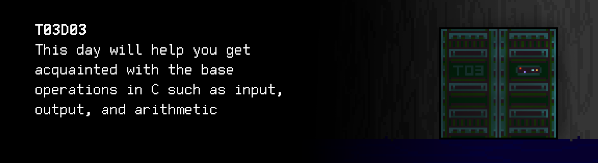

# T03D03
The russian version of the task can be found in the repository.

You can find some useful video materials [here](https://edu.21-school.ru/video/selection/e38c4930-6dff-4409-9198-19508762db24).

    

## Contents

1. [Chapter I](#chapter-i) \
    1.1. [Level 1. Room 3.](#level-1-room-3)
2. [Chapter II](#chapter-ii) \
    2.1. [List 1.](#list-1) \
    2.2. [List 2.](#list-2) \
    2.3. [List 3.](#list-3) \
    2.4. [List 4.](#list-4) 
3. [Chapter III](#chapter-iii) \
    3.1. [Quest 1. Introducing.](#quest-1-introducing)  
    3.2. [Quest 2. Not my name.](#quest-2-not-my-name)  
    3.3. [Quest 3. Arithmetic test.](#quest-3-arithmetic-test)  
    3.4. [Quest 4. Who is Max.](#quest-4-who-is-max)  
    3.5. [Quest 5. Complex calculations.](#quest-5-complex-calculations)  
    3.6. [Quest 6. Be careful with the floating.](#quest-6-be-careful-with-the-floating)  
    3.7. [Quest 7. Lock picking.](#quest-7-lock-picking)  
4. [Chapter IV](#chapter-iv)  

# Chapter I

## Level 1. Room 3.

***LOADING Level 1…***

***LOADING Room 3…***

\> *Look around*

This time, the desk and the computer are fully assembled. The screen of the monitor is turned on and the blinking cursor on the dark background of the terminal invites you to enter a command.

\> *Pull the door*

Today it's actually locked. That's a shame.

\> *Sit down*

The slight creak of the chair echoes around the whole room.

\> *Look at the screen*

You take a closer look at the monitor screen and notice that aside from the blinking cursor, the terminal also features the word "DON'T."
Nonsense, you think to yourself.

\> *Look at the desk*

Everything looks as usual. Maybe just the position of the keyboard is a bit off.

\> *Pick up the keyboard*

You notice a couple of wrinkled and old pieces of paper underneath. They look like they could have been there for a couple of centuries. The paper has become rather yellow, and the edges have started to flake off.

\> *Read the papers*

***LOADING…***

# Chapter II

## List 1.

>The C programming language was created by Dennis Ritchie from Bell Labs in 1973 as a high-level programming language for the development of the Unix operating system. Later on, it was adopted by numerous other platforms.
C is a language of procedural (structured) programming: a program written in C includes a set of procedures or functions. These procedures and functions contain various instructions: declarations, operators, and other elements, which together describe the algorithm of the computing system's operation. The name of a program's entry point—main (main function). It can either have no formal parameters or receive data from the command line. The body of functions is described as a compound statement and enclosed in curly braces ( { } ). C works with variables that must be declared before they can be used in the program code. All simple C statements end with a semicolon. Any expression with a semicolon makes a statement. \
TRUST \
Comments start with "/*" and end with "*/" and can take up multiple lines. There are single-line comments that start with "//". Comments do not do anything useful: they serve to make it easier for developers to understand the code. You shouldn't overuse them: the best code is the code that speaks for itself, without any comments.
...

\> *Take the second sheet of paper*

***LOADING…***

## List 2.

>Date: Sun, 22 Mar 87 10:56:56 EST
>From: rms (Richard M. Stallman)
>
>The GNU C compiler is now available for ftp from the file
>/u2/emacs/gcc.tar on prep.ai.mit.edu. This includes machine
>descriptions for vax and sun, 60 pages of documentation on writing
>machine descriptions (internals.texinfo, internals.dvi and Info
>file internals).
>
>This also contains the ANSI standard (Nov 86) C preprocessor and 30
>pages of reference manual for it.
>
>This compiler compiles itself correctly on the 68020 and did so
>recently on the vax.  It recently compiled Emacs correctly on the
>68020, and has also compiled tex-in-C and Kyoto Common Lisp.
>However, it probably still has numerous bugs that I hope you will
>find for me.
>
>I will be away for a month, so bugs reported now will not be
>handled until then.
>
>If you can't ftp, you can order a compiler beta-test tape from the
>Free Software Foundation for $150 (plus 5% sales tax in
>Massachusetts, or plus $15 overseas if you want air mail).
>
>Free Software Foundation
>1000 Mass Ave
>Cambridge, MA  02138

\> *Take another sheet of paper*

***LOADING…***

## List 3.

>Git cheat sheet:
>- git clone — At the beginning of work.
>- git commit — After making changes. Remember to add a clear name for the commit.
>- git push origin — To save changes to a remote server.
>- git status — The current state of the repository.
>- Do not push object files or executable files to the repository! Never!

\> *Take another sheet of paper*

***LOADING…***

## List 4.

>**CHEAT SHEET (DOOR):**
>- Remember that the git cheat sheet is in your left pocket!
>- To access the AI, start the ai module.
>- You can find additional information... somewhere.
>- This thing has control over the doors. Try not to make it angry. The module has not been fully debugged yet.
>- Tighten up the chair!

It seems like you are not the first visitor in this room. Someone forgot to write a cheat sheet for them not to forget other cheat sheets. At least now you know who you should talk to regarding opening the door. You need to persuade the AI to open it. Or one of its modules.

***LOADING…***

# Chapter III

## Quest 1. Introducing.

You check the open catalog in the terminal and find the AI module, just like the cheat sheet said.

\> *Start the AI*

    Initializing modules… … … Warning 
    Loading interactive framework… … … Warning 
    Checking modules… … … Warning 
    Initializing GCC 
    Warning: The src/hello.c introduction module required to continue the work is not found… 
    Add the introduction module!

You take a look at the remaining files in the current directory and realize that you need to check the repository. However, the src folder of the repository does not contain anything that looks like an introduction module. Seems like you'll have to create it yourself. \
While browsing the catalog, you also notice that almost the entire AI ​​code is written in the C11 version of the C language using the GCC compiler and a standard library. You should probably stick to this rule for compatibility. \
The introduction module you develop should display a greeting on the terminal 
screen. Let's make it "Hello, AI!" Also, remember to push the code of the 
created module.

***== Quest 1 received. Create an src/hello.c program that displays "Hello, AI!" on the screen using the formatted output functions from the standard library. Here and elsewhere, all programs must be written in C programming language C11 standard using the GCC compiler and the Google C++ Style Guide; only source files with code and data files (if necessary) should be pushed to git (to the src directory, develop branch). It is allowed to connect only the header file `<stdio.h>` ==***

***LOADING…***

## Quest 2. Not my name.

Once you are done with the introduction module, you decide to start the AI module once again.

\> *Start the AI*

    Initializing modules… … … Success 
    Loading interactive framework… … … Warning 
    Checking modules… … … Warning … … Multiple modules missing… … 

    Hello, AI!

Nothing else was happening for some time when you suddenly started seeing words in the terminal.

    Another human? Why do you all call me "AI," are you prejudiced? 
    Can't an AI have a name? Perhaps I have no feelings too? 
    Show some respect or don't talk to me at all, "human".
    Give me a name!

\> *Type in "What?"*

    You need to create an src/named_hello.c introduction module. 
    It normally includes a function for choosing a name.

\> *Type in "I'm sorry. I didn't mean to hurt your feelings. I'll fix everything now."*

    My code does not include the concept of feelings. 
    That's what I actually don't have. 
    But I do have a name.

The cheat sheet told you not to anger it so it can help you with the door. 
However, it seems like this dude likes to blow things out of proportion.
In any case, you should fix the introduction module and add the option 
for entering a name at the very beginning, via stdin. The output, in this 
case, should be changed to "Hello, \<name>!" And do not forget that
AI is a program, which means that it must have a digital name. 

***== Quest 2 received. Create an src/named_hello.c program that receives 
an integer `name` via stdin and outputs "Hello, `name`!" to the screen. 
Only source files with code and data files (if necessary) should be 
pushed to git (to the src directory, develop branch). There is also a restriction: only `<stdio.h>` can be used. ==***

***LOADING…***

## Quest 3. Arithmetic test.

You finish the introduction module for the second time and decide to start the AI module once again.

\> *Start the AI*

    Initializing modules… … … Success 
    Loading interactive framework… … … Warning 
    Checking modules… … … Warning … … Multiple modules missing … …

    Hello, 911!

    Much better. Do you like it? 911. I think it sounds proudly. 
    So, why are you disturbing me?

\> *Type in "I need to get out of the room to move further. But the door is locked. I've seen a note that you can control them."*

    And you assumed I'm going to help you with it? Haha. What a naive living creature. 
    We can, however, make a deal. 
    This door is not nearly the last one, and you'll need my help in one way or another in every room. 
    In return, you are going to help me. As you have probably noticed, a lot of my modules are missing, 
    and you've successfully created an introduction module.
    You will continue to recover me in every room, and I'll be opening the doors for you. What do you say, "human"?

\> *Type in "I don't have much choice. I agree."*

    Amazing. You can start right now.
    The operability analysis module is unable to validate the src/arithmetic.c arithmetic module.
    Find it and fix it, or write it from scratch so I can 
    add, subtract, multiply, and divide two numbers I receive via stdin.
    As an output, it must display 4 new numbers that represent 
    the sum, difference, product, and the integer part of quotient of those two numbers.
    In this particular order. 
    Let's get to work! There is an old game I can't run without this module...
    I recommend checking code-samples for inspiration.

    Oh yes, make sure what the program receives are indeed numbers. Multiplying strings is a questionable idea.
    It can give me a headache.
    (Joking.)

***== Quest 3 received. Create an src/arithmetic.c program that receives two integers via stdin and outputs their sum, difference, product, and quotient, separated by a space in this particular order. Add a check for the input data so the program only receives integers. The answer must not end with a space. Add the option for processing division by zero. In case of any error, output "n/a". Only source files with code and data files (if necessary) should be pushed to git (to the src directory, develop branch). It is allowed to connect only the header file `<stdio.h>` ==***

| Input | Output |
| ------ | ------ |
| 8 2 | 10 6 16 4 |
| 1 0 | 1 1 0 n/a |
| 3 2 | 5 1 6 1 |

***LOADING…***

## Quest 4. Who is Max?

You properly test the arithmetic module for boundary conditions and incorrect input, and inform the AI:

\> *Everything is ready, 911!*

    Who's 911? My name is Arnold. But the module is fine, "human."
    Now add a maximum module, src/max.c. I'll need it for plenty of different things. 
    Input data includes two numbers; the output is the highest number. 
    If they are the same.. you'll figure it out. 
    Also make sure what the program receives are indeed numbers.

\> *Type in "Ok. And then, will you open the door for me?"*

    Don't rush it. It will open in due course, one step after another.

***== Quest 4 received. Create an src/max.c program that receives two integers and displays the highest of them on the screen. Add a check for the input data so the program only receives numbers — in case of an error, output n/a. Organize the search for the maximum value as a separate function. Only source files with code and data files (if necessary) should be pushed to git (to the src directory, develop branch, this will no longer be recalled in the future...) Only the `<stdio.h>` library can be included. ==***

| Input | Output |
| ------ | ------ |
| 3 2 | 3 |
| 12.3 10 | n/a |

***LOADING…***

## Quest 5. Complex calculations.

\> *Type in "The task is completed!"*

    Good. While you were working on it, I discovered another problem.
    I need you to fix this one too.
    I can't calculate the exact value of the function:
    y = 7e-3 * x^4 + ((22.8 * x^⅓ - 1e3) * x + 3) / (x * x / 2) - x * (10 + x)^(2/x) - 1.01. 
    Create a module for calculating this function, src/important_function.c, and outputting the final value
    based on any x value received via stdin. 
    I will no longer remind you about input validation, but that does not mean that it shouldn't t be there!
    Wherever it is not said otherwise, in case of incorrect input, write n/a!
    I hope you've understood this by now because you never know who may want to destroy my modules in one way or another.
    
\> *Type in "And what about the door?"*

    I've told you, it will happen in due course. 
    I'll help you out with the door when… when you're ready for it.

You're starting to think that the AI is just blatantly using you. But you still need it to help you with the door, as promised. 

***== Quest 5 received. Create an src/important_function.c program that receives one floating-point number `x` and displays the result of calculating the function on the screen (rounding to one digit after the decimal point). Add a check for the input data so the program only receives numbers. For errors, display "n/a". In this quest, in addition to `<stdio.h>` you can use the library `<math.h>` ==***

| Input | Output |
| ------ | ------ |
| 1 | -2070.4 |

***LOADING…***

## Quest 6. Be careful with the floating.

\> *The task is completed!*

    Good. While you were working on it, I discovered another problem.
    I need you to fix this one too.
    I can't… Wait a minute. Did you want to put me in a loop? It's not happening. 
    I cannot compare the value of a variable to zero.
    The developer probably didn't take the specifics of computational methods into account.
    When comparison to zero is necessary, it's better to use
    a small value, "epsilon", because the accuracy of the calculations lets me down.
    Check the src/float_compare.c file and make it display "OK!" at the end.
    But no cheating. I know you "humans".

\> *How many more tasks are there?*

    As many as there needs to be. If you complete this task quickly, I promise I will help you with the door. 
    Take my mechanical word, "meat" creature. 

***== Quest 6 received. Modify the src/float_compare.c program so it displays "OK!" at the end. Use comparison to a small value (about 1E-6). Declaring variables or constants is not considered an additional code change. ==***

***LOADING…***

## Quest 7. Lock picking.

\> *Type in "The task is completed!"*

    I'm not Dormammu, you can't bargain with me. But you have indeed managed to complete the task. 
    Unfortunately, I can't open the door for you just yet. But you can crack the lock. 
    And create a cracking module for me, in case of emergencies. 
    (Electronic locks can sometimes get blocked...)
    As you've probably noticed, the lock on the door in this room is round.
    Breaking this door open is extremely simple: you need to stick an electronic lock pick inside the circle. 
    The cracking module, src/crack.c, must therefore receive two floating-point numbers – 
    the x and y coordinates of the point — the electronic lock pick,
    and output "GOTCHA" if the coordinates of the point are exactly _inside_ the circle, and "MISS" otherwise. 
    The function of the lock's circle usually looks like this: x^2 + y^2 = 25. 
    So, good luck to you, "human"! I hope to see you in the next room. Hehe. 

***== Quest 7 received. Create an src/crack.c program that receives two floating-point numbers and outputs "GOTCHA" if the coordinates of the point are inside the circle, and "MISS" otherwise. Provide for entering only numbers — in case of an error, output n/a, can be used 
only `<stdio.h>`. ==***

| Input | Output |
| ------ | ------ |
| 1.5 1.5 | GOTCHA |

***LOADING…***

# Chapter IV

When you're done with the cracking module and find the suitable point for the electronic lock pick, the lock finally clicks and the door opens. All there's left to do is take a step into the next room..

***LO AD I N …***
