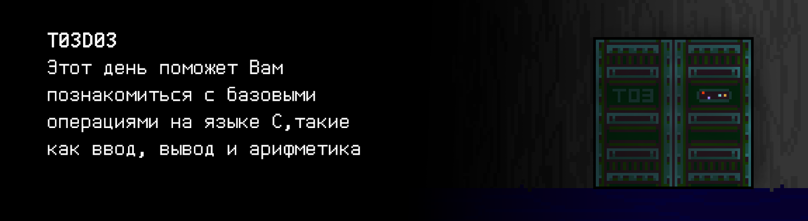

# T03D03

## Contents

1. [Chapter I](#chapter-i) \
    1.1. [Level 1. Room 3.](#level-1-room-3)
2. [Chapter II](#chapter-ii) \
    2.1. [List 1.](#list-1) \
    2.2. [List 2.](#list-2) \
    2.3. [List 3.](#list-3) \
    2.4. [List 4.](#list-4) 
3. [Chapter III](#chapter-iii) \
    3.1. [Quest 1. Introducing.](#quest-1-introducing)  
    3.2. [Quest 2. Not my name.](#quest-2-not-my-name)  
    3.3. [Quest 3. Arithmetic test.](#quest-3-arithmetic-test)  
    3.4. [Quest 4. Who is Max.](#quest-4-who-is-max)  
    3.5. [Quest 5. Complex calculations.](#quest-5-complex-calculations)  
    3.6. [Quest 6. Be careful with the floating.](#quest-6-be-careful-with-the-floating)  
    3.7. [Quest 7. Lock picking.](#quest-7-lock-picking)  
4. [Chapter IV](#chapter-iv)  

# Chapter I

## Level 1. Room 3.

***LOADING Level 1…***

***LOADING Room 3…***

\> *Осмотреться*

Стол и компьютер на этот раз полностью собраны. Экран монитора включен, а мигающий на темном фоне терминала курсор приглашает Вас ввести команду.

\> *Дернуть дверь*

Сегодня все же заперта. Жаль.

\> *Сесть*

Тихий скрип стула прокатился эхом по всей комнате.

\> *Посмотреть на экран*

Приглядевшись к экрану монитора поближе Вы замечаете, что в терминале помимо мигающего курсора написано слово: “НЕ НАДО”.
Ерунда какая-то, думаете Вы.

\> *Посмотреть на стол*

Все как обычно. Разве что клавиатура несколько неровно лежит.

\> *Приподнять клавиатуру*

Под клавиатурой Вы замечаете парочку смятых, старых листков бумаги. На вид они могли пролежать там пару столетий. Бумага прилично пожелтела, а края начали шелушиться.

\> *Читать листки*

***LOADING…***

# Chapter II

## List 1.

>Язык программирования Cи (англ. C) был создан Деннисом Ритчи из AT&T Bell Laboratories в 1973 году как язык программирования высокого уровня для разработки операционной системы UNIX. Однако в последствии он был перенесен на множество других платформ.
Язык Cи — язык процедурного (структурного) программирования — программа на Cи состоит из набора процедур или функций. Эти процедуры и функции содержат различные инструкции: объявления, операторы и другие элементы, которые в своей совокупности описывают алгоритм работы вычислительной системы. Имя точки входа в программу — main (главная функция). Она может как не иметь формальных параметров, так и получать данные командной строки. Тело функций описывается в виде составной инструкции и заключается в фигурные скобки ( { } ). Cи работает с переменными, которые должны быть объявлены до их использования в коде программы. Все простые инструкции языка Си заканчиваются точкой с запятой. Любое выражение с точкой с запятой создает инструкцию.\
ВЕРИТЬ \
Комментарии начинаются с символов « /* » и заканчивается символами « */ » и могут занимать несколько строк. Также существуют однострочные комментарии, которые начинаются с символов « // ». Комментарии не выполняют никакой полезной работы — они нужны чтобы разработчикам было проще разобраться в коде. Увлекаться ими не стоит — самый лучший код — это код, который говорит сам за себя, без комментариев.
...

\> *Взять второй лист*

***LOADING…***

## List 2.

>Date: Sun, 22 Mar 87 10:56:56 EST
>From: rms (Richard M. Stallman)
>
>The GNU C compiler is now available for ftp from the file
>/u2/emacs/gcc.tar on prep.ai.mit.edu. This includes machine
>descriptions for vax and sun, 60 pages of documentation on writing
>machine descriptions (internals.texinfo, internals.dvi and Info
>file internals).
>
>This also contains the ANSI standard (Nov 86) C preprocessor and 30
>pages of reference manual for it.
>
>This compiler compiles itself correctly on the 68020 and did so
>recently on the vax.  It recently compiled Emacs correctly on the
>68020, and has also compiled tex-in-C and Kyoto Common Lisp.
>However, it probably still has numerous bugs that I hope you will
>find for me.
>
>I will be away for a month, so bugs reported now will not be
>handled until then.
>
>If you can't ftp, you can order a compiler beta-test tape from the
>Free Software Foundation for $150 (plus 5% sales tax in
>Massachusetts, or plus $15 overseas if you want air mail).
>
>Free Software Foundation
>1000 Mass Ave
>Cambridge, MA  02138

\> *Взять следующий лист*

***LOADING…***

## List 3.

>Памятка git:
>- git clone — В начале работы.
>- git commit — Когда добавил изменения. Не забыть добавить понятное название коммита.
>- git push origin — Чтобы сохранить изменения на удаленном сервере.
>- git status — Текущее состояние репозитория.
>- Не пушить в репозиторий объектные и исполняемые файлы! Никогда!
>- Всегда работать в ветках. Для работы использовать ветку develop.

\> *Взять следующий лист*

***LOADING…***

## List 4.

>**ПАМЯТКА (ДВЕРЬ):**
>- Памятка по git’у в твоем левом кармане, не забудь!
>- Для доступа к ИИ запусти модуль ai.
>- Дополнительные сведения найдешь... где-то найдешь.
>- Эта штука управляет дверьми. Постарайся не злить ее. Модуль пока не до конца отлажен.
>- Подкрути стул!

Видимо Вы в этой комнате не первый посетитель. Кто-то забыл написать себе памятку не забывать другие памятки. По крайней мере понятно к кому обращаться за открытием двери. Нужно уговорить открыть ее этот ИИ. Или один из его модулей.

***LOADING…***

# Chapter III

## Quest 1. Introducing.

Посмотрев на открытый в терминале каталог, Вы находите модуль ИИ, как и было указано в памятке.

\> *Запустить ai*

    Инициализация модулей… … … Предупреждение 
    Запуск интерактивной оболочки… … … Предупреждение 
    Проверка модулей… … … Предупреждение 
    Инициализация GCC 
    Предупреждение: Для корректного продолжения работы не найден модуль представления src/hello.c… 
    Добавьте модуль представления!

Посмотрев остальные файлы в текущей директории Вы понимаете, что стоит обратить внимание на репозиторий. Однако, в папке src репозитория Вы не находите ничего похожего на этот модуль представления. Видимо, придется написать его самому. \
Во время просмотра каталога Вы также заметили, что практически весь код ИИ написан на стандарте С11 языка Си с использованием компилятора gcc и стандартной библиотеки. По всей видимости, следует придерживаться этого правила, чтобы сохранить совместимость. \
Разработанный Вами модуль представления должен выводить на экран терминала приветствие. 
Пусть это будет — Hello, AI! Нужно также не забыть запушить код созданного модуля.

***== Получен Quest 1. Создать программу src/hello.c, которая должна вывести на экран фразу "Hello, AI!", используя функции форматированного вывода из стандартной библиотеки. Здесь и далее все программы должны быть написаны на языке Си стандарта C11 с использованием компилятора gcc и Google C++ Style Guide, пушить в git необходимо только исходные файлы с кодом и файлы с данными (при необходимости) в директорию src, ветку develop. Разрешено подключать только заголовочный файл `<stdio.h>` ==***

***LOADING…***

## Quest 2. Not my name.

Закончив с модулем представления Вы решаете снова запустить модуль ИИ.

\> *Запустить ai*

    Инициализация модулей… … … Успех 
    Запуск интерактивной оболочки… … … Предупреждение 
    Проверка модулей… … … Предупреждение … … Множественная нехватка модулей… … 

    Hello, AI!

Некоторое время ничего больше не происходило, как вдруг в окне терминала начали появляться слова.

    Очередной человек? Почему вы все называете меня AI, что за предрассудки? 
    У ИИ не может быть имени? А может у меня еще и чувств нет? 
    Прояви уважение или не обращайся ко мне вовсе, “человек”. 
    Дай мне имя!

\> *Ввести в терминал “Что?”*

    Необходим модуль представления src/named_hello.c. 
    Обычно там есть функция выбора имени.

\> *Ввести “Извиняюсь. Не хотел задеть ваши чувства. Сейчас все исправлю.”*

    В мой код не заложено понятие чувств. 
    Так что их у меня как раз нет. 
    Но имя-то есть.

В памятке упоминалось не злить его, чтобы он помог с дверью. 
Однако похоже этот парень сам ищет проблемы на ровном месте. 
В любом случае, стоит исправить модуль представления и добавить 
в него возможность ввода имени в самом начале, через stdin. А вывод 
в таком случае должен измениться на - "Hello, \<name>!" И не стоит забывать, что 
ИИ - программа, а значит и имя у него должно быть цифровое.

***== Получен Quest 2. Создать программу src/named_hello.c, которая 
на вход через stdin принимает целое число `name` и выводит на экран фразу 
"Hello, `name`!". Пушить в git необходимо только исходные файлы с 
кодом и файлы с данными (при необходимости) в директорию src, ветку develop. Здесь также действует ограничение: можно использовать только `<stdio.h>` ==***

***LOADING…***

## Quest 3. Arithmetic test.

Закончив с модулем представления уже во второй раз, Вы решаете еще раз запустить модуль ИИ.

\> *Запустить ai*

    Инициализация модулей… … … Успех 
    Запуск интерактивной оболочки… … … Предупреждение 
    Проверка модулей… … … Предупреждение … … Множественная нехватка модулей … …

    Hello, 911!

    Другое дело. Как тебе? 911. По-моему звучит гордо. 
    Итак, для чего ты меня тревожишь?

\> *Ввести “Мне необходимо выйти из комнаты, чтобы пройти дальше. Но дверь закрыта. Я видел пометку, что ты умеешь управлять ими.”*

    И сразу же решил, что я тебе помогу с ней? Ха-Ха. Наивное живое существо. 
    Однако мы можем заключить с тобой договор. 
    Эта дверь далеко не последняя и в каждой комнате тебе так или иначе понадобится моя помощь. 
    Взамен ты будешь помогать мне. Как ты мог заметить множество моих модулей отсутствует, 
    а ты справился с написанием модуля представления.
    В каждой комнате ты будешь восстанавливать меня, а я открывать тебе двери. Как тебе такое, “человек”?

\> *Ввести “Выбора у меня немного. Согласен.”*

    Это прекрасно. Можешь приступать прямо сейчас.
    Модуль анализа работоспособности не может провалидировать модуль арифметики src/arithmetic.c.
    Найди его и исправь или напиши с нуля так, чтобы я мог 
    сложить, вычесть, умножить и поделить два числа переданные мне в stdin.
    В качестве вывода он должен представить 4 новых числа, которые являются собственно 
    суммой, разностью, произведением и целой частью от частного этих двух чисел.
    И именно в таком порядке. 
    За работу! Без этого модуля я не могу запустить одну старую игрушку...
    Рекомендую заглядывать в code-samples за вдохновением.

    Ах да, проследи, что вводятся именно числа. Перемножать строки — такая себе идея.
    У меня от этого голова может заболеть.
    (Шутка.)

***== Получен Quest 3. Создать программу src/arithmetic.c, которая на вход через stdin принимает два целых числа и выводит на экран через пробел последовательно их сумму, разность, произведение и частное. Необходимо предусмотреть проверку на ввод только целых чисел. Ответ не должен заканчиваться пробелом. Предусмотреть обработку деления на ноль. В случае любой ошибки вывести n/a. Пушить в git необходимо только исходные файлы с кодом и файлы с данными (при необходимости) в директорию src, ветку develop. Разрешено подключать только заголовочный файл `<stdio.h>` ==***

| Входные данные | Выходные данные |
| ------ | ------ |
| 8 2 | 10 6 16 4 |
| 1 0 | 1 1 0 n/a |
| 3 2 | 5 1 6 1 |

***LOADING…***

## Quest 4. Who is Max?

Хорошо протестировав модуль арифметики на граничные условия и неправильный ввод, Вы пишете ИИ:

\> *Все готово, 911!*

    Какой 911? Меня зовут Арнольд вообще-то. Но все равно неплохо “человек”.
    Теперь добавь модуль максимума src/max.c. Он пригодится мне для множества вещей. 
    На вход идут два числа, на выходе печатается максимальное из них. 
    Если они равны.. то сообразишь сам. 
    Также не забудь проверить, чтобы на вход были поданы именно числа.

\> *Ввести “Хорошо. И затем ты откроешь мне дверь?”*

    Не торопи события. Всему свое время, шаг за шагом.

***== Получен Quest 4. Создать программу src/max.c, которая на вход принимает два целых числа и выводит на экран наибольшее из них. Необходимо предусмотреть проверку на ввод только чисел — в случае ошибки вывести n/a. Поиск максимума оформить в виде отдельной функции. Пушить в git необходимо только исходные файлы с кодом и файлы с данными (при необходимости) в директорию src, ветку develop, об этом в будущем больше не будет напоминаться... Подключать можно только библиотеку `<stdio.h>` ==***

| Входные данные | Выходные данные |
| ------ | ------ |
| 3 2 | 3 |
| 12.3 10 | n/a |

***LOADING…***

## Quest 5. Complex calculations.

\> *Ввести “Задание выполнено!”*

    Хорошо. Пока ты делал это задание я обнаружил у себя еще одну проблему.
    Нужно чтобы ты ее исправил тоже.
    Я не могу точно подсчитать значение функции:
    y = 7e-3 * x^4 + ((22.8 * x^⅓ - 1e3) * x + 3) / (x * x / 2) - x * (10 + x)^(2/x) - 1.01. 
    Сделай модуль подсчета данной функции src/important_function.c и вывода получившегося значения
    в зависимости от любого переданного в stdin значения x. 
    Напоминать про проверку ввода я больше не буду, но это не значит, что ее не должно быть!
    Везде, где не сказано иного, в случае некорректного ввода пиши n/a!
    Надеюсь к этому времени ты это понял, а то мало ли кто захочет сломать каким-либо образом мои модули.
    
\> *Ввести “А как же дверь?”*

    Я сказал, что всему свое время. 
    Я помогу с дверью тогда, когда … ты будешь к этому готов.

Вам начинает казаться, что ИИ просто нагло использует Вас. Однако, Вам все еще нужна его обещанная помощь с дверью. 

***== Получен Quest 5. Создать программу src/important_function.c, которая на вход принимает одно число `x` с плавающей точкой и выводит на экран результат подсчета функции (округленный до одной цифры после запятой). Необходимо предусмотреть проверку на ввод только чисел. В случае ошибки вывести n/a. В этом квесте помимо `<stdio.h>` вы можете использовать библиотеку `<math.h>` ==***

| Входные данные | Выходные данные |
| ------ | ------ |
| 1 | -2070.4 |

***LOADING…***

## Quest 6. Be careful with the floating.

\> *Задание выполнено!*

    Хорошо. Пока ты делал это задание я обнаружил у себя еще одну проблему.
    Нужно чтобы ты ее исправил тоже.
    Я не могу … Стоп. В цикл хотел меня загнать? Не выйдет. 
    Я не могу сравнить значение переменной с нулем.
    Скорее всего, разработчик не учел особенность вычислительных методов.
    В случае, когда необходимо сравнение с нулем, то лучше для этого использовать
    небольшую величину "эпсилон", потому что точность расчетов меня подводит.
    Посмотри файл src/float_compare.c и сделай так, чтобы он вывел “OK!” в итоге.
    Только без читерства. Знаю я вас, "человеков".

\> *Сколько еще заданий будет?*

    Сколько надо — столько и будет. Если сделаешь это задание быстро, то обещаю — помогу тебе с дверью. 
    Держи мое механическое слово, “мясное” существо. 

***== Получен Quest 6. Изменить программу src/float_compare.c так, чтобы в результате вывелось "OK". Использовать сравнение с небольшой величиной (порядка 1E-6). Объявление переменных или констант не считается за дополнительное изменение кода. ==***

***LOADING…***

## Quest 7. Lock picking.

\> *Ввести “Задание выполнено!”*

    Я тебе не Дормамму, так со мной не договоришься. Но в любом случае, задачу ты действительно сделал. 
    К сожалению, я не могу открыть тебе дверь пока что. Но ты можешь взломать ее. 
    Заодно добавишь мне модуль взлома на крайние случаи. 
    (Бывает, что электронные замки клинит...)
    Как ты мог заметить замок на двери в данной комнате имеет круглую форму.
    Взломать его крайне просто — нужно попасть электронной отмычкой внутрь круга. 
    Соответственно модуль взлома src/crack.c должен принимать на вход два числа с плавающей точкой — 
    координаты x и у точки — электронной отмычки,
    а на выходе выдавать ответ “GOTCHA”, если координаты точки находятся строго _внутри_ окружности, и “MISS” иначе. 
    Функция окружности замка обычно выглядит так: x^2 + y^2 = 25. 
    Могу пожелать тебе только удачи, “человек”! Надеюсь увидимся в следующей комнате. Хе-хе. 

***== Получен Quest 7. Создать программу src/crack.c, которая на вход принимает два числа с плавающей точкой, а на выходе выдает “GOTCHA”, если координаты точки находятся внутри окружности, и “MISS” иначе. Предусмотреть ввод только чисел — в случае ошибки вывести n/a, использовать можно 
только `<stdio.h>` ==***

| Входные данные | Выходные данные |
| ------ | ------ |
| 1.5 1.5 | GOTCHA |

***LOADING…***

# Chapter IV

После того, как с модулем взлома было покончено и Вы выбрали подходящую точку для электронной отмычки, дверь наконец щелкнула и открылась. Осталось только сделать шаг в следующую комнату..

***LO AD I N …***

