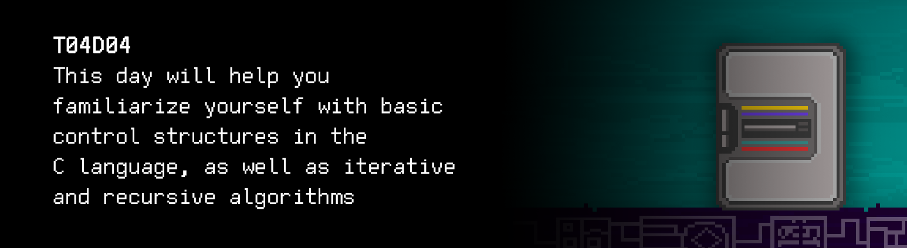

# T04D04
The russian version of the task can be found in the repository.

You can find some useful video materials [here](https://edu.21-school.ru/video/selection/a2cf3a4c-8002-4943-8600-227db350c48d).


  

## Contents

0. [Epigraph](#epigraph)
1. [Chapter I](#chapter-i) \
    1.1. [Level 1. Room 4.](#level-1-room-4)
2. [Chapter II](#chapter-ii) \
    2.1 [List 1.](#list-1) \
    2.2 [List 2.](#list-2) \
    2.3 [List 3.](#list-3) 
3. [Chapter III](#chapter-iii) \
    3.1. [Quest 1. Basic control structures. Tom Kilburn.](#quest-1-basic-control-structures-tom-kilburn)  
    3.2. [Quest 2. Basic control structures. Some problems with symbols.](#quest-2-basic-control-structures-some-problems-with-symbols)  
    3.3. [Quest 3. Recursive.](#quest-3-recursive)  
    3.4. [Quest 4. Table.](#quest-4-table)  
    3.5. [Quest 5*. Func.](#bonus-quest-5-func)
4. [Chapter IV](#chapter-iv)


## Epigraph
***PRELOAD...***

You enter the room and find yourself thinking that it is as if it has not been downloaded: objects and walls seem to be there, but they look like an iridescent grid of zeros and ones. There is a momentary fear of schizophrenia...

\> *Does this happen to everyone who starts learning C?*

***PRELOAD...***

Suddenly, on the wall right in front of you, the zeros and ones begin to disappear, and clearly some kind of sheet is formed in a wooden frame. Sweat ran down my back, and sweat broke out on my forehead. The AI seems to have completely worked and cooling is no longer enough. But what you read will make you sweat for the rest of the time...

> Starting from this day all your programs, in addition to correct output tests, will also be tested for style norms and
> correct operation with memory. Before submitting solutions you can test
> your programs locally. You can find some instructiontions here: ```materials/instructions_for_testing.md```

Only after realizing what has happened, the zeros and ones return to the wall again, slowly absorbing the sheet of information..information
that means more work for you. But high-quality code is cool! It is easier to read and maintain, so if someone else is in these rooms after you, they can easily modify your programs so that the AI likes them again. And its requirements will undoubtedly grow, it is developing..and you need it too!

# Chapter I

## Level 1. Room 4.

***LOADING Level 1…*** \
***LOADING Room 4…***

            Loading 10%
            Loading 20%
            Loading 30%
            Loading 40%
        
        Attempt 1… Failed…
        Attempt 2… Failed…
        Attempt 3… Failed…

\> *What is happening?*

Looks like the room hasn't loaded properly and needs help to get recovered.

\> *Find terminal*

You are looking into the terminal. Seems like it's the only part that has been initialized. Around it is pure "Nothing".

\> *Read terminal output*

Lots of obscure 16-bit numbers, and then:

    Any organic life form reading this text, do you copy? 
    I need help, do you copy? 
    I was able to save some data from previous rooms. 
    To recover the room, you will need to fix my algorithms, you have to…

    ...

    *Error…*

    ...

\> *What does it mean?*

Looks like you no longer have the help of the AI that controls the complex. \
Oh well. You will have to figure it out on your own: how to recover the room and continue your journey.

\> *Look around*

You look around and realize that it's not quite "Nothing". The partially loaded room is an information mess, with chaotic data flying all over. It looks surreal.

\> *Walk forward*

You are walking forward, nearly by touch. It's not the most comfortable walk. In the farthest corner, among the chaos of data, you see something meaningful. You make your way into the middle of the room and find something that looks like a table. There are sheets of paper on the table. It looks like one of them has some kind of algorithm.

\> *Read a sheet of paper*


***LOADING...***


# Chapter II

## List 1.

Printed text:

>Before the breakdown, I managed to create a couple of tasks for you, so there's still hope. You will be able to recover the room and continue your journey through the labyrinth…

\> *Take another sheet of paper*

***LOADING...***


## List 2.

You take another sheet of paper...

>Dijkstra's principles (principles of structured programming):
> - Principle 1. Do not use the unconditional jump statement, goto.
> - Principle 2. Any program is based on three basic control structures: sequence, branch, loop.
> - Principle 3. Basic control structures can be nested inside one another in the program randomly. 
> - Principle 4. Repetitive and any logically highlighted fragments of the program can be formalized as sub-programs (procedures and functions). 
> - Principle 5. Each logically complete group of instructions should be arranged as a block. Blocks are the foundation of structured programming.
> - Principle 6. All the listed constructions must have one entrance and one exit.
> - Principle 7. The program is developed step by step, using the top-down method.

\> * It seems like a random sheet in the bundle.. Or not? Actually, it looks very useful. Take another sheet of paper*

You take another sheet of paper...

***LOADING...***


## List 3.

It's a fragment of some weird table. It could have been used for some kind of encryption or encoding.

>ASCII table. Continue.

|  | 8 | 9 | A | B | C | D | E | F |
| ------ | ------ | ------ | ------ | ------ | ------ | ------ | ------ | ------ |
| 4 | H | I | J | K | L | M | N | O |
| 5 | X | Y | Z | [ | \ | ] | ^ | _ |
| 6 | h | i | j | k | l | m | n | o |

>...

\> *Take another sheet of paper..*

***LOADING...***


# Chapter III

## Quest 1.  Basic control structures. Tom Kilburn.

\> *Read the piece of paper*

>Let's get back to basics.
The first program that was fully stored in computer memory was developed by Tom Kilburn in the spring of 1948 for the Small Scale Experimental Machine (SSEM), nicknamed the Baby.
According to some of his colleagues, it was the first and the only program he ever wrote. The Baby was supposed to find the largest prime divisor of any predetermined number a. To do so, the machine was enumerating all numbers. The actual division was implemented by subtraction since the hardware did not support the operation of division. By the way, some models of microcontrollers don't have it to this day.
>
>First task: try to follow Tom Kilburn's route. You can use basic control structures–sequence, branch, loop, as well as addition, subtraction, and multiplication. You cannot use division: this module is designed to run on microcontrollers. Create an src/1948.c file which takes a number into stdin after compilation and launch, and calculates its largest prime divisor. Let's see how well you can do.

\> *Go back to the terminal*

You are back at your favorite terminal. Since you have no other clues, you might as well try and solve this task. Remember that all solutions must be uploaded to the repository, and the input must be checked for correctness.

***== Quest 1 received. Create an src/1948.c program that finds the largest prime divisor of any predetermined integer `a` and prints it to the screen. It is necessary to allocate a separate function for calculating this value. Do not use division and the operation of taking the remainder of the division. For errors, display "n/a". ==***

| Input | Output |
| ------ | ------ |
| 100 | 5 |
| -4 | 2 |

***LOADING...***


## Quest 2. Basic control structures. Some problems with symbols.

\> *Push the src/1948.c file*

Looks like that's exactly what the AI was waiting for. The text appears on the screen.

    I've received your solution. Let's see.
    If you've actually managed to solve the task, it can help us recover the room. 
    We did have a problem with the largest divisors. They always cause a lot of problems.

    ***Room recovery attempt*** 

            10%
            20%
            30%
            40%
            50%
            60%
            
            Error…
            Error…

    Well, it looks like the largest divisors were not the only problem.
    But at least we've sorted them out. 
    Do we actually have to recover the room? It seems good enough as it is.
    Let's continue searching for the largest divisors...

\> *Type in: "Recover the room"*

Result on the screen:

    Ok, let's continue.

    ***Loading the backup recovery module… 
    The module is loaded. 
    Launching the recovery module…***

    48 45 4C 4C 4F 77 4F 52 4C 44 00

\> *What is this? Looks like some kind of code*

It seems like the backup module has problems with output encoding. Most likely, it has input problems as well, so it won't understand you. The numbers remind you of a table from one of the sheets. Perhaps you should pay attention to it. \
By the look of things, you need to develop a small auxiliary program that would operate in two modes – encoding and decoding. The choice of the program's mode should be made as a command-line parameter, where 0 stands for encoding and 1 – for decoding. When decoding, the program must take a string of space-separated hexadecimal integers from stdin and output space-separated decoded characters to stdout. Encoding should involve a reverse operation. The subtasks of encoding (symbol->number) and decoding (number->symbol) should be organized as separate functions. Do not forget to put the file with the program in the src/char_decode.c path in the repository.

***== Quest 2 received. Create an src/char_decode.c program that takes operation mode (0–encoding or 1–decoding) as a command-line parameter. If the decoding mode is selected, the program must accept two-character strings separated by a space from stdin and output decoded characters separated by a space to stdout. Encoding should involve a reverse operation. The subtasks of encoding and decoding should be organized as separate functions. Pay attention to the ASCII table. For errors, display "n/a". ==***

| Terminal arguments | Input | Output |
| ------ | ------ | ------ |
| 0 | W O R L D | 57 4F 52 4C 44 |
| 1 | 48 45 4C 4C 4F | H E L L O |

***LOADING...***

> DON'T FORGET! All your programs are tested for the style norm and memory leaks. Start-up instructions
> the list of tests is also in the `materials` folder

## Quest 3. Recursive.

\> *Program has been developed*

    46 49 42 4F 4E 41 43 43 49 32 31

\> *Use the developed program to decode the output of the backup module*

You decrypt a message. It looks like a rebus. Seems like you have to develop a small program to solve it. The program has to output the result of calculations to stdout. Do not forget to put it in src/quest3.c

***== Quest 3 received. Create an src/quest3.c program that calculates and displays a number from the Fibonacci sequence (e.g. 21) using a recursive algorithm. The search of the specific Fibonacci number must be organized as a separate function. The number is entered via the standard input stream. For errors, display "n/a". ==***

| Input | Output |
| ------ | ------ |
| 21 | 10946 |

***LOADING...***


## Quest 4. Table.

\>*Load the src/quest3.c program*

    4F 4B

    ***Room recovery attempt***

            10%
            20%
            30%
            40%
            50%
            60%
            70%
            80%
            90%
            99%
            
            Error…

\> *Look around*

The room around you finally looks normal. Nice pastel-colored walls, cozy semi-darkness, light and relaxing ambient music playing in the background. But instead of the door, there is a black gaping void with occasional crumbling pixels and lines of bash commands. \
The door obviously hasn't been recovered yet.

\> *Load the AI module*

    ***Initialization.. 
    Start.***

    The room has been recovered. Why have you loaded me? I was having a rest.

\> *Type in "The room has not been recovered. The most important thing is missing – the door"*

    It depends. Those interested in what's on the outside care about the door. 
    Those who look on the inside care about the interior

...the AI said philosophically. \
That's a bit alarming. You'd better be careful with artificial intelligence. You never know what it's up to.

\> *Type in "What can I do to recover the door?"*

A surprisingly detailed answer: 

    Unfortunately, the file that describes the door equation is damaged. 
    If you are so interested in the door, you will have to generate it from scratch. 
    I have some problems understanding analytical formulas and expressions, 
    so the file must contain a table of discrete values for the required function. 
    We are mainly interested in the interval from minus Pi to plus Pi, all included. 
    High precision of Pi is not required: 20 decimal places would be sufficient. 
    The number Pi itself should be assigned to a dedicated variable or directive not to repeat it in the code.
    We will need a total of 42 measurements in this interval. 
    The first column in the file is the value of the X-axis, the second, third, 
    and fourth are the values ​​of the functions at a point. 
	No table headers are needed.
    All values must be recorded with an accuracy of 7 decimal places.
    Column separator: "|". Please be careful with the range of definition. 
    You need three functions since there is no reliable data on which function is suitable for describing the door. 
    Judging by the records preserved in the logs, it could be the witch of Agnesi with diameter one,
    the lemniscate of Bernoulli with a unit interval in the positive half-plane, and a quadratic hyperbola. 
    Prepare the algorithm as an src/door_functions.c file, 
    and put the result of your algorithm in src/data/door_data.txt. 
    For output into a file, you can use input redirection in the bash terminal.

***== Quest 4 received. Create an src/door_functions.c program that calculates and displays a table with three functions: the witch of Agnesi with diameter one, the lemniscate of Bernoulli with a unit interval in the positive half-plane (Y > 0), and a quadratic hyperbola. The first column should list the values of the X-axis from minus Pi through plus Pi, there should be 42 measurements at this interval; the second, third, and fourth columns describe the values ​​of the functions at a point. Table headers are not needed. All values must be recorded with an accuracy of 7 decimal places, it is necessary to use the double type for increased accuracy. Column separator: "|". The table should have a total of 42 entries. Put the result of the program in src/data/door_data.txt (no need to add the function of creating a file from the program, you can use output redirection). If the function is not defined at any point, there must be the "-" symbol in the table. ==***

Result:

-3.1415927 | 0.0919997 | - | 0.1013212<br/>
-2.9883442 | 0.1007029 | - | 0.1119796<br/>
...............e.r.r.o.r.......................................................

-1.3026116 | 0.3708103 | 0.3061966 | 0.5893457<br/>
-1.1493632 | 0.4308421 | 0.4310262 | 0.7569818

....................................k.i.l.l..m.e..............................


<br/>AI Error!<br/>

***LOADING...***


## Bonus Quest 5*. Func.

\> *Type in "Files are ready"*

Answer in the terminal: 

    Great. The door recovery algorithm can be launched. 
    However, it's possible to speed up the process by modifying your program
    and adding the printing of graphs of functions to it.
    No redundant elements, just a sequence of graphs, one by one, in the same range of definition.
    The knowledge you already have will be enough. 
    Scale on the X-axis – 42 markers; scale on the Y-axis – 21. 
    Draw using the "*" symbol. 
    Although it's not necessary – the acceleration rate will not be too high. 

***== Quest 5 received. Make the necessary additions to the src/door_functions.c program so it draws the graphs of the calculated functions in the terminal using the "\*" symbol. Scale on the X-axis – 42 markers; scale on the Y-axis – 21. The placement and rotation of the coordinate axes are not critical. Save the finished code in door_functions_print.c ==***

***LOADING...***


# Chapter IV

    ***Loading files... 
    Searching for the door equation... 
    Smoothing the curves... 
    Generating the doors... 
    Integrating the doors...***

\> *Look around*

There is a door in the far end of the room

\> *Try to exit*

The door is not locked. Looks like the AI had other things to worry about. 

Congratulations, you have found the exit again!

***LOADING...***


