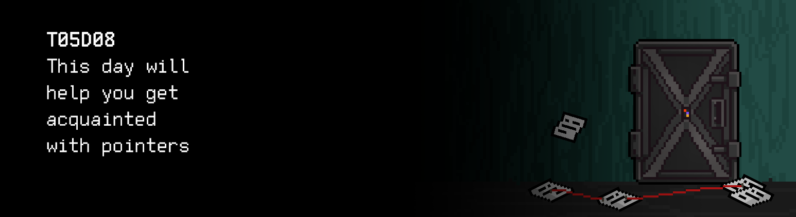
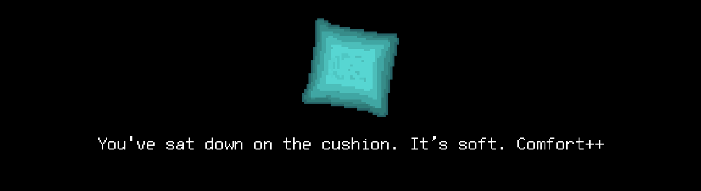

# T05D08
The russian version of the task can be found in the repository.

You can find some useful video materials [here](https://edu.21-school.ru/video/selection/5d943ff8-2aba-4808-9aca-346080a11442).

## Contents

1. [Chapter I](#chapter-i) \
 1.1. [Level 2. Room 1.](#level-2-room-1) 
2. [Chapter II](#chapter-ii) \
 2.1. [List 1. Pointer.](#list-1-pointer) \
 2.2. [List 2. Listing.](#list-2-listing) \
 2.3. [List 3. Operations.](#list-3-operations) \
 2.4. [List 4. Array.](#list-4-array) \
 2.5. [List 5. Equality.](#list-5-equality) 
3. [Chapter III](#chapter-iii) \
 3.1.  [Quest 1. Arguments and pointers.](#quest-1-arguments-and-pointers) \
 3.2.  [Quest 2. Data I/O.](#quest-2-data-io) \
 3.3.  [Quest 3. Data metrics.](#quest-3-data-metrics) \
 3.4.  [Quest 4. Search.](#quest-4-search) 
4. [Chapter IV](#chapter-iv)

# Chapter I

## Level 2. Room 1.

***LOADING Level 2… \
LOADING Room 1…***

The first level was not easy, but you still managed to get out. It's hard to say if the new level of this labyrinth is different from the previous one or not. Perhaps the color of the walls is a bit different... or not? Let's hope the AI is a bit calmer on this level. \
These are just some of the thoughts racing in your head.

\> *Look around*

The room looks unusual. A computer with an old dot matrix printer and a stack of yellowed paper is standing on the floor right in the middle of the room, as if someone measured out its location. Next to it is a crumpled cushion, a saucer for cookies (which is obvious from the abundance of crumbs), and a long-finished cup of tea (which is also obvious from a dried-up teabag). The floor and the walls are covered with an even layer of sheets of paper with numbers on them. Red threads are stretched over the paper. It all looks like a spy movie.

\> *Sit down on the cushion*

You've sat down on the cushion. It's soft. \
Comfort++

\> *Move saucer and cup away*

You've moved the saucer and the cup away. It hasn't helped much. \
Comfort--

\> *Look at the monitor*

The terminal shows a single line: Segmentation fault, and a blinking cursor.

\> *Look at the floor*

Among lots of similar-looking sheets of paper, you notice a makeshift booklet stitched with red thread. Yes, it sounds like a metaphor.

\> *Take the booklet*

You can feel that many people have touched the booklet before you. You need to be careful with it. The cover features a single unremarkable word that was clearly typed on with a typewriter: POINTER. \
The unformalized nature of it gives you chills.

\> *Turn the page*

***LOADING...***

# Chapter II

## List 1. Pointer.

>In 1955, Soviet computer scientist Kateryna Yushchenko invented the Address programming language that made possible indirect addressing and addresses of the highest rank – analogous to pointers. This language was widely used on the Soviet Union computers. However, it was unknown outside the Soviet Union and usually Harold Lawson is credited with the invention, in 1964, of the pointer. In 2000, Lawson was presented the Computer Pioneer Award by the IEEE "for inventing the pointer variable and introducing this concept into PL/I, thus providing for the first time, the capability to flexibly treat linked lists in a general-purpose high-level language". His seminal paper on the concepts appeared in the June 1967 issue of CACM entitled: PL/I List Processing. According to the Oxford English Dictionary, the word pointer first appeared in print as a stack pointer in a technical memorandum by the System Development Corporation.

\> *Turn the page*

***LOADING...***

## List 2. Listing.

    void main() {
        int a = 2;      // a == 2
        int b = 4;      // b == 4
        int *p = 0;     // p == 0
        p = &a;         // p == address of the a variable
        *p = 3;         // a == 3... or not?
        p++;            // p == address of the b variable ??!?!?
        (*p)++;         // b == 5 O_o WTF
        *p = *(p - 1);  // b == a == 3 ...
    }

Looks like someone was struggling to understand what POINTER is...

\> *Turn the page*

***LOADING...***

## List 3. Operations.

> Permitted operations with a typed pointer:
> (perhaps I will remember it this way) 
>- Getting an address
>- Pointer dereference
>- Number addition
>- Subtraction of pointers
>- Comparison of pointers
>- Logical operations with pointers
>- Pointer assignment

\> *Turn the page*

***LOADING...***

## List 4. Array.

> REMEMBER!
>- Arrays do not exist in the C language!
>- int a[10] is not an array!
>- It's a pointer! Everything is a pointer!
>- The function is a pointer.
>- You are a pointer.
>- Yes, those "people" in the hall are also pointers.
>- Locked up for experiments and research...

It looks a lot like a madman's diary. It's got to be.

\> *Turn the page*

***LOADING...***

## List 5. Equality.

    void main() {
        int a[10];
        a[2] == *(a + 2) == *(2 + a) == 2[a]; //!!!!!!!!!!!!!!!
    }

\> *Yeah. That's very informative. Turn the page*

The remaining pages are heavily wrinkled and scribbled all over. It's impossible to read anything. Your predecessor obviously fought for a long time trying to figure out these questions... And he wasn't very successful at that. \
Let's see if you can do it.

\> *It sounds like teasing*

Not at all. Just a friendly conversation between a narrator and a player. Nothing unusual.

\> *Press Enter in a determined manner*

    AI Data Analyzer v0.01
    Initializing......
    Loading....
    1. Load module #1... Success!     
    2. Load module #2... Success!
    3. Load decision-making module 
    3.1. Load maxmin module

    Segmentation fault

***LOADING...***

# Chapter III
>**Attention!** In the quests of this day, it is forbidden to use dynamic memory.
## Quest 1. Arguments and pointers.

\> *View the src folder in the repository*

You see several files, including the maxmin module. 

\> *Load the maxmin module separately*

    Segmentation fault

Looks like you'll have to fix it.

...

\> *I've dreamed of fixing maxmin modules my whole life.* 

\> *Open a reminder*
> DON'T FORGET! All your programs are tested for the style norm and memory leaks. Start-up instructions
> the list of tests is also in the `materials` folder

***== Quest 1 received. Make corrections in the src/maxmin.c program so it compiles itself and works correctly (finds max and min out of 3 integer numbers and displays them on the screen). Do not change the structure of the program. In case of incorrect input, you must output n/a. ==***

| Input | Output |
| ------ | ------ |
| 1 2 3 | 3 1 |

***LOADING…***

## Quest 2. Data I/O.

\> *Ready*

    AI Data Analyzer v0.01
    Initializing......
    Loading....
    1. Load module #1... Success!     
    2. Load module #2... Success!
    3. Load decision-making module 
    3.1. Load maxmin module... Success!
    3.2. Load data i/o & squaring module
    
    Segmentation fault

\> *The evening is no longer languid*

It's daytime now. Probably..

\> *View the src folder in the repository*

A squaring module is also in the folder.

\> *Load the squaring module separately*

    Segmentation fault

This one also needs to be fixed.

...

***== Quest 2 received. Make corrections in the src/squaring.c program so it compiles itself and works correctly (receives an array of integers via stdin, squares them and outputs the result to stdout). In case of incorrect input, you must output n/a. Decreasing the decomposition is not allowed–you can add functions if needed, but you cannot delete them. ==***

| Input | Output |
| ------ | ------ |
| 3 1 2 3 | 1 4 9 |

***LOADING…***

## Quest 3. Data metrics

\> *Ready*

    AI Data Analyzer v0.01
    Initializing......
    Loading....
    1. Load module #1... Success!     
    2. Load module #2... Success!
    3. Load decision-making module 
    3.1. Load maxmin module... Success!
    3.2. Load data i/o & squaring module... Success!
    3.2. Load stat module
    
    ERROR 

"Not again," you think to yourself.

\> *View the src folder in the repository again*

The folder contains a stat module. It's almost empty. It's probably designed for calculating statistical metrics from an array of data. 

\> *Open a mathematical statistics textbook*

Your dear crazy friend hasn't left one here. You'll have to guess and figure it out for yourself.

...

***== Quest 3 received. Add implementations of the necessary functions into 
the src/stat.c program so it compiles itself and works correctly (receives 
an array of integers via stdin, displays it, calculates and displays on the new line a set 
of statistical metrics – maxima and minima, the expected value, and variance). 
In case of incorrect input, you must output n/a. Decreasing the decomposition 
is not allowed – you can add functions if needed, but you cannot delete them. 
Stick to the recommended program structure. Output floating-point numbers with an accuracy of 6 decimal places. ==***

| Input | Output |
| ------ | ------ |
| 4 1 2 3 4 | 1 2 3 4 4 1 2.500000 1.250000 |

***LOADING…***

## Quest 4. Search.

\> *Ready*

    AI Data Analyzer v0.01
    Initializing......
    Loading....
    1. Load module #1... Success!     
    2. Load module #2... Success!
    3. Load decision-making module 
    3.1. Load maxmin module... Success!
    3.2. Load data i/o & squaring module... Success!
    3.2. Load stat module... Success!
    3.4. Load searching module
    
    NOT FOUND 

\> *View the src folder in the repository again*

The folder includes a search module. But you're not going to like it. 

\> *View the search module*

Just comments. No code. Looks like you need to implement it to move forward.

...

***== Quest 4 received. Implement the src/search.c program in accordance with the comment. The program has to receive an array of integers via stdin and find the first occurrence of number that meets the following requirements in that array: even number, equal to or above the expected value, follows the three-sigma rule, does not equal 0. The number it finds must be output to stdout. If such number does not exist, the program must output 0. The maximum number of numbers entered is 30. In case of incorrect input, you must output n/a. During the development, stick to the ideas of decomposition from previous quests; you are welcome to reuse the functions that have already been developed. The functions must be simple and compact and take up no more than 20–30 lines of code. ==***

| Input | Output |
| ------ | ------ |
| 4 1 2 3 4 | 4 |

***LOADING…***

# Chapter IV.

\> *No good will come of this. Ready.*

    AI Decision Making Module v0.01
    Initializing......
    Loading....
    1. Load module #1... Success!     
    2. Load module #2... Success!
    3. Load data modules 
    3.1. Load maxmin module... Success!
    3.2. Load data i/o & squaring module... Success!
    3.2. Load stat module... Success!
    3.4. Load searching module... Success!

    .........
    ............
    ...............

    Hello. Standard decision-making module here. How can I help you?

\> *Type in "I would like to exit through the ~~window~~ door"*

    Analyzing request...
    Collecting data...
    Analyzing data...
    Making a decision...

    The door is open. 
    You are expected in the next room, please come through.
    Thank you for using the services of the decision-making module v0.01.

\> *Open the door*

It's been too quiet and simple this time around. You wonder what has happened to the local madman. Will you meet him in the future? \
It turned out the door was open so you left the room freely, rustling the paper with printed memory blocks and almost stumbling over the stretched threads.

***LOADING…***

