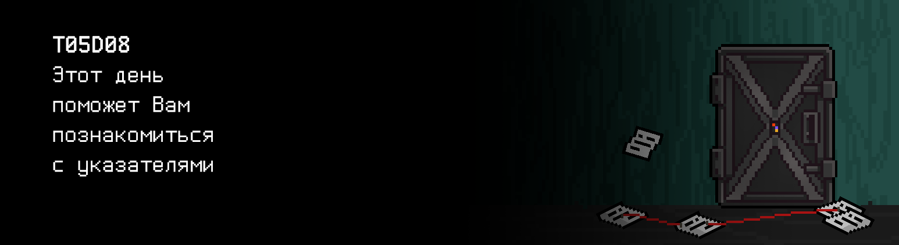
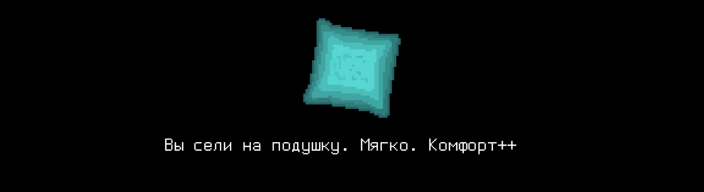

# T05D08

## Contents

1. [Chapter I](#chapter-i) \
 1.1. [Level 2. Room 1.](#level-2-room-1) 
2. [Chapter II](#chapter-ii) \
 2.1. [List 1. Pointer.](#list-1-pointer) \
 2.2. [List 2. Listing.](#list-2-listing) \
 2.3. [List 3. Operations.](#list-3-operations) \
 2.4. [List 4. Array.](#list-4-array) \
 2.5. [List 5. Equality.](#list-5-equality) 
3. [Chapter III](#chapter-iii) \
 3.1.  [Quest 1. Arguments and pointers.](#quest-1-arguments-and-pointers) \
 3.2.  [Quest 2. Data I/O.](#quest-2-data-io) \
 3.3.  [Quest 3. Data metrics.](#quest-3-data-metrics) \
 3.4.  [Quest 4. Search.](#quest-4-search) 
4. [Chapter IV](#chapter-iv)

# Chapter I

## Level 2. Room 1.

***LOADING Level 2… \
LOADING Room 1…***

Первый уровень дался непросто, но Вы все-таки выбрались. Сложно сказать, отличается ли новый уровень этого лабиринта от старого, или нет. Разве что цвет стен несколько иной... или так кажется? Хорошо бы, если ИИ на этом уровне был поспокойнее.  \
Вот лишь небольшой срез мыслей, роящихся в Вашей голове.

\> *Оглядеться*

Комната, меж тем, нетипичная. Ровно по центру, будто геометрически вычисленному, прямо на полу стоит компьютер со стареньким матричным принтером с пожелтевшей стопкой бумаг. Рядом с ним - смятая подушка, блюдце для печенья (о чем намекает обилие крошек) и чашка с давно выпитым чаем (о чем также недвусмысленно намекает засохший чайный пакетик). Пол и стены ровным слоем устелены листами с наборами чисел. А поверх них растянуты красные нити. Шпионский фильм, не иначе.

\> *Сесть на подушку*

Вы сели на подушку. Мягко. \
Комфорт++

\> *Отодвинуть блюдце и чашку*

Вы отодвинули блюдце и чашку. Не сильно помогло. \
Комфорт--

\> *Посмотреть в монитор*

В терминале одна единственная строчка - Segmentation fault. И мигает курсор.

\> *Посмотреть на пол*

Среди множества однотипных листов вы замечатете "самиздатовский" буклет, подшитый красной нитью. Да, звучит как метафора.

\> *Взять буклет*

Буклет часто брали в руки - это ощущается. Надо бы с ним поосторожнее. На обложке вы видите только одно неприметное слово, явно набитое печатной машинкой - POINTER. \
Что-то неформализуемое в нем заставило пробежать легкую дрожь по Вашей коже.

\> *Перелистнуть страницу*

***LOADING...***

# Chapter II

## List 1. Pointer.

>In 1955, Soviet computer scientist Kateryna Yushchenko invented the Address programming language that made possible indirect addressing and addresses of the highest rank – analogous to pointers. This language was widely used on the Soviet Union computers. However, it was unknown outside the Soviet Union and usually Harold Lawson is credited with the invention, in 1964, of the pointer. In 2000, Lawson was presented the Computer Pioneer Award by the IEEE "for inventing the pointer variable and introducing this concept into PL/I, thus providing for the first time, the capability to flexibly treat linked lists in a general-purpose high-level language". His seminal paper on the concepts appeared in the June 1967 issue of CACM entitled: PL/I List Processing. According to the Oxford English Dictionary, the word pointer first appeared in print as a stack pointer in a technical memorandum by the System Development Corporation.

\> *Перелистнуть страницу*

***LOADING...***

## List 2. Listing.

    void main() {
        int a = 2;      // a == 2
        int b = 4;      // b == 4
        int *p = 0;     // p == 0
        p = &a;         // p == адрес переменной a
        *p = 3;         // a == 3... или нет?
        p++;            // p == адрес переменной b ??!?!?
        (*p)++;         // b == 5 O_o WTF
        *p = *(p - 1);  // b == a == 3 ...
    }

Кажется, кто-то силился понять, что же это такое - POINTER...

\> *Перелистнуть страницу*

***LOADING...***

## List 3. Operations.

> Допустимые операции над типизированным указателем:
> (может хотя бы так я это запомню) 
>- Получение адреса
>- Разыменование указателя
>- Сложение с числом
>- Вычитание указателей
>- Сравнение указателей
>- Логические операции над указателями
>- Присваивание указателей

\> *Перелистнуть страницу*

***LOADING...***

## List 4. Array.

> ПОМНИ!
>- В языке С - массивов не существует!
>- int a[10] - это не массив!
>- Это указатель! Все указатель!
>- И функция указатель.
>- И ты - указатель.
>- Да, те "люди" из холла тоже указатели.
>- Запертые для опытов и изучения...

Очень похоже на записки сумасшедшего. Наверняка, это они и есть.

\> *Перелистнуть страницу*

***LOADING...***

## List 5. Equality.

    void main() {
        int a[10];
        a[2] == *(a + 2) == *(2 + a) == 2[a]; //!!!!!!!!!!!!!!!
    }

\> *Мда. Очень информативно. Перелистнуть страницу*

Остальные страницы сильно смяты, и все исчерканы. Разобрать что-либо невозможно. Очевидно ваш предшественник долго сражался, пытаясь осознать эти вопросы... И у него это не слишком-то и вышло. \
Посмотрим, получится ли у Вас?

\> *Это похоже на подначивание*

Ничуть. Просто дружеская беседа рассказчика и игрока. Ничего необычного.

\> *Волевым образом нажать на Enter*

    AI Data Analyzer v0.01
    Initialising......
    Loading....
    1. Load module #1... Success!     
    2. Load module #2... Success!
    3. Load desision decision-making module 
    3.1. Load maxmin module

    Segmenation fault

***LOADING...***

# Chapter III
>**Внимание!** В квестах этого дня запрещено использовать динамическую память
## Quest 1. Arguments and pointers.
\> *Посмотреть папку src репозитория*

Вы видите несколько файлов, в том числе maxmin модуль. 

\> *Запустить maxmin модуль отдельно*

    Segmenation fault

По всей видимости, придется его починить.

...

\> *Всю жизнь мечтал чинить maxmin модули.* 

\> *Открыть напоминание*

> НЕ ЗАБЫВАЙ! Все твои программы тестируются на стилевую норму и утечки памяти. Инструкция по запуску 
> тестов все также лежит в папке `materials`

***== Получен Quest 1. Внести исправления в программу src/maxmin.c таким образом, 
чтобы программа собиралась и корректно работала (находила max и min из 3х целых чисел и
выводила их на экран). Структуру программы не менять. В случае некорректного ввода 
необходимо выводить n/a.==***

| Входные данные | Выходные данные |
| ------ | ------ |
| 1 2 3 | 3 1 |

***LOADING…***

## Quest 2. Data I/O.

\> *Готово*

    AI Data Analyzer v0.01
    Initialising......
    Loading....
    1. Load module #1... Success!     
    2. Load module #2... Success!
    3. Load desision decision-making module 
    3.1. Load maxmin module... Success!
    3.2. Load data i/o & squaring module
    
    Segmenation fault

\> *Вечер перестает быть томным*

Сейчас день. Наверное..

\> *Посмотреть папку src репозитория*

В папке еще находится модуль squaring.

\> *Запустить модуль squaring отдельно*

    Segmenation fault

И тут требуется починка.

...

***== Получен Quest 2. Внести исправления в программу src/squaring.c таким образом, 
чтобы программа собиралась и корректно работала (принимала через stdin массив целых чисел, 
возводила их в квадрат и выводила в stdout). В случае некорректного ввода необходимо выводить n/a. 
Уменьшать декомпозицию нельзя - функции можно только добавлять при необходимости, но не убирать. ==***

| Входные данные | Выходные данные |
| ------ | ------ |
| 3 1 2 3 | 1 4 9 |

***LOADING…***

## Quest 3. Data metrics

\> *Готово*

    AI Data Analyzer v0.01
    Initialising......
    Loading....
    1. Load module #1... Success!     
    2. Load module #2... Success!
    3. Load desision decision-making module 
    3.1. Load maxmin module... Success!
    3.2. Load data i/o & squaring module... Success!
    3.2. Load stat module
    
    ERROR 

"Сколько же можно", - проскальзывает в Вашей голове.

\> *Снова посмотреть папку src репозитория*

В папке находится модуль stat. Он практически пустой. Судя по всему, он предназнчаен для расчета статистических метрик по массиву данных. 

\> *Открыть учебник по математической статистике*

Ваш любезный друг-сумасшедший его нигде тут не оставил. Придется гадать и разбираться так.

...

***== Получен Quest 3. Добавить реализации необходимых функций в программу src/stat.c таким образом, 
чтобы программа собиралась и корректно работала (принимала через stdin массив целых чисел, выводила 
бы его, вычисляла и выводила на новой строке набор статистических метрик - экстремумы (max и min), математическое 
ожидание и дисперсию). В случае некорректного ввода необходимо выводить n/a. Уменьшать декомпозицию 
нельзя - функции можно только добавлять при необходимости, но не убирать. Придерживаться предложенной 
структуры программы. Числа с плавающей запятой выводить с точностью 6 знаков после запятой. ==***

| Входные данные | Выходные данные |
| ------ | ------ |
| 4 1 2 3 4 | 1 2 3 4 4 1 2.500000 1.250000 |

***LOADING…***

## Quest 4. Search.

\> *Готово*

    AI Data Analyzer v0.01
    Initialising......
    Loading....
    1. Load module #1... Success!     
    2. Load module #2... Success!
    3. Load desision decision-making module 
    3.1. Load maxmin module... Success!
    3.2. Load data i/o & squaring module... Success!
    3.2. Load stat module... Success!
    3.4. Load searching module
    
    NOT FOUND 

\> *Посмотреть папку src репозитория еще раз*

Есть модуль search. Но он Вам не понравится. 

\> *Посмотреть модуль search*

Только комментарии. Кода нет. Чтобы двигаться дальше, видимо нужно реализовать его.

...

***== Получен Quest 4. Реализовать программу src/search.c в соответствии с комментарием. Программа должна принимать через stdin массив целых чисел и находить в нем первое вхождение числа, удовлетворяющего следующим требованиям: быть четным, быть большим или равным математическому ожиданию, подчиняться правилу трех сигм и не равняться 0. Найденное число должно быть выведено в stdout. Если такого числа нет, то программа должна выдавать 0. Максимальное количество введенных чисел равно 30. В случае некорректного ввода необходимо выводить n/a. При разработке необходимо придерживаться идей декомпозии из предыдущих квестов, приветствуется переиспользование уже разработанных функций. Функции должны быть компактными и простыми, и занимать не более 20-30 строк кода.==***

| Входные данные | Выходные данные |
| ------ | ------ |
| 4 1 2 3 4 | 4 |

***LOADING…***

# Chapter IV.

\> *Добром это не кончится. Готово.*

    AI Decision Making Module v0.01
    Initialising......
    Loading....
    1. Load module #1... Success!     
    2. Load module #2... Success!
    3. Load data modules 
    3.1. Load maxmin module... Success!
    3.2. Load data i/o & squaring module... Success!
    3.2. Load stat module... Success!
    3.4. Load searching module... Success!

    .........
    ............
    ...............

    Hello. Вас приветствует стандартный модуль принятия решений. Чем могу быть полезен?

\> *Ввести :"Хотелось бы выйти в ~~окно~~ дверь"*

    Анализ запроса...
    Сбор данных...
    Анализ данных...
    Принятие решения...

    Дверь открыта. 
    Вас ожидают в следующей комнате, пожалуйста пройдите дальше.
    Спасибо, что воспользовались услугами модуля принятия решений v0.01.

\> *Открыть дверь*

Как-то тихо и просто оказалось в этот раз. Интересно, что случилось с местным сумасшедшим? Встретитесь ли Вы с ним в будущем? \
Дверь оказалось открытой и Вы свободно вышли из комнаты, шурша листочками с распечатанными блоками памяти и слегка спотыкаясь о растянутые нити.

***LOADING…***

