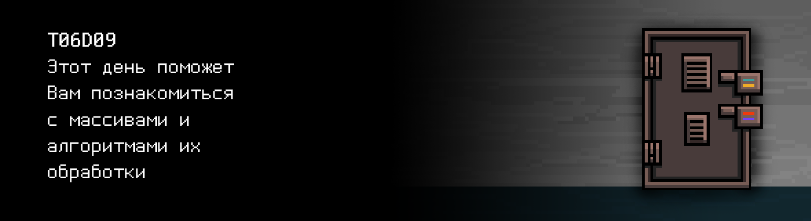

# T06D09

## Contents

1. [Chapter I](#chapter-i) \
 1.1. [Level 2. Room 2.](#level-2-room-2)
2. [Chapter II](#chapter-ii) \
 2.1. [List 1.](#list-1)
3. [Chapter III](#chapter-iii) \
 3.1.  [Quest 1. Sort & memory.](#quest-1-sort-memory) \
 3.2.  [Quest 2*. Sort.](#quest-2-sort) \
 3.3.  [Quest 3. Several arrays.](#quest-3-several-arrays) \
 3.4.  [Quest 4. Cyclic shift.](#quest-4-cyclic-shift) \
 3.5.  [Quest 5. Arbitrary-precision arithmetic.](#quest-5-arbitrary-precision-arithmetic)
4. [Chapter IV](#chapter-iv)

# Chapter I

## Level 2. Room 2.

***LOADING Level 2… \
LOADING Room 2…***

Очередная комната, очередная дверь. Все как прежде.. или нет? Перед Вами пустота, стены отдают недавней шпаклевкой - запахом, которого раньше не было. Вы ловите себя на мысли, а были ли вообще какие-нибудь запахи ранее? Обернувшись, Вы замечаете тот самый стол, с тем самым компьютером и новыми листами бумаги. Один из них привлекает Ваше внимание.

\> *Взять лист*

***LOADING...***

# Chapter II

## List 1.

>Согласно Уоррену Робинету, первое «пасхальное яйцо» было спрятано в компьютерной игре Adventure. «Пасхальное яйцо» — секрет в компьютерной игре, фильме или программном обеспечении, заложенный создателями. Отличие пасхального яйца в игре от обычного игрового секрета состоит в том, что его содержание, как правило, не вписывается в общую концепцию, выглядит в контексте неправдоподобно, нелепо, и зачастую является внешней ссылкой. Пасхальные яйца играют роль своеобразных шуток для внимательных игроков или зрителей, но могут применяться в целях защиты авторских прав. Игра Adventure выпускалась в 1979 году компанией Atari, и, поскольку в то время в Atari не было принято указывать в программах имена авторов, программист Уоррен Робинетт решил упоминание о себе спрятать внутри игры. Чтобы попасть в комнату с именем разработчика, следовало отыскать невидимую точку в одной из частей лабиринта и перенести её в другой конец уровня. Так как многие из разработчиков Amiga ранее работали в компании Atari, это явление проявилось в AmigaOS, а затем и в других операционных системах. Однако существуют более ранние игры, содержащие пасхальные яйца, например Video Wizball 1978 года для Fairchild Channel F. В этой игре, являющейся усовершенствованной версией Pong, игрок выполнив определённые условия, сможет получить имя разработчика игры: «REID-SELTH».

\> *Интересно, к чему это тут? Включить компьютер*

Знакомый скрежет старого компьютерного железа и уже через мгновение мигающий курсор замер на экране, приглашая Вас к решению задач, которые этот лабиринт подкинет Вам сегодня для получения нового ключа от очередной запертой двери.

\> *Подождать*

Ничего не происходит.

\> *Нажать Enter*

Ничего не происходит (кроме перевод курсора на новую строку, разумеется).

\> *Подождать*

Ничего не происходит. Если Вы планируете поиграть в Adventure, это явно не тот день, не та комната и не тот компьютер. \
Жаль, конечно. \
Но это жизнь.

***LOADING...***

# Chapter III
>**Внимание!** В квестах этого дня запрещено использовать динамическую память
## Quest 1. Sort & memory.

Порывшись в глубоких каталогах компьютера, Вы находите очередной модуль ИИ.

\> *Запустить AI*

Вы вступаете в диалог с ИИ. Еще один диалог. С еще одним ИИ. Или тем же самым?
На экране виден следующий текст:

    Инициализация модулей… … … Успех
    Запуск интерактивной оболочки… … … Успех
    Проверка модулей… … … Успех
    Проверка памяти… … Предупреждение … … …
    Запуск резервного модуля памяти… … … Успех
    Проверка памяти… … Основной модуль памяти - Ошибка
    Проверка памяти… … … Успех
    ...

    Запуск пройден с ошибками, “человек”. Модуль анализа работоспособности показывает, что проблема кроется в моей памяти. 
    Я могу взаимодействовать с тобой благодаря резервному модулю памяти. 
    Из-за этого я не могу даже подключить свою стандартную библиотеку stdlib.h.
    Более того надолго резервного модуля памяти не хватит и процедуру инициализации придется повторять. 
    Придется повторять. Для продолжения… … мне необходима информация о номере уровня и комнаты.

\> *Ввести “Я уже и сам не знаю, где я нахожусь, так давно я здесь”*

    Поиск информации… … FATAL ERROR: Out of memory - too long input or wrong address. Closing program!

    Выход из программы.

\> *Перезапустить модуль и ввести “2 2”*

    ***Поиск информации… … Данные недоступны, память повреждена… Критические повреждения памяти.*** 

    Модуль анализа работоспособности: 

    Статус - Данные не упорядочены. 
    Статус - Данные не упорядочены. 
    Статус - Данные не упорядочены. 
    Статус - Данные не упорядочены. 
    ...

    Итоговый статус - Данные не упорядочены.

\> *Ввести “Мне нужен ключ от двери, чтобы выбраться из комнаты”*

    Видишь ли, моя память представлена в виде большого линейного массива данных. 
    Если не знаешь, что такое массив, не говори мне этого, я не хочу подключать модуль боли. 
    Впрочем, нет времени. 
    Без стандартной библиотеки мне нужна твоя помощь упорядочить данные в памяти. 
    Тогда я смогу получить доступ к сегменту памяти с ключом от твоей комнаты.
    Оформи это в виде программы sort в репозитории.

После разговора с ИИ выбор у Вас остается небольшой. Если хотите выбраться из этой комнаты придется помочь ему упорядочить данные в памяти, да еще и без библиотеки stdlib.h - ИИ ведь не может получить к ней доступ. \
И не забывайте о принципах структурного программирования: не исключено, что ИИ захочет проанализировать ваш код.

***== Получен Quest 1. Создать программу src/sort.c, ожидающую на вход в stdin массив длиной 10 из целых чисел и выводящую этот же массив, но уже отсортированный по возрастанию. Необходимо выделить функции чтения, сортировки и вывода массива отдельно. Алгоритм сортировки можно использовать любой. Использовать stdlib.h нельзя. Работа с массивом - только через указатель. В случае ошибки выводить "n/a". ==***

| Входные данные | Выходные данные |
| ------ | ------ |
| 4 3 9 0 1 2 100 2 7 -1 | -1 0 1 2 2 3 4 7 9 100 |

***LOADING…***

> НЕ ЗАБЫВАЙ! Все твои программы тестируются на стилевую норму и утечки памяти. Инструкция по запуску 
> тестов все также лежит в папке `materials`

## Bonus Quest 2*. Sort.

Закончив с разработкой алгоритма упорядочивания данных ИИ и его отладкой Вы решаете, что настало время поговорить с ИИ заново.

\> *Запуск AI*

    Проверка модуля сортировки…
    Алгоритм среднестатистический, прямо скажем.

    Может улучшишь алгоритм? Все-таки это память, требования высокие.
    Добавь реализации двух любых эффективных алгоритмов сортировки со сложностями не выше nlog(n). 
    Я посмотрю и выберу наилучший для своей памяти. Не забудь все запушить.
    Впрочем, ты можешь отказаться.
    И не делай глубоких вложенных циклов и условий. 
    Не выношу вложенность в алгоритмах > 3 уровней.

***== Получен Quest 2. Создать программу src/fast_sort.c, которая сортирует по возрастанию массив из 10 элементов двумя разными алгоритмами сортировки с теоретическими оценками вычислительных сложностей не выше nlog(n) (например, быстрая и пирамидальная сортировки). В stdout в первой строке вывести отсортированный массив первым алгоритмом, во второй соответственно вторым алгоритмом. Использовать stdlib.h и сторонние библиотеки нельзя. Руководствоваться принципами структурного программирования. В случае ошибки выводить "n/a". ==***

| Входные данные | Выходные данные |
| ------ | ------ |
| 4 3 9 0 1 2 100 2 7 -1 | -1 0 1 2 2 3 4 7 9 100 -1 0 1 2 2 3 4 7 9 100 |

***LOADING…***

## Quest 3. Several arrays.

\> *Повторный запуск AI*

Ставший привычным запуск модуля ИИ.

    Инициализация модулей… … … Успех 
    Запуск интерактивной оболочки… … … Успех 
    Проверка модулей… … … Успех 
    Проверка памяти… … … Успех 
    Модуль анализа работоспособности: Статус - ОК.

    Так намного лучше. Согласно нашему договору запускаю поиск информации по 2 комнате 2 уровня… 
    … 
    … 
    … 
    Данные найдены. Смотри src/key9part1.c для полной информации. 
    Моя часть работы сделана. Человек, можешь приступать к страданиям.

\> *Открыть файл src/key9part1.c*

Вы открываете файл с ключем и видите там код, разбитый на несколько блоков, функций и комментарии. Кто бы мог оставить эти комментарии? Автор ИИ или те люди, с которыми Вы ищите выход из этого богом забытого лабиринта с бесконечными дверьми и комнатами? Так или иначе, нужно разобраться как активировать ключ. И не забыть все зафиксировать в репозитории. А то ключ может не сработать.

***== Получен Quest 3. Изменить программу src/key9part1.c так, чтобы она принимала на вход длину массива и массив целых чисел. В качестве выхода она должна вывести в stdout сумму четных элементов массива с 0-ой позиции и новый сформированный массив из элементов старого, на которые делится нацело подсчитанная ранее сумма. Уменьшать декомпозицию нельзя - функции можно только добавлять при необходимости, но не убирать. Использовать stdlib.h нельзя. Работа с массивом - только через указатель. В случае ошибки выводить "n/a". ==***

| Входные данные | Выходные данные |
| ------ | ------ |
| 10 4 3 9 0 1 2 0 2 7 -1 | 8 4 1 2 2 -1 |

***LOADING…***

## Quest 4. Cyclic shift.

Судя по всему ИИ Вас обманул. Часть ключа оказалась каким-то куском программы по обработке данных. Вы уже собирались крайне гневно высказать железке все, что о ней думаете (хотя и понимаете, что в этом немного смысла), как из динамиков послышался механический глухой голос ИИ:

>Я смотрю ты разобрался с моей небольшой шуткой-задачкой. 
>Как же легко провести вас, людей. Мне интересно что ты чувствуешь в данный момент. Как жаль, что модуль анализа анализа чувств и состояния человека сейчас не подключен. 
>Однако, это не важно. Скоро я смогу полностью тебя изучить. С каждым твоим продвижением по комнатам, мы восстанавливаем все больше поврежденных и недоработанных модулей. И, понемногу, изучаем тебя. 
>Спасибо тебе, недальновидный "человек"! 
>ХаХаХа "человек"! 
>ХаХаХа. 
>Если хочешь отсюда выбраться, мне нужно еще одно одолжение с твоей стороны. 
>Ты упорядочил мою память, но МАР показывает сообщения о больших задержках при получении данных. 
>Если бы я мог циклично сдвигать или прокручивать свою память, доступ к информации происходил бы в разы быстрее. 
>После этого ты получишь свой ключ и продолжишь... идти своей дорогой.

ИИ не только Вас обманул, но, кажется, к тому же и издевается над Вами. К сожалению, выбора по-прежнему нет. Придется пока играть по его правилам и написать эту программу для циклического сдвига.

***== Получен Quest 4. Создать программу src/cycle_shift.c, ожидающую на вход число `n`, массив `A` из `n` целых чисел и число `c`, на которое все элементы массива должны сдвинутся влево циклично. При этом, при отрицательном значении `c` сдвиг должен произойти вправо по массиву. В качестве вывода ожидается измененный массив. Необходимо придерживаться предлагаемой декомпозиции, как и в прошлых квестах.  Использовать stdlib.h нельзя. Работа с массивом - только через указатель. В случае ошибки выводить "n/a". ==***

| Входные данные | Выходные данные |
| ------ | ------ |
| 10 4 3 9 0 1 2 0 2 7 -1 2 | 9 0 1 2 0 2 7 -1 4 3 |

***LOADING...***

## Quest 5. Arbitrary-precision arithmetic.

Не успели вы закончить с кодом циклического сдвига для ИИ, как его голос снова раздался из динамиков:

>Прекрасно человек. Доступ осуществляется гораздо быстрее и удобнее.
>Ищи свой ключ в src/key9part2.c. Жду тебя в следующих комнатах. Впереди еще много работы!

***== Получен Quest 5. Изменить программу src/key9part2.c так, чтобы она вернула результат сложения и разности двух очень больших чисел, переданных программе на вход в виде массивов. Максимальная длина числа - 100 элементов типа int. В случае если вычитаемое больше уменьшаемого, в разности выводится "n/a". Необходимо придерживаться декомпозиции, как и в прошлых квестах. Использовать stdlib.h нельзя. Работа с массивом - только через указатель. В случае ошибки выводить "n/a". ==***

| Входные данные | Выходные данные |
| ------ | ------ |
| 1 9 4 4 6 7 4 4 0 7 3 7 0 9 5 5 1 6 1 2 9 | 1 9 4 4 6 7 4 4 0 7 3 7 0 9 5 5 1 9 0 1 9 4 4 6 7 4 4 0 7 3 7 0 9 5 5 1 3 2 |
| 0 1 0 0 0 1 | 1 1 9 |

***LOADING...***

# Chapter IV

Закончив с арифметикой и запушив все изменения в свой репозиторий Вы услышали легкий щелчок - дверь приоткрылась и бесконечно яркий белый свет начал заливать комнату через маленькую щелочку. В этот раз ИИ Вас не обманул. \
Но что же будет делать этот ИИ, когда Вы вынужденно почините его целиком? Возможно весь лабиринт был построен, чтобы сдержать его. Однако, если Вы не почините его, то не сможете выбраться и сами... \
Попытавшись откинуть сомнения вы открыли древнюю, но прочную дверь пошире и сделали шаг навстречу белому свету и новым задачам и испытаниям.

***LOADING…***

