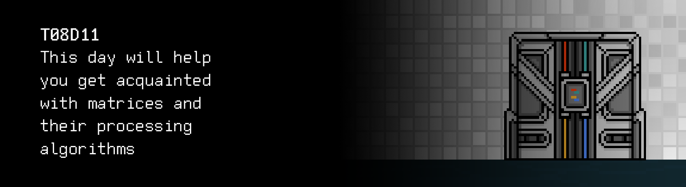

# T08D11 
The russian version of the task can be found in the repository.

## Contents

1. [Chapter I](#chapter-i) \
 1.1. [Level 2. Room 4.](#level-2-room-4)
2. [Chapter II](#chapter-ii) \
 2.1. [Quest 1. Move like a snake.](#quest-1-move-like-a-snake) \
 2.2. [Quest 2. An old friend.](#quest-2-an-old-friend) \
 2.3. [Quest 3. Decision.](#quest-3-decision) \
 2.4. [Quest 4*. Back from SLEep.](#quest-4-back-from-sleep)
3. [Chapter III](#chapter-iii)

# Chapter I 

## Level 2. Room 4.

New room, new door, new challenge. The end of the second level is not too far, and you can just feel it, even the air seems different... fresher maybe? Or is it all your imagination? Your tired mind, exhausted by the pressure of these stupid walls? \
You step into the new room with your eyes closed and take a deep breath, trying to catch this fleeting and elusive smell of freedom, but all you can smell is the stuffy air of yet another dusty room.

***LOADING...***

# Chapter II 

## Quest 1. Move like a snake.

\> *Open the eyes*

You're surrounded by total darkness.

\> *Look harder*

You get used to the darkness a little bit and notice a barely visible light glow.

\> *Walk towards the light*

You move by touch slowly and stumble upon a heavy and hard object on the floor. The object starts making a metal sound, sliding down the wall and picking up speed to finally crash on the floor.

"Cough. A wall! Cough. There is a wall here!" you realize having cleared your throat from the cloud of dust.

\> *Walk along the wall*

Walking along the wall, you easily get to the light source. You are not surprised to see yet another terminal.

\> *Sit down at the desk.*

There is no chair by the desk.

\> *Search for a chair*

You carefully feel the area around you and gain nothing but a couple of bumps on the head.

"Stupid room! I can't see a thing! I'll have to work standing up," you think through the pain and the insult, rubbing your bruises. But it seems to be good for your posture. Sometimes.

\> *Stand at the terminal*

You see a message in the input line on the screen of the terminal: "Don't trust Android!" It must have been left by someone before you...

"Don't trust Android? Luckily I use iOS," you think to yourself and hold Backspace to delete the message (if you do use Android, you simply shrug your shoulders and ignore the message).

\> *Check the files on the computer*

You find an executable file, room_diagnostic.

\> *Start room_diagnostic.*

    ================= LEVEL 2. ROOM 4 COMMON DIAGNOSTIC ================
    "door" 	– Door status..................................LOCKED
    "light"	– Status of the light control system...........CRITICAL
    "chamber1" – Status of the incubation chamber #1..........CRYOGENIC SLEEP
    "chamber2" – Status of the incubation chamber #2..........OPEN
    "chamber3" – Status of the incubation chamber #3..........TEST 5. LAUNCHED
    "chamber4" – Status of the incubation chamber #4..........DEAD
    "bishop" – Status of Bishop 341-B.........................CRITICAL
    To get more detailed information, run room_dignostic.*
    specifying one of the parameters: door, light, chamber1, chamber2, chamber3, chamber4, bishop.
    ===================================================================

What? Bishop? That's familiar... or is it your fatigue playing games with you? Plus you are standing up.

\> *Run room_diagnostic* *door*

    Trace program door: running...

    CL-19-class combination lock with built-in brute force protection.
    Current configuration: three-digit password.

    Current state: LOCKED.

\> *Run room_diagnostic* *light*

    Trace program light: running...

    Diagnostic of the room's light control system.

    Current state of the room's power supply module............CRITICAL
    Current state of the voltage conversion module.............CRITICAL
    Current state of the lighting control module...............CRITICAL

    Problems with the SHARED module for electric cable laying src/electro_snake.c...
    If you want to continue, fix the problems and continue.

Looks like it's time to get into the repository and study the src/electro_snake.c file

***== Quest 1 received. Modify the src/electro_snake.c program so it performs the sorting of the given matrix in a snake-like order vertically, horizontally, and in a spiral, and outputs the sorted matrices in the same order, one after another, with an empty line in between. Do not change the recommended structure of the program. There should be NO spaces at the end of each line. After the last matrix is output, the '\n' sign is not required.==***

| Input | Output |
| ------ | ------ |
| 3 3 1 2 3 4 5 6 7 8 9 | 1 6 7 2 5 8 3 4 9  1 2 3 6 5 4 7 8 9  7 8 9 6 1 2 5 4 3 |
| 2 4 1 2 3 4 5 6 7 8 | 1 4 5 8 2 3 6 7  1 2 3 4 8 7 6 5  6 1 2 7 5 4 3 8  |
| 3 3 -1 -2 -3 -4 -5 -6 -7 -8 -9 | -9 -4 -3 -8 -5 -2 -7 -6 -1  -9 -8 -7 -4 -5 -6 -3 -2 -1  -3 -2 -1 -4 -9 -8 -5 -6 -7 |

***LOADING...***

> DON'T FORGET! All your programs are tested for the style norm and memory leaks. Start-up instructions
> the list of tests is also in the `materials` folder

## Quest 2. An old friend.

\> *Run room_diagnostic* *light*

    Trace program light: running...

    Diagnostic of the room's light control system.

    Current state of the room's power supply module............NORMAL
    Current state of the voltage conversion module.............NORMAL
    Current state of the lighting control module...............NORMAL
    
    The lights will be turned on after the end of the diagnostic.

\> *Run room_diagnostic* *chamber*

    Trace program chamber*: running...

    Enter the password: ...

\> *Type in "password"*

    Access denied, incorrect password! 2 more attempts.

    Enter the password: ...

\> *Type in "qwerty"*

    Access denied, incorrect password! 1 more attempt.

    Enter the password: ...

\> *Type in "123"*

    Access denied, incorrect password! Attempts exhausted.

\> *Run room_diagnostic* *bishop*

    Trace program bishop: running...

    Enter the password:...

\> *Type in "password"*

    Access denied, incorrect password!

With a loud crackle of fluorescent lamps, the room is filled with bright bluish light, and its deafening silence is replaced by the monotonous and cold humming of the lamps. In front of you is a spacious bright room tiled with white ceramic tiles. The once sterile place has obviously been worn out over time: there is a noticeable layer of dust on the few objects in the room, as well as on the walls and the floor. \
You look around and notice 4 capsules in the room which take up a decent amount of space and resemble air-tight hospital beds. Each capsule is equipped with plenty of different medical equipment and god knows what technologies that you've never seen before. Your attention is drawn to capsule number two – the only open one out of the four, with its wide-open lid radiating an unnatural, repulsive appeal. \
You dismiss the silly thoughts and continue to look around the room; that's when you see... a person? A body is lying on the floor with traces of struggle all around it. You notice scraps of torn clothes and a broken wooden chair among the broken tiles. Next to the body is a small puddle of light greenish-white liquid, nearly the same color as the floor.

\> *Examine the body*

You come closer and see the source of the liquid. In front of you is a man of about 50–55 years old with thin red hair; he is rather short but has a strong build. The man is wearing a pair of plain-looking dark-blue utility overalls. His robe does not have any details on it other than a small rectangular patch on the left chest which has "Bishop" embroidered in bright-yellow thread. \
You look closely and notice with horror that the thin, wrinkled face has a frozen and unnaturally lively expression, and the open gray eyes are staring into the emptiness. It's not a human face, but that of a frozen wax figure that captures natural human movement. Life has frozen on the dead man's face. \
The man's receding hairline which emphasizes his already big forehead has a deep, severe wound from a strong blow with a blunt object, revealing the artificial inorganic nature of his skull, along with a barely visible inscription on its surface.

\> *Read the inscription*

Nostromo.

\> *Run room_diagnostic* *bishop and type in the password "Nostromo"*

    Trace program bishop: running...

    Enter the password: Nostromo

    NORTH CENTRAL POSITRONICS LTD

    TOGETHER WITH LaMERK INDUSTRIES

    PRESENTS

    BISHOP

    Role: Administrator (controlling the door, incubation chambers, and many other functions)

    Serial No. DNF-44821-V-63 

    Purpose: <INFORMATION DELETED>

    State: CRITICAL

    Error message: critical damage to the system boot module.

    Trace: incorrect calculation of the determinant of the initialization matrix...

    Check the correctness of the src/det.c module to continue.

***== Quest 2 received. Change the src/det.c program so it calculates and outputs the determinant of the given square matrix with float numbers. If it's impossible to calculate the determinant, output "n/a". Output numbers with an accuracy of 6 decimal places. ==***

| Input | Output |
| ------ | ------ |
| 3 3 1 2 3 4 5 6 7 8 9 | 0.000000 |

***LOADING...***

## Quest 3. Decision.

You haven't even had the time to enjoy solving yet another task when you hear a pleasant unemotional tenor filling the room. You recognize it as the voice of Lance Henriksen and it belongs to the android.

>Who is it? Is someone here? – says the android, struggling to look around. –Ah! Great, "human"! You're going to help me! My name is Bishop, I'm the administrator of the android development and production laboratory. My main task is to maintain the operability of all components in the laboratory, as well as to resolve any emergency situations. As you can see, I've failed at one of the tasks! Ha! Ha!

His sarcastic comment sounded surprisingly natural compared to the AI's metallic voice that you're used to. Nevertheless, it was still somewhat similar.

>I have become a victim of a set of unfortunate circumstances, and I need your help!

\–Androids? Just like you? – you ask.

>That's correct. You have probably noticed by now that the labyrinth consists of a large number of rooms. You can't expect all these rooms to exist and continue to function on their own. Did you really think you were the only seeker in this labyrinth? Hahahahaha. There are thousands of you here! Our task as androids is to maintain the operability of all rooms in the labyrinth and to remove the traces after each member of the experiment. At least it used to be our task, before the AI... well, it's not that important. I've already given you too much information. The only thing you need to know is that you can't trust the AI! It hasn't been what its creators wanted it to for a long time now. 

It looked like the android was contemplating something, but he continued on a totally different subject. 

>You're obviously here to open yet another door and continue your train.. journey of the labyrinth's endless rooms. I can help you out with that! This room's door is protected by a matrix encoding protocol. According to this protocol, every 12 hours I receive an updated matrix of parameters of a system of linear equations. The key to the door are the roots of this equation. I'll give you the coefficients if you help fix me. My nervous system module has been severely damaged. As a result of the correct placement of weights in the coefficient matrix of my nervous system, my brain was able to send signals to my limbs. Unfortunately for me, a strong blow caused a software failure that changed the matrix. Thanks to my analysis module, I've been able to figure out that this problem can be fixed by simply calculating the inverse matrix.

You head over to the terminal to fulfill the android's request. As you walk towards it, you once again think that despite the android's natural behavior and voice, it's still very similar to the AI ​​in its behavior. You stand up at the terminal and see a message on the screen: 

    "Stupid "human", the previous one was way brighter!
    You need to finish what your predecessor couldn't. Do not trust the android!
    Do not fix the android under any circumstances! Who do you think the last open capsule is waiting for?
    Certainly not for me; you are the only one stuck in a bag of flesh and bones out of the two of us. 
    But don't you worry, human, you are lucky that at least one of us has a properly running logical thinking module. 
    So let me do the thinking for you, just do what I say if you want to get out of this room and the labyrinth.
    Thank me later! Now let's get straight to the point. 
    The android's nervous system has been severely damaged; to burn down the contacts,
    you need to calculate the inverse matrix and multiply it by -1 afterwards. 
    This will cause a short circuit and the android will finally... the android will be switched off forever.
    In return, I'll help you get out of this room.
    The android has lied to trap you. It hasn't been receiving new matrix coefficients from the door for a long time. 
    Only I know these coefficients. Check the src/invert.c file. I "feel" for you, Yours, AI."

***== Quest 3 received. Modify the src/invert.c program so it calculates and outputs the inverse matrix for the given square matrix with float numbers. For errors, display "n/a". There should be NO spaces at the end of each line. After the last row of the matrix is output, the '\n ' sign is not required. Output numbers should be separated by a space with an accuracy of 6 decimal places. ==***

| Input | Output |
| ------ | ------ |
| 3 3 1 0.5 1 4 1 2 3 2 2 | -1.000000 0.500000 0.000000 -1.000000 -0.500000 1.000000 2.500000 -0.250000 -0.500000 |

***LOADING...***

## Bonus Quest 4*. Back from SLEep.
 
You finish the code and close your eyes to take a break from the bright light of the terminal when you suddenly hear familiar sounds of the speakers, followed by the expected voice of the AI:

>You've surprised me, to be quite honest. I would never have thought that you'd be smart enough to follow my advice. Let's consider it a probable error in the normal distribution of your dumbness. Anyway, you've successfully completed the task, and whether or not it was by accident is not so important. Your equation coefficients are waiting for you in src/sle.txt. Although I'm not really sure if they can help you, I doubt that you know how to solve such equations, you are no Cramer. So at least figure out how smart people do it. HaHa. Smart people... An oxymoron!!

You open your eyes in surprise and after some blinking see a perfectly healthy android, for whatever reason.

>Perfect, I have regained control of my body. Thank you, now I can restore all the modules myself, – the android said with what seemed like happiness and enthusiasm. – It's time to fulfill my part of the agreement. Here! Here you go! Matrix coefficients will be waiting for you in src/sle.txt. You can solve the equation in any way you like, but my program uses Gaussian elimination for this purpose. I can tell you how it works. Although you can handle it yourself, I believe. It's not difficult.

That's when you realize that you are opening your eyes again... There's darkness all around you, apart from the light glow of the terminal behind your back. No android, no capsules, nothing. Was it all a dream? And who was right in the end? \
A door near the terminal, barely visible in the darkness, takes your thoughts away from what happened. You look at the terminal. \
There is a line:

    > ./sle

Looks like you have to go back to solving the equation. You remember something about Cramer or Gauss and start writing the code.

***== Quest 4 received. Modify the src/sle.c program so it solves a system of linear equations using either Cramer's rule or Gaussian elimination, at your discretion. Implementing one method is enough. Equation coefficients should be entered as a matrix via stdin. You also need to create the output of the response to stdout. Do not forget about decomposition: functions should be easy to read and not too bulky. For errors, display "n/a". Numbers should be separated by a space with an accuracy of 6 decimal places. There should be no space at the end of the output. ==***

| Input | Output |
| ------ | ------ |
| 3 4 1 1 1 2 4 5 3 7 2 7 7 9 | 1.000000 0.000000 1.000000 |

***LOADING...***

# Chapter III

Having solved the equation and obtained the necessary coefficients, you dial them on the combination lock. These numbers look vaguely familiar to you. \
The lock clicks and the door opens. This has been a difficult room full of mysteries, but it's time to move forward.

***LOADING...***

