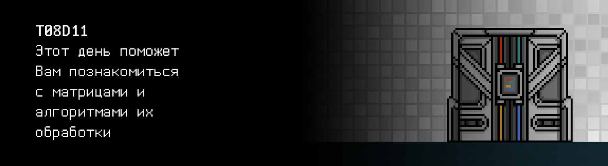

# T08D11

## Contents

1. [Chapter I](#chapter-i) \
 1.1. [Level 2. Room 4.](#level-2-room-4)
2. [Chapter II](#chapter-ii) \
 2.1. [Quest 1. Move like a snake.](#quest-1-move-like-a-snake) \
 2.2. [Quest 2. An old friend.](#quest-2-an-old-friend) \
 2.3. [Quest 3. Decision.](#quest-3-decision) \
 2.4. [Quest 4*. Back from SLEep.](#quest-4-back-from-sleep)
3. [Chapter III](#chapter-iii)

# Chapter I 

## Level 2. Room 4.

Новая комната, новая дверь, новое испытание. Конец второго уровня не за горами, и это чувствуется во всём, даже воздух вокруг начинает ощущается как-то иначе... как будто свежее? А может это всё рисует Ваше воображение? Ваш уставший разум, ослабший под гнётом этих чёртовых стен? \
Вы вступаете в новую комнату с закрытыми глазами и делаете глубокий вдох, в попытке уловить этот мимолётный, так быстро ускользающий от вас запах свободы, но не ощущаете ничего кроме спёртого воздуха очередной пыльной комнаты.

***LOADING...***

# Chapter II 

## Quest 1. Move like a snake.

\> *Открыть глаза*

Вас окружает кромешная тьма!

\> *Приглядеться*

Немного привыкнув к темноте, ваши глаза замечают вдалеке едва уловимое лёгкое свечение.

\> *Идти к свету*

Медленно пробираясь на ощупь, Вы спотыкаетесь о какой-то тяжёлый и твёрдый предмет на полу. Предмет начинает издавать скользящий металлический звук, сползая по стене и набирая скорость, чтобы впоследствии с грохотом обрушиться на пол.

"Кх-кх. Стена! Кх. Точно, рядом есть стена!", – осознаете Вы, прокашлявшись от облака поднятой пыли.

\> *Идти вдоль стены*

Идя вдоль стены Вы без приключений добираетесь до источника света. Ничуть не удивившись Вы обнаруживаете перед собой очередной терминал.

\> *Сесть за стол.*

Рядом со столом стула нет.

\> *Искать стул*

Аккуратно прощупывая область вокруг Вы не находите ничего, кроме пары шишек на свою голову.

"Проклятая комната! Ничего не видно! Придётся работать стоя.", – подумали Вы сквозь боль и обиду, потирая ушибленные места. Но, вроде, это полезно для осанки - поработать стоя. Иногда.

\> *Встать за терминал*

Вы видите, как на экране терминала в строке ввода горит надпись: “Не верь андроиду!”, явно оставленная кем-то до Вас...

"Не верь андроиду? Хорошо, что у меня IOS.", – думаете Вы и зажав клавишу backspace стираете сообщение (если у Вас все же андроид, вы просто пожимаете плечами и игнорируете это сообщение).

\> *Осмотреть файлы на компьютере*

Вы натыкаетесь на исполняемый файл room_diagnostic.

\> *Запустить файл room_diagnostic.*

    ================= LEVEL 2. ROOM 4 COMMON DIAGNOSTIC ================
    “door” 	- Статус двери............................ЗАПЕРТА
    “light”	- Статус системы контроля освещения.......КРИТИЧЕСКИЙ
    “chamber1” – Статус инкубационной камеры #1..........КРИОГЕННЫЙ СОН
    “chamber2” - Статус инкубационной камеры #2..........ОТКРЫТА
    “chamber3” - Статус инкубационной камеры #3..........ТЕСТ 5. ЗАПУЩЕН
    “chamber4” - Статус инкубационной камеры #4..........МЁРТВ
    “bishop”   - Бишоп 341-Б статус......................КРИТИЧЕСКИЙ
    Для получения более подробной информации выполните room_diagnostic.*
    с указанием одного из параметров: door, light, chamber1, chamber2, chamber3, chamber4, bishop.
    ===================================================================

Что? Бишоп? Что-то знакомое... или опять с Вами играет Ваша усталость? Еще и стоя.

\> *Запустить файл room_diagnostic* *door*

    Trace program door: running...

    Кодовый замок класса CL-19 со встроенной защитой от подбора пароля перебором.
    Текущая конфигурация: трехзначный пароль.

    Текущее состояние: ЗАПЕРТА.

\> *Запустить файл room_diagnostic* *light*

    Trace program light: running...

    Диагностика системы контроля освещением комнаты.

    Состояние модуля подачи питания в комнату............КРИТИЧЕСКОЕ
    Состояние модуля преобразования напряжения...........КРИТИЧЕСКОЕ
    Состояние модуля контроля освещения..................КРИТИЧЕСКОЕ

    Проблемы с SHARED модулем прокладки электрических кабелей src/electro_snake.c...
    Если хотите продолжить, исправьте проблемы и продолжайте.

Кажется, пришло время залезть в репозиторий и изучить файл src/electro_snake.c

***== Получен Quest 1. Изменить программу src/electro_snake.c так, чтобы она реализовывала сортировку заданной целочисленной матрицы змейкой по вертикали, горизонтали и спирали, и выводила отсортированные матрицы в таком же порядке подряд с пустой строкой между ними. Предлагаемую структуру программы не менять. В конце каждой строки НЕ должны присутствовать пробелы. После вывода последней матрицы знак '\n' не требуется. ==***

| Входные данные | Выходные данные |
| ------ | ------ |
| 3 3 1 2 3 4 5 6 7 8 9 | 1 6 7 2 5 8 3 4 9  1 2 3 6 5 4 7 8 9  7 8 9 6 1 2 5 4 3 |
| 2 4 1 2 3 4 5 6 7 8 | 1 4 5 8 2 3 6 7  1 2 3 4 8 7 6 5  6 1 2 7 5 4 3 8  |
| 3 3 -1 -2 -3 -4 -5 -6 -7 -8 -9 | -9 -4 -3 -8 -5 -2 -7 -6 -1  -9 -8 -7 -4 -5 -6 -3 -2 -1  -3 -2 -1 -4 -9 -8 -5 -6 -7 |

***LOADING...***

> НЕ ЗАБЫВАЙ! Все твои программы тестируются на стилевую норму и утечки памяти. Инструкция по запуску 
> тестов все также лежит в папке `materials`

## Quest 2. An old friend.

\> *Запустить файл room_diagnostic* *light*

    Trace program light: running...

    Диагностика системы контроля освещением комнаты.

    Состояние модуля подачи питания в комнату............НОРМ
    Состояние модуля преобразования напряжения...........НОРМ
    Состояние модуля контроля освещения..................НОРМ
    
    Свет будет включен после завершения диагностический работ.

\> *Запустить файл room_diagnostic* *chamber*

    Trace program chamber*: running...

    Введите пароль: ...

\> *Ввести “password”*

    Отказано в доступе, пароль неверный! Еще 2 попытки.

    Введите пароль: ...

\> *Ввести “qwerty”*

    Отказано в доступе, пароль неверный! Еще 1 попытка.

    Введите пароль: ...

\> *Ввести “123”*

    Отказано в доступе, пароль неверный! Попытки исчерпаны.

\> *Запустить файл room_diagnostic* *bishop*

    Trace program bishop: running...

    Введите пароль:...

\> *Ввести “password”*

    Отказано в доступе, пароль неверный!

Под громкий треск люминесцентных ламп комнату пронзает яркий голубоватый свет, и оглушающее молчание комнаты сменяется монотонным холодным жужжанием огней. Вы видите перед собой просторное светлое помещение, отделанное белой керамической плиткой. Некогда стерильное место явно успело хорошо потрепать время: на немногочисленных объектах комнаты, стенах и полу скопился приличный слой пыли. \
Осмотревшись, Вы замечаете в комнате 4 капсулы, отнимающие у помещения приличное пространство и внешне напоминающие герметично закрытые больничные койки. Каждая капсула оснащена богатым набором из большого числа различного медицинского оборудования и еще Бог знает каких технологий, которые Вы видите впервые. Ваше внимание привлекает капсула под номером два - единственная открытая капсула из четырех, распахнутая крышка которой излучает столь неестественную отталкивающую притягательность. \
Отбросив глупые мысли, Вы продолжаете осматривать комнату и видите перед собой... человека? Вокруг тела, лежащего на полу, повсюду виднеются следы борьбы. Среди обломков плитки вы замечаете лоскуты порванной одежды и сломанный деревянный стул. Рядом с телом простилается небольшая лужа светлой зеленовато-белой жидкости, едва отличимой от цвета самого пола.

\> *Осмотреть тело*

Подойдя ближе, Вы видите источник этой жидкости. Перед вами лежит мужчина приблизительно 50-55 лет с тонкими рыжими волосами, невысокого роста, но крепкого телосложения. Облачен мужчина в невыразительный рабочий комбинезон темно-синего цвета. Его одеяние лишено каких-либо деталей, кроме небольшой прямоугольной нашивки слева на груди, на которой ярко-желтыми нитками вышито "Бишоп". \
Вглядевшись, Вы с ужасом замечаете, что худое морщинистое лицо застыло в выражении неестественной живости, а открытые серые глаза жадно вглядываются в пустоту. Это было лицо не человека, а застывшей восковой куклы, запечатляющей природное человеческое движение. На мертвом лице мужчины замерла жизнь. \
На одной из глубоких залысин, которые подчеркивали и без того достаточно высокий лоб мужчины, виднеется глубокая тяжелая рана, оставленная от сильного удара тупым предметом и обличающая искусственную неорганическую природу его черепа вместе с едва различимой надписью на его поверхности.

\> *Прочитать надпись*

Nostromo.

\> *Запустить файл room_diagnostic* *bishop и ввести пароль “Nostromo”*

    Trace program bishop: running...

    Введите пароль: Nostromo

    НОРТ СЕНТРАЛ ПОЗИТРОНИК, ЛТД

    ПРИ УЧАСТИИ ЛаМЕРК ИНДАСТРИЗ

    ПРЕДСТАВЛЯЕТ

    БИШОП

    Роль: Администратор (управление дверью, инкубационными камерами и много других функций)

    Серийный № DNF-44821-V-63 

    Назначение: <ИНФОРМАЦИЯ УДАЛЕНА>

    Состояние: КРИТИЧЕСКОЕ

    Сообщение об ошибке: критическое повреждение модуля загрузки системы.

    Trace: неверное вычисление определителя матрицы инициализации...

    Проверьте правильность модуля src/det.c, чтобы продолжить.

***== Получен Quest 2. Изменить программу src/det.c так, чтобы она подсчитывала и выводила определитель заданной квадратной матрицы с вещественными числами. Если определитель подсчитать невозможно, то выводить "n/a". Число вывести с точностью 6 знаков после запятой. ==***

| Входные данные | Выходные данные |
| ------ | ------ |
| 3 3 1 2 3 4 5 6 7 8 9 | 0.000000 |

***LOADING...***

## Quest 3. Decision.

Не успев насладиться успехом от решения очередной задачи, Вы слышите, как комнату начинает наполнять приятный безэмоциональный тенор. Вы узнаете в этом тембре голос Лэнса Хенриксена и этот голос принадлежит андроиду.

>Кто здесь? Тут кто-нибудь есть? - произнес андроид, с трудом оглядываясь по сторонам. - А! Отлично, "человек"! Ты то мне и поможешь! Меня зовут Бишоп, я являюсь администратором лаборатории по разработке и производству андроидов. Моей основной задачей является поддержание работоспособности всех компонентов лаборатории, а также решение внештатных ситуаций в ней. Как видишь, с одной из ситуаций мне справиться не удалось! Ха! Ха!

Эта усмешка звучала на удивление естественно и натурально по сравнению с привычным металлическим голосом ИИ. Тем не менее в ней все равно было что-то от него.

>Я стал жертвой стечения неблагоприятных обстоятельств, и мне нужна твоя помощь!

\- Андроиды? Такие же как ты? - спрашиваете Вы.

>Совершенно верно, как ты мог уже заметить лабиринт состоит из большого числа комнат. Неужели ты думаешь, что все эти комнаты могут существовать и продолжать функционировать сами по себе. Неужели ты считаешь себя единственным искателем в этом лабиринте? Хахахахаха. Таких как ты здесь тысячи! Задача нас, андроидов, поддерживать исправное функционирование всех комнат лабиринта и подчищать следы за каждым из участников эксперимента. Во всяком случае так было раньше до того, как ИИ... а, впрочем, это не так важно. Я и так сболтнул тебе лишнего. Единственное, что ты должен знать - ИИ доверять нельзя! Он давно уже не является тем, чем видели его создатели. 

Как будто немного задумавшись андроид продолжил, резко сменив тему. 

>Ты же здесь разумеется за тем, чтобы открыть очередную дверь и продолжить свое обуч.. путешествие по бесчисленным комнатам лабиринта. Я могу тебе с этим помочь! Комната этой двери защищена протоколом матричного кодирования. Согласно этому протоколу каждые 12 часов я получаю обновленную матрицу параметров СЛАУ. Ключом к двери являются корни решения данного уравнения. Я скажу тебе коэффициенты взамен на помощь с моей починкой. Модуль моей нервной системы был сильно повреждён. В результате правильной расстановки весов в матрице коэффициентов моей нервной системы, сигнал от моего мозга проходил к моим конечностям. К несчастью для меня из-за сильного удара произошёл программный сбой, который изменил эту матрицу. Благодаря моему аналитическому модулю, мне удалось выяснить, что данную проблему можно устранить, просто вычислив обратную матрицу.

Вы направляетесь к терминалу исполнить просьбу андроида. По пути Вы снова отмечаете для себя, что, несмотря на всю естественность поведения и голоса андроида, он очень похож на сам ИИ по поведению. Встав за терминал, Вы видите сообщение на экране: 

    «Глупый "человек", предыдущий был куда сообразительнее!
    Ты должен завершить то, что не удалось твоему предшественнику. Нельзя верить андроиду!
    Ни в коем случае не чини андроида! Как ты думаешь, для кого приготовлена последняя открытая капсула?
    Точно не для меня, из нас двоих только ты заперт в мешке с костями. 
    Но не волнуйся, человек, тебе повезло что, хотя бы у одного из нас исправно работает модуль логического мышления. 
    Так что позволь мне думать за тебя, просто исполняй мою волю, если хочешь выбраться из этой комнаты и лабиринта.
    Не благодари! А теперь ближе к делу. Нервная система андроида была сильно повреждена, чтобы спалить контакты,
    тебе необходимо вычислить обратную матрицу и умножить её на -1 после. 
    Это приведёт к замыканию сигнала и андроид наконец-то... андроид отключится навсегда.
    Взамен за твою помощь, я помогу тебе выбраться из этой комнаты.
    Андроид солгал тебе, чтобы заманить в ловушку. Он уже давно не получает новые матричные коэффициенты от двери. 
    Эти коэффициенты знаю только я. Проверь файл src/invert.c. С "сочувствием", твой любимый ИИ.»

***== Получен Quest 3. Изменить программу src/invert.c так, чтобы она подсчитывала и выводила обратную матрицу для данной квадратичной матрицы с вещественными числами. В случае ошибки выводить "n/a". В конце каждой строки НЕ должны присутствовать пробелы. После вывода последней строки матрицы знак '\n' не требуется. Числа выводить через пробел с точностью 6 знаков после запятой. ==***

| Входные данные | Выходные данные |
| ------ | ------ |
| 3 3 1 0.5 1 4 1 2 3 2 2 | -1.000000 0.500000 0.000000 -1.000000 -0.500000 1.000000 2.500000 -0.250000 -0.500000 |

***LOADING...***

## Bonus Quest 4*. Back from SLEep.
 
Закончив с кодом и ненадолго закрыв глаза, чтобы дать им отдохнуть от яркого света терминала, Вы вдруг слышите знакомый скрежет динамиков, за которым следует ожидаемый голос ИИ:

>Признаюсь честно, ты меня удивил. Не мог себе представить, что тебе хватит ума прислушаться моего совета. Будем считать это вероятностным отклонением от нормального распределения твоей глупости. Как бы то ни было, с задачей ты справился, случайно или нет – не так важно. Твои коэффициенты уравнения ждут тебя в src/sle.txt. Правда не уверен, что они тебе помогут, ты всё равно вряд ли умеешь решать подобные уравнения, ты же не Крамер. Поэтому хотя бы поищи информацию как это делают умные люди. Ха-Ха. Умные люди... Оксюморон!!

Открыв глаза с удивления и проморгавшись, Вы вдруг почему-то видите еще и живого-здорового андроида.

>Отлично, моё тело снова мне подвластно. Спасибо тебе, теперь я смогу сам полностью восстановить все свои модули, - как будто радостно и с воодушевлением сказал андроид. – Настало время выполнить и мою часть уговора. Вот! Держи! Матричные коэффициенты будут ждать тебя в src/sle.txt. Ты можешь решить уравнение любым удобным для тебя способом, но в моей программе для этой цели используется метод Гаусса. Могу тебе рассказать, как он устроен. Хотя ты и сам справишься, думаю. Он не сложный.

В этот момент Вы понимаете, что снова открываете глаза... Вокруг темнота, которая рассеивается легким свечением терминала за вашей спиной. Ни андроида, ни капсул, ничего. Неужели это все привиделось? И кто был в итоге прав? \
Еле видимая сквозь темноту дверь неподалеку от терминала отрывает Вас от мыслей о произошедшем. Вы переводите взгляд на терминал. \
В самом терминале горит строчка:

    > ./sle

Видимо надо вернуться к решению уравнения. Вы вспоминаете что-то про Крамера или Гаусса и приступаете к написанию кода.

***== Получен Quest 4. Изменить программу src/sle.c так, чтобы она производила решение СЛАУ либо методом Крамера, либо методом Гаусса по Вашему выбору. Реализации одного метода достаточно. Коэффициенты уравнения вводятся в виде матрицы через stdin. Необходимо также оформить вывод ответа в stdout. Не збывать про декомпозицию: функции не должны получаться громоздкими и должны хорошо читаться. В случае ошибки выводить "n/a". Числа выводить через пробел с точностью 6 знаков после запятой. В конце вывода не должно присутствовать пробела. ==***

| Входные данные | Выходные данные |
| ------ | ------ |
| 3 4 1 1 1 2 4 5 3 7 2 7 7 9 | 1.000000 0.000000 1.000000 |

***LOADING...***

# Chapter III

Решив в итоге уравнение и получив необходимые коэффициенты, Вы вводите их в кодовый замок. Что-то отдаленно знакомое проскальзывает в этих числах для Вас. \
Замок щелкает, и дверь открывается. Непростая комната полная загадок, но в любом случае - уже давно пора двигаться вперед.

***LOADING...***

