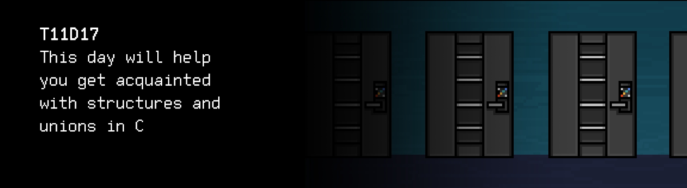

# T11D17
The russian version of the task can be found in the repository.

You can find some useful video materials [here](https://edu.21-school.ru/video/selection/062eaa22-bce7-407c-9b9d-e334bb2ad5a2).

## Contents

1. [Chapter I](#chapter-i) \
 1.1. [Level 3. Room 3.](#level-3-room-3)
2. [Chapter II](#chapter-ii) \
 2.1. [List 1. MCO.](#list-1-mco) \
 2.2. [List 2. Instructions.](#list-2-instructions)
3. [Chapter III](#chapter-iii) \
 3.1. [Quest 1. The Doors.](#quest-1-the-doors) \
 3.3. [Quest 2. Polynomial.](#quest-2-polynomial) \
 3.4. [Quest 3. Stack for key.](#quest-3-stack-for-key) 
4. [Chapter IV](#chapter-iv)

# Chapter I

## Level 3. Room 3.

***LOADING Level 3… \
LOADING Room 3…***

\> *Look around*

Another room with a desk, a computer, a lamp, and no books. Only this time, instead of just one door, it has fifteen. They all have some strange electronic locks with keypads. That's disturbing. Well at least there's a lamp here – it makes the room cozier.

\> *Pull the first door*

It's locked.

\> *Pull the second door*

Locked again.

\> *Pull the third door*

It doesn't open.

\> *Pull the fourth door*

Nope.

\> *For i = 5, while i <= 15 -> Pull the i door and increase the i*

Wasted CPU time.

\> *Look around again*

Next to a pile of papers on the desk, someone left a clipping. Did the AI somehow manage to do it or was it someone before you? Although it's rather questionable to assume that the AI would read newspapers, let alone make clippings.

\> *Skim read the clipping*

***LOADING...***

# Chapter II

## List 1. MCO.

The piece of paper is yellowed and worn out. It was also cut out extremely sloppily. 

>Mars Climate Orbiter was launched on December 11, 1998, aboard a Delta II launch vehicle. The vehicle reached Mars in 9 months. On September 23, 1999, Mars Climate Orbiter was supposed to perform a braking burn and get into a highly elliptical orbit with a 14-hour period, and then, over the course of two months, use a range of aerodynamic maneuvers in the upper part of the Martian atmosphere to loop around Mars. At the estimated time, at an altitude of 193 km, the vehicle fired the engines for braking. Five minutes later, Mars Climate Orbiter began the orbital insertion maneuver and never sent any other signals. Data analysis suggests that the orbiter passed over the surface of Mars at an altitude of 57 km instead of the planned 110 km and was destroyed in the atmosphere. Such a significant discrepancy was caused by an error in the mission software: the unit of force used by the engine thrust commands in the Mars Climate Orbiter software was the newton, while the software on Earth that generated those commands used the British pound-force...

\> *Take the first sheet from the stack of paper under the clipping*

***LOADING...***

## List 2. Instructions.

This looks like a page from a computer programming book... You should probably read it carefully.

>Structure is a type defined by the user, which allows you to store and move several values of different types together. A structure is defined as follows:

    struct [structure name] {
    element definition;
    element definition;
    …
    element definition;
    } [one or several variables];

>The use of structures makes it possible to combine shared data, and also leaves the possibility for further modification of the transmitted data without changing function headers.
>
>The amount of memory occupied by the structure equals the total memory occupied by all of its elements. Therefore structures in C are zero-cost abstractions. Structure elements are arranged in memory in the order in which they are defined.

\> *Take another sheet of paper*

>Union is a data type that makes it possible to reuse memory for storing values ​​of different types. A union is defined as follows:

    union [union name] {
    element definition;
    element definition;
    …
    element definition;
    } [one or several variables];

>The memory occupied by a union is defined as the memory required to store the biggest element of the union.
>.....................

The rest of the text is illegible

>One of the applications of unions and structures are so-called unions with a label. These structures store one of several valid data types and contain a label–an integer that can be used to determine which data type is currently in the union.

\> *Take another sheet of paper*

>Singly linked list is a data structure that consists of interlinked nodes with the same type of data. Each element of the list has a pointer to the next element, and the last one stores a null pointer (0/NULL in C). The lists have variable length and make it possible to easily unite multiple lists, but take up more memory and require more elementary operations for their bypass, compared to arrays.

***LOADING...***

# Chapter III

## Quest 1. The Doors. 

\> *Look around the room carefully in search for extra clues*

Nothing.

\> *Examine the desk carefully in search for extra clues*

You notice a small orange piece of paper under the keyboard. Such pieces of paper are often used as stickers for reminders. 

\> *Take and read*

Are you sure? This may be personal...

\> *I am. It didn't bother anyone before. Plus I don't have much choice.*

>src/dmanager_module.c – door control module. \
>Do not touch the door initialization function, it destroys the logic of the core of the room. \
>Do not open all the doors, it crushes the transmission protocol. \
>For management, dedicate the function of door sorting in ascending order and closing "open" doors. 
> 
>Door structure: integer id and numeric status (0 – closed, 1 – open).

Looks like a reminder that someone left long before you. And this reminder may help you. You should pay attention to this door control module.

***== Quest 1 received. Create door structure in src/door_struct.h. 
The structure itself consists of an integer door id and an integer status 
(0 – closed, 1 – open). Correct the src/dmanager_module.c program so it 
sorts the initialized array of doors in ascending order using any algorithm 
and displays it in the following format: "door id, door status". 
In addition to that, set the status "closed" for all doors. Changing the 
door initialization function is not allowed. Stick to the structured approach. 
The program should be built using a Makefile. Stage name: door_struct. The 
executable file should be located in the build folder at the root of the 
repository. It should be named Quest_1. The solution will be checked for memory 
leaks and for the style norm, instructions as usual-in `materials` ==***

0, 0 
1, 0 
2, 0 
3, 0 
4, 0 
5, 0 
6, 0 
7, 0 
8, 0 
9, 0 
10, 0 
11, 0 
12, 0 
13, 0 
14, 0 

***LOADING...***

## Quest 2. Polynomial.

Looks like door initialization works. But how can you get out? Which door should you assign the "open" status to? Based on the notes, if you do it for all doors – it may cause some kind of disaster.

\> *Flip the piece of paper over*

Here's the rest of the note.

>The necessary door changes every day. \
>The number of the current one is calculated using a polynomial function, a different one every time. \
>The function looks as follows: P(x) = a*x^n + b*x^(n−1) + ... + y * x + z. \
>Through trial and error, it has turned out that the argument of the function is always the same – 3. \
>The last working polynomial is in the materials folder. \
>The same folder contains small clues for creating a program for solving the given polynomial using a singly linked list.

There was something about a singly linked list on one of the sheets. You should find out more about this list and memory allocation for it as well. \
You also have to remember to solve the last working polynomial from the file and assign the status "open" to the door with that ordinal number in the array after its sorting and primary output.

***== Quest 2 received. Develop an src/polynomial.c program that takes a line 
with a polynomial as input data, e.g. `-5*x^6+3*x^2-x+7`, splits it into tokens, 
uses them to form the elements of a singly linked list, and performs the 
necessary calculations. The answer is output to stdout. You do not have to
enter the argument manually; you can set it as a constant with a value of 
three. You can find a clue for polynomial's implementation as a list in the 
materials folder. Add functions for working with the list separately. The 
materials folder also contains a polynomial that needs to be solved. Its 
answer is the ordinal number of the door in the sorted array that has to 
receive the status "open", in the src/dmanager_module.c program after sorting 
and output. The program should be built using a Makefile. Stage name: polynomial. 
The executable file should be located in the build folder at the root of the 
repository. It should be named Quest_2.
This quest will also be checked for memory leaks and the style norm. ==***

| Input | Output |
| ------ | ------ |
| x^5-10*x^3+3*x^2+5 | 5 |
| x^1+5*x^0 | 8 |

***LOADING...***

## Quest 3. Stack for key. 

Ok, the door you need is now open, it's time to leave.

\> *Pull the handle*

It's locked... \
However, you notice a small screen open on the door. The message says in big letters:

> NO DYNAMIC INT STACK AND/OR STACK OPERATIONS

You go back to the computer and think about what it could possibly mean. It's a shame there are no more pieces of paper with clues anywhere... \
You give it some thought and remember that a stack seems to be a variety of dynamic data structures, which is often implemented as a list. Looks like in order to open the door you also need to create a dynamic stack that contains integers. You need to implement the stack's standard interface: data pushing and popping operations. Also, don't forget to save all implementations in src/stack.c, whereas function declarations and structures in src/stack.h. You should also write module tests in tests/stack_test.c to make sure the stack and its functions are working. Who knows what might happen if the stack doesn't work correctly..

***== Quest 3 received. Develop an src/stack.c program which contains 
implementations of functions for working with a dynamic stack (init, push, 
pop, destroy). Put declarations of functions and structures of the dynamic 
stack that stores integers in src/stack.h. Write module tests for checking 
the push and pop functions of the stack in src/stack_test.c. Method functions 
should return SUCCESS if the test is successful and FAIL if there is an error. 
The tests should be built using a Makefile. Stage name: stack_test. 
The executable file should be located in the build folder at the root of 
the repository. It should be named Quest_3.
Please note: this quest will be tested by the `cppcheck` utility. ==***

> ***This task does not provide for autotesting!***

***LOADING...***

# Chapter IV

\> *Push the last task in the repository*

Looks like it's all done.

\> *Come up to the necessary door*

The small screen is empty. Looks like your stack has worked for the door.

\> *Pull the handle*

The door opens and you take a step into the next room.

***LOADING...***

