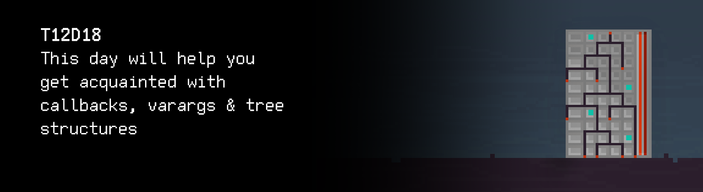
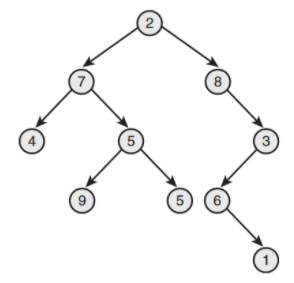

# T12D18
The russian version of the task can be found in the repository.




## Contents

1. [Chapter I](#chapter-i) \
 1.1. [Level 3. Room 4.](#level-3-Room-4)
2. [Chapter II](#chapter-ii) \
 2.1.  [Quest 1. Print Module.](#quest-1-print-module) 
3. [Chapter III](#chapter-iii) \
 3.1. [List 1.](#list-1) 
4. [Chapter IV](#chapter-iv) \
 4.1. [Quest 2. Checking Module.](#quest-2-checking-module) 
5. [Chapter V](#chapter-v) \
 5.1. [List 2.](#list-2) \
 5.2. [List 3.](#list-3) \
 5.3. [List 4.](#list-4) 
6. [Chapter VI](#chapter-vi) \
 6.1. [Quest 3. BST.](#quest-3-bst) \
 6.2. [Quest 4. Growing tree.](#quest-4-growing-tree) \
 6.3. [Quest 5. Three styles of traversing.](#quest-5-three-styles-of-traversing)
7. [Chapter VII](#chapter-vii)


# Chapter I

## Level 3. Room 4.

***LOADING Level 3… \
LOADING Room 4…***

\> *Look around*

You enter a new room with no books or weird scrolls on the walls, and only one door. Everything would be fine and quite normal if it wasn't for a huge real tree growing in the middle of the room. You wonder why all the rooms on this level are so strange.. \
You come closer to the workstation and see an open report in the command terminal, probably from one of the engineers. There's also a couple of yellow leaves fallen from the tree.

\> *Study the report*

    I've recently had to develop a kernel mode driver. 
    This made a lot of my colleagues very angry and was viewed as a bad engineering move.

    Like every other piece of code I've written, that driver had a few serious bugs 
    which caused some interesting side effects. 
    In particular, the driver prevented a number of other drivers from loading and eventually caused the system to crash.

    I discovered later that many drivers assume that their initialization procedure is always successful 
    and cannot process a violation... 
    Several years ago, an AI codenamed j00ru was developed to document such cases 
    in a special log, and many of them are still relevant for current OS versions. 
    As a result, those buggy drivers were no longer a problem: 
    j00ru did a great job, saving me a lot of years. 
    I decided that the AI can not only help with fixing problematic drivers, 
    but also help me and many other people with many other things: 
    analyzing the code, finding logical errors,
    making a shopping list for the week, finding the necessary information, etc. 
    That's why I focused on expanding its functionality. 
    I had a lot of work ahead of me, and its first part was adding various structures for 
    ...

***LOADING...***


# Chapter II

> **Attention!** All executable files, as before, should be located in the `build` folder of the root directory of the project

## Quest 1. Print Module.

The report is suddenly interrupted and you see an error message. You study it in more detail and realize that the output module is corrupt (who would have thought!) and needs to be replaced.
The system suggests adding your own module.

\> *Search for documentation on the computer*

Luck is in the air tonight. The computer has a bit of information about the output module and the documentation module.


\> *Read the documentation*

You upload the documentation and study it.

...

You study the documentation in more detail and realize that the system simply lacks an output function. The signature of the requesting module looks as follows:

`void print_log(char (*print) (char), char* message);`

After more studying, you realize that the core of the system works using callbacks and you need to figure out the display implementation and call it in a module.

***== Quest 1 received. Write a print_log function in the src/print_module.c file so it can display the following message using the function transmitted to it with the parameters: "[LOG] current_time message". The current time should be displayed in the HH:MM:SS format. Change the src/main_module_entry_point.c file if necessary. Build the program using the Makefile. Stage name: print_module, executable file name: Quest_1. ==***

***LOADING...***


# Chapter III

## List 1.

\> *Push the changes to the repository*

    System segmentation fault…
    Loading module structure seems to be broken
    System: Output stream module load… success
                    LOADING...
                      SUCCESS
        Continue reading where you left off?
                        N/Y

The report continues with several embedded data structures for use in the AI code. As with any large software project, these general data structures and primitives are provided for reuse in the code. Developers should reuse them whenever possible. \
The following sections of the documentation describe the following general data structures: Linked lists, Queues, Maps, Binary Trees. Each section contains information with a description, scope, and complexity of the algorithm.

        SELECT DOCUMENT YOU WANT TO READ?
                    >...

                    ERROR…
                    
The text is suddenly interrupted and the system starts checking the integrity of the remaining data.

                UNRECOGNIZED OPERATION…
                FILTER MODULE: MISSED 

The system underlines several lines in the extensive error log:

    System segmentation fault…
    Loading module structure seems to be broken
    missed or unknown header: stdarg.h
    missed or unknown header: varargs.h
    va_start can’t be used
    va_arg can’t be used
    va_end can’t be used
    use 'man stdarg' to get more information

\> *What is this?*

Whom are you asking after all

***LOADING...***


# Chapter IV

## Quest 2. Checking Module.

According to the documentation, it looks like you need to write a function – an AI module described by the following signature:

`short check_available_documentation_module(int (*validate) (char*), int document_count, ...);`

Based on the signature, the function should apply a callback to each transmitted parameter.

***== Quest 2 received. Write a check_available_documentation_module function in the src/documentation_module.c file so it can apply a validation function transmitted in the parameters to each document it transmits in the parameters. The program should result in a binary mask of document availability. Modify the src/main_module_entry_point.c file so it implements a human-readable output of document availability using the obtained mask (format: [document_name] : [(un)available]). For the checked components, set the output field size modifier to 15 units. Note that the function takes an arbitrary number of arguments. Build the program using the Makefile. Stage name: documentation_module, executable file name: Quest_2. ==***

***LOADING...***


# Chapter V

## List 2.

> DON'T FORGET! All your programs are tested for the style norm and memory leaks. Start-up instructions
> the list of tests is also in the `materials` folder

        Validating module…
        System segmentation fault…
        Loading module structure seems to be broken
        Checking available documents:
            1. Linked lists: 	unavailable
            2. Queues: 		unavailable
            3. Maps: 		unavailable
            4. Binary Trees: 	available

        Select document to open:
        >1
        LOADING...
        Document unavailable

        Select document to open:
        >2
        LOADING...
        Document unavailable

        Select document to open:
        >3
        LOADING...
        Document unavailable

        Select document to open:
        >4
        LOADING…
        LOAD: SUCCESS
        Do you want to read it now? 
        N/Y

***LOADING...***


## List 3.

    Definitions: 
    A tree is a data structure that enables a hierarchical tree structure.
    Mathematically speaking, it's an acyclic connected directed graph,
    where each vertex (called a node) has zero or more outbound edges and zero or one inbound edge. 

    The structure of one element (leaf, node) is described as follows:

```
typedef struct 		s_btree 
{
struct s_btree 	*left; 
struct s_btree 	*right;
int 			item; 
} t_btree;
```

    A binary tree is a tree the nodes of which have no more than two outbound edges.

 \
Fig. 1. Binary tree.

    PRESS PAGE DOWN TO CONTINUE


## List 4.

    Definitions: 
    Binary search tree (BST) is a binary tree with a specific order 
    of nodes. The order is often determined using the following induction: 
    The left subtree of the root only contains nodes with values less than the root. 
    The right subtree of the root only contains nodes with values higher than the root. 
    All subtrees are also binary search trees.

    Characteristics

    |   | on average | worst-case scenario |
    | ------ | ------ | ------ |
    | Storage consumption | O(n)      | O(n)    |
    | Search         | O(log n)      | O(n)    |
    | Insert       | O(log n)      | O(n) |
    | Delete       | O(log n)      | O(n) |

    A binary search tree is therefore a binary tree in which all nodes are ordered
    so that left child elements are less than their parent and right child elements are bigger 
    than their parent. Hence, both search for the given node
    and tree traversal are effective (logarithmic and linear, respectively).

 \
Fig. 2. Binary search tree.

    END OF CURRENT DOCUMENT
    PRESS ANY KEY TO RETURN…

    Validating module…
    System segmentation fault…
    AI documentation module found but not loaded correctly… 
    Hint: Try to sort modules in the right order

***LOADING...***

# Chapter VI

## Quest 3. BST.

\> *So what should I do?*

Looks like you need to follow the subtle clues of the system and sort the AI ​​modules using a binary search tree. Each module has its own numeric id, from 0 to 10. Based on the information you've found on the computer, you know that the documentation module's identifier is 4. \
Luckily for you, the tree element (leaf) structure is already provided in the documentation. 

The first step is to write a function for creating a node in src/bst.c (the function must save the value in the node and initialize the initial states of the child nodes). The function's signature should look as follows:

`t_btree *bstree_create_node(int item)`

The t_btree type needs to be described in the corresponding header file. Finally, the node creation function should be tested in src/bst_create_test.c using module testing, as it has been done before.

***== Quest 3 received. Create an src/bst.c program with a function for creating a node of a binary search tree, bstree_create_node. Put the description of the type of the tree node in src/bst.h. Using module testing, check the created function in src/bst_create_test.c (at least two input values with an output of what's been created). Build the program using the Makefile. Stage name: bst_create_test, executable file name: Quest_3. ==***

***LOADING...***


## Quest 4. Growing tree.

\> *Ready*

Now that the function for creating one element is ready, you can start creating the entire tree by inserting the next node.

The signature of the function should look as follows and also be located in src/bst.c:

`void bstree_insert(t_btree *root, int item, int (*cmpf) (int, int));`

As you can see from the signature, the values of the nodes should be compared using a callback – cmpf. \
Finally, the function also needs to be tested in src/bst_insert_test.c with at least two different sets of input values and an output where the tree leaf is inserted.

***== Quest 4 received. Supplement the src/bst.c program by implementing the function of inserting a binary search tree node, bstree_insert. Using module testing, check the created function in src/bst_insert_test.c (at least two sets of input values with an output of the location of the tree leaf's insertion). Create an implementation of the comparator function. Build the program using the Makefile. Stage name: bst_insert_test, executable file name: Quest_4. ==***

***LOADING...***


## Quest 5. Three styles of traversing.

\> *Looks like all that remains is tree traversal*

You need to create functions for tree traversal. Since there is no information about the exact order in which the AI ​​documentation modules must be located to load correctly, you'll have to write 3 different tree traversal functions:
– infix: elements will be displayed in ascending order 
(left subtree -> root -> right subtree);
– prefix: elements will be displayed in the same order as they are stored 
(root -> left subtree -> right subtree);
– postfix: elements will be displayed in descending order 
(right subtree -> root -> left subtree).

Function signatures look as follows and must all be implemented in src/bst.c:

`void bstree_apply_infix(t_btree *root, void (*applyf) (int));`

`void bstree_apply_prefix(t_btree *root, void (*applyf) (int));`

`void bstree_apply_postfix(t_btree *root, void (*applyf) (int));`

applyf is also a callback to which the node value must be transmitted. This function can, for instance, display the values on the screen. \
For the tests, take sets of input data from the previous test and create screen output for the trees in three different ways in src/bst_traverse_test.c.

***== Quest 5 received. Supplement the src/bst.c program by implementing tree traversal functions for the binary search tree: bstree_apply_infix, bstree_apply_prefix, bstree_apply_postfix. Using module testing, check the created functions in tests/bst_traverse.c (take sets of input data from the previous test and create screen output for the trees in three different ways). Prepare implementation of the applyf function as a function that outputs the value of the node in the terminal. ==***

***LOADING...***


# Chapter VII

\> *Push the solution to the repository*

Verification messages start flickering in the terminal and you are ready to read the end of the report.

    Validating module… 
    ... 
    Success 
    ...

Having waited for 15 minutes for the modules to complete the validation, you realize that the computer has frozen and does not respond to any actions.

\> *Press the restart button on the computer*

The screen light goes off and you notice a little bit of smoke coming out of the computer case. Looks like it has overheated or something has overheated it..\
Before you come to any conclusion, the door of the room blows out with a sharp sound, like that of an explosion, and hits the tree in the middle of the room.
"Alright, the exit is clear, the computer is broken. Unfortunately, there's no way to finish reading the report. And the AI is still nowhere to be found. Hopefully it never returns. I can handle the doors very well without him," you think to yourself and step over the threshold.

***LOADING...***

