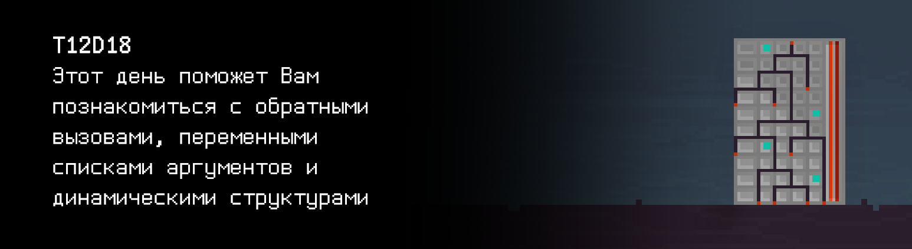

# T12D18




## Contents

1. [Chapter I](#chapter-i) \
 1.1. [Level 3. Room 4.](#level-3-Room-4)
2. [Chapter II](#chapter-ii) \
 2.1.  [Quest 1. Print Module.](#quest-1-print-module) 
3. [Chapter III](#chapter-iii) \
 3.1. [List 1.](#list-1) 
4. [Chapter IV](#chapter-iv) \
 4.1. [Quest 2. Checking Module.](#quest-2-checking-module) 
5. [Chapter V](#chapter-v) \
 5.1. [List 2.](#list-2) \
 5.2. [List 3.](#list-3) \
 5.3. [List 4.](#list-4) 
6. [Chapter VI](#chapter-vi) \
 6.1. [Quest 3. BST.](#quest-3-bst) \
 6.2. [Quest 4. Growing tree.](#quest-4-growing-tree) \
 6.3. [Quest 5. Three styles of traversing.](#quest-5-three-styles-of-traversing)
7. [Chapter VII](#chapter-vii)


# Chapter I

## Level 3. Room 4.

***LOADING Level 3… \
LOADING Room 4…***

\> *Осмотреться*

Вы перешли в новую комнату без книг, странных полотен на стенах и только с одной дверью. Все было бы прекрасно и вполне обычно, если только не огромное живое дерево, растущее посреди комнаты. И почему на этом уровне все комнаты такие странные.. \
Подойдя ближе к рабочей станции Вы видите открытый отчёт в командном терминале - по всей видимости, одного из инженеров. Ну и пару пожелтевших листов, упавших с дерева.

\> *Изучить отчёт*

    Недавно мне пришлось разработать драйвер режима ядра. 
    Это очень разозлило многих моих коллег и было расценено как неудачный инженерный ход.

    Как и любой другой фрагмент кода, написанный мной, у этого драйвера было несколько серьезных ошибок, 
    которые вызывали некоторые интересные побочные эффекты. 
    В частности, этот драйвер препятствовал загрузке ряда других драйверов и в итоге приводил к сбою системы.

    Позже я узнал, что многие драйверы предполагают, что их процедура инициализации всегда успешна, 
    и не могут обработать нарушение.
    ... 
    Несколько лет назад ИИ с кодовым именем - j00ru был разработан для документирования подобных случаев 
    в специальном журнале, и многие из них по-прежнему актуальны в текущих версиях ОС.
    ...
    В итоге эти глючные драйверы перестали быть проблемой: 
    j00ru прекрасно справился со своей задачей, сэкономив мне многие годы жизни. 
    Я же решил, что ИИ может не только помогать в исправлении проблемных драйверов, 
    но и еще помогать мне, и многим другим людям, в множестве других вещей: 
    анализировать код, находить логические ошибки,
    составлять список покупок на неделю, находить необходимую информацию и т.д. 
    Поэтому я сосредоточился на расширении его функционала. 
    Мне предстояла большая работа, первой частью которой было добавление различных структур для 
    ...

***LOADING...***


# Chapter II

>**Внимание!** Все исполняемые файлы, как и ранее, должны располагаться в папке `build` корневой директории проекта

## Quest 1. Print Module.

Отчёт неожиданно прерывается и Вы видите сообщение об ошибке. Изучив его подробнее, Вы понимаете, что модуль вывода поврежден (кто бы мог подумать!) и нуждается в замене.
Система предлагает добавить свой модуль.

\> *Поискать документацию на компьютере*

Удача Вам сегодня улыбается. На компьютере есть немного информации про модули вывода и документации.


\> *Прочитать документацию*

Вы загружаете документацию и изучаете ее.

...

Подробнее изучив документацию, Вы понимаете, что в системе просто отсутствует функция вывода на экран. Сигнатура запрашивающего модуля выглядит следующим образом:

`void print_log(char (*print) (char), char* message);`

Еще поизучав документацию, Вы понимаете, что ядро системы работает на функциях обратного вызова (callbacks) и Вам нужно разобраться с реализацией вывода на экран и вызвать её в модуле.

***== Получен Quest 1. Дописать в файле src/print_module.c функцию print_log таким образом, чтобы она при помощи переданной ей в параметрах функции выводила сообщение следующего типа: "[LOG] текущее_время сообщение". Текущее время должно быть в формате ЧЧ:ММ:СС. По необходимости изменить файл src/main_module_entry_point.c. Сборка программы должна осуществляться при помощи Makefile. Имя стадии - print_module, исполняемого файла - Quest_1. ==***

***LOADING...***


# Chapter III

## List 1.

\> *Запушить изменения в репозиторий*

    System segmentation fault…
    Loading module structure seems to be broken
    System: Output stream module load… success
                    LOADING...
                      SUCCESS
        Желаете продолжить чтение с места где остановились?
                        N/Y

В продолжении отчета представлены несколько встроенных структур данных для использования в коде ИИ. Как и в любом крупном программном проекте, эти общие структуры данных и примитивы предоставляются для повторного использования в коде. Разработчики должны переиспользовать их всякий раз, когда это возможно. \
В следующих разделах документации приведено описание следующих общих структур данных, а именно: связанные списки (Linked lists), очереди (Queues), карты (Maps), бинарные деревья (Binary Trees). Каждый раздел содержит информацию с описанием, областью применения и сложности алгоритма.

        SELECT DOCUMENT YOU WANT TO READ?
                    >...

                    ERROR…
                    
Текст неожиданно прерывается и система начинает проверять целостность оставшихся данных.

                UNRECOGNIZED OPERATION…
                FILTER MODULE: MISSED 

Среди большого лога ошибок, система подчеркнула несколько строк:

    System segmentation fault…
    Loading module structure seems to be broken
    missed or unknown header: stdarg.h
    missed or unknown header: varargs.h
    va_start can’t be used
    va_arg can’t be used
    va_end can’t be used
    use 'man stdarg' to get more information

\> *Что это такое?*

Казалось бы у кого Вы спросили этот вопрос

***LOADING...***


# Chapter IV

## Quest 2. Checking Module.

Согласно документации по всей видимости Вам нужно написать функцию-модуль ИИ, которая описывается следующей сигнатурой:

`short check_available_documentation_module(int (*validate) (char*), int document_count, ...);`

Судя по сигнатуре, функция должна применить механизм обратного вызова к каждому переданному параметру.

***== Получен Quest 2. Дописать в файле src/documentation_module.c функцию check_available_documentation_module так, чтобы она применяла к каждому переданному ей документу в параметрах функцию валидации, также переданную в параметрах. Результатом работы программы должна являться бинарная маска доступности документов. Изменить файл src/main_module_entry_point.c так, чтобы он реализовывал человекочитаемый вывод доступности документов при помощи полученной маски (формата: [название документа] : [(un)available]). Для проверяемых документов установите модификатор размера поля вывода в 15 единиц. Обратить внимание, что функция принимает произвольное число аргументов. Сборка программы должна осуществляться при помощи Makefile. Имя стадии - documentation_module, исполняемого файла - Quest_2. ==***

***LOADING...***


# Chapter V

## List 2.

> НЕ ЗАБЫВАЙ! Все твои программы тестируются на стилевую норму и утечки памяти. Инструкция по запуску 
> тестов все также лежит в папке `materials`

    Validating module…
    System segmentation fault…
    Loading module structure seems to be broken
    Checking available documents:
        1. Linked lists: 	unavailable
        2. Queues: 		unavailable
        3. Maps: 		unavailable
        4. Binary Trees: 	available

    Select document to open:
    >1
    LOADING...
    Document unavailable

    Select document to open:
    >2
    LOADING...
    Document unavailable

    Select document to open:
    >3
    LOADING...
    Document unavailable

    Select document to open:
    >4
    LOADING…
    LOAD: SUCCESS
    Do you want to read it now? 
    N/Y

***LOADING...***


## List 3.

    Definitions: 
    Дерево - это структура данных, обеспечивающая иерархическую древовидную структуру.
    Математически - это ациклический связный ориентированный граф,
    в котором каждая вершина (называемая узлом) имеет ноль или более исходящих ребер и ноль или одно входящее ребро. 

    Структура одного элемента (листа, узла) описывается следующим образом:

```
typedef struct 		s_btree 
{
struct s_btree 	*left; 
struct s_btree 	*right;
int 			item; 
} t_btree;
```

    Бинарное дерево - это дерево, в котором узлы имеют не более двух исходящих ребер.

 \
Рис. 1. Бинарное дерево.

    PRESS PAGE DOWN TO CONTINUE

***LOADING...***


## List 4.

    Definitions: 
    Бинарное дерево поиска(Binary search tree/BST) - это бинарное дерево с определенным порядком, 
    наложенным на его узлы. Порядок часто определяется через следующую индукцию: 
    Левое поддерево корня содержит только узлы со значениями, меньшими, чем корень. 
    Правое поддерево корня содержит только узлы со значениями, большими, чем корень. 
    Все поддеревья также являются двоичными деревьями поиска.

Characteristics:

|   | в среднем | в худшем случае |
| ------ | ------ | ------ |
| Расход памяти | O(n)      | O(n)    |
| Поиск         | O(log n)      | O(n)    |
| Вставка       | O(log n)      | O(n) |
| Удаление       | O(log n)      | O(n) |

    Таким образом, бинарное дерево поиска - это бинарное дерево, в котором все узлы упорядочены таким образом,
    что левые дочерние элементы имеют значение меньше, чем их родитель, а правые дочерние элементы больше, 
    чем их родитель. Следовательно, как поиск заданного узла, так и обход по порядку эффективны 
    (логарифмический и линейный соответственно).

 \
Рис. 2. Бинарное дерево поиска.

    END OF CURRENT DOCUMENT
    PRESS ANY KEY TO RETURN…

    Validating module…
    System segmentation fault…
    AI documentation module found but not loaded correctly… 
    Hint: Try to sort modules in the right order

***LOADING...***


# Chapter VI

## Quest 3. BST.

\> *Что же делать?*

По всей видимости необходимо последовать ненавязчивым подсказкам системы и отсортировать модули ИИ при помощи бинарного дерева поиска. Каждый модуль имеет свой числовой id от 0 до 10. Из информации найденной на компьютере известно, что модуль документации имеет идентификатор 4. \
К счастью для Вас, структура элемента дерева (листа) уже дана в документации. 

Первым делом необходимо написать функцию создания узла в src/bst.c (функция должна сохранять значение в узле и инициализировать начальные состояния дочерних узлов). Сигнатура функции должна выглядеть следующим образом:

`t_btree *bstree_create_node(int item)`

Тип t_btree необходимо описать в соответствующем header-файле. В конце функцию создания узла стоит проверить в src/bst_create_test.c при помощи модульного тестирования, как это уже делалось раньше.

***== Получен Quest 3. Создать программу src/bst.c, в которой реализовать функцию создания узла дерева бинарного поиска bstree_create_node. В src/bst.h расположить описание типа узла дерева. При помощи модульного тестирования проверить разработанную функцию в src/bst_create_test.c (минимум два входных значения с выводом что создалось). Сборка программы должна осуществляться при помощи Makefile. Имя стадии - bst_create_test, исполняемого файла - Quest_3. ==***

***LOADING...***


## Quest 4. Growing tree.

\> *Готово*

Теперь, когда готова функция создания одного элемента, можно приступить к созданию всего дерева при помощи вставки очередного узла.

Сигнатура функции должна выглядеть следующим образом и располагаться все также в src/bst.c:

`void bstree_insert(t_btree *root, int item, int (*cmpf) (int, int));`

Как можно понять из сигнатуры, сравнивать значения узлов необходимо при помощи функции обратного вызова - cmpf. \
В конце функцию также необходимо проверить в src/bst_insert_test.c с минимум двумя различыми наборами входных значений и выводом куда вставляется лист дерева.

***== Получен Quest 4. Дополнить программу src/bst.c путем реализации функции вставки узла дерева бинарного поиска bstree_insert. При помощи модульного тестирования проверить разработанную функцию в src/bst_insert_test.c (минимум два различых набора входных значений с выводом места вставки листа дерева). Предусмотреть реализацию функции компаратора. Сборка программы должна осуществляться при помощи Makefile. Имя стадии - bst_insert_test, исполняемого файла - Quest_4. ==***

***LOADING...***


## Quest 5. Three styles of traversing.

\> *Видимо, теперь остался обход дерева*

Нужно написать функции прохода по дереву. Поскольку нет информации о том, в каком именно порядке необходимо расположить модули документации ИИ для правильной загрузки, придётся написать 3 разных функции прохода (traverse) по дереву:
- infix - элементы отобразятся по возрастанию 
(левое поддерево -> корень -> правое поддерево);
- prefix - элементы отобразятся в том же порядке, что хранятся 
(корень -> левое поддерево -> правое поддерево);
- postfix - элементы отобразятся по убыванию 
(правое поддерево -> корень -> левое поддерево).

Сигнатуры функций выглядят следующим образом и все они должны быть реализованы в src/bst.c:

`void bstree_apply_infix(t_btree *root, void (*applyf) (int));`

`void bstree_apply_prefix(t_btree *root, void (*applyf) (int));`

`void bstree_apply_postfix(t_btree *root, void (*applyf) (int));`

applyf - тоже функция обратного вызова, которой необходимо передать значение узла. Такая функция может, например, вывести значения на экран. \
Для тестов стоит взять наборы входных данных из предыдущего теста и оформить вывод на экран дверевьев тремя разными способами в src/bst_traverse_test.c.

***== Получен Quest 5. Дополнить программу src/bst.c путем реализации функций обхода дерева бинарного поиска bstree_apply_infix, bstree_apply_prefix, bstree_apply_postfix. При помощи модульного тестирования проверить написанные функции в src/bst_traverse_test.c (взять наборы входных данных из предыдущего теста и оформить вывод на экран деревьев тремя разными способами). Подготовить реализацию функции applyf как функции, печатающей значение узла в терминал. Сборка программы должна осуществляться при помощи Makefile. Имя стадии - bst_traverse_test, исполняемого файла - Quest_5. ==***

***LOADING...***


# Chapter VII

\> *Запушить решение в репозиторий*

В терминале побежали строчки проверок и Вы приготовились закончить чтение отчета.

    Validating module… 
    ... 
    Success 
    ...

Прождав минут 15 пока модули полностью закончат валидацию, Вы понимаете, что компьютер завис и не отвечает ни на какие действия.

\> *Нажать кнопку перезагрузки на компьютере*

Экран потух и Вы заметили легкий дымок выходящий из системного блока рядом. Похоже, что он перегрелся или что-то его перегрело..\
Домыслить Вам не удалось, так как дверь из комнаты с громким резким звуком, как будто от взрыва, слетела с петель и отлетела в сторону дерева.\
"Чтоже, выход открыт, компьютер сломан. Отчет, к сожалению, не дочитать. И ИИ все еще куда-то пропал. Как бы хотелось, чтобы он и не возвращался. С дверьми получается прекрасно разбираться и без него.", - подумали Вы и сделали шаг через порожек.

***LOADING...***

