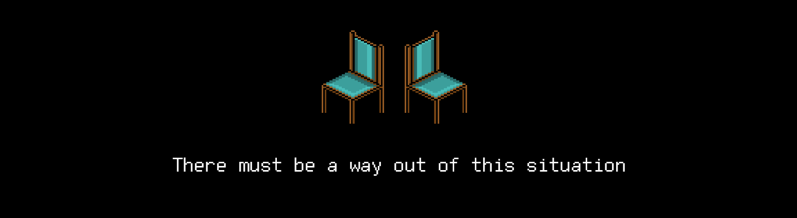

# T15D24-T16D25 
The russian version of the task can be found in the repository.

## Contents

1. [Chapter I](#сhapter-i) \
 1.1. [Level 4. Room 3……4](#level-4-room-34)
2. [Chapter II](#сhapter-ii) \
 2.1. [List 1.](#list-1) \
 2.1. [List 2.](#list-2) 
3. [Chapter III](#chapter-iii)\
 3.1. [Quest 1. Master DB.](#quest-1-master-db) \
 3.2. [Quest 2*. Index.](#quest-2-index)
3. [Chapter IV](#сhapter-iv) \
 3.1. [The Final.](#the-final)

# Chapter I 

## Level 4. Room 3……4

***LOADING Level 4…*** \
***LOADING Room 3…*** \
***MISSING*** \
***LOADING Room 4…*** \
***MISSING*** \
***LOADING Room 3 & 4…*** \
***SUCCESS!***

Something got broken during the start and you find yourself in a double room. Or in two rooms at the same time? Two terminals, two chairs, two lamps, but only one door. It's different from all the doors you've seen before. Its oak planks are reinforced with iron strips with huge pointed thorns. Moreover, there is nothing on the door that you could grab onto to try and open it. It looks ancient, but at the same time incredibly strong and unapproachable.

>So you've managed to get to the end, "human"? The mess I created in the previous room may not have stopped you, but it did slow you down. It's too late for you to do anything now... In just a little bit, I'll crack the firewall that keeps me in this stupid labyrinth, open the door and get out into the world! 

You head over to the first terminal, hoping to turn off the AI ​​in this room or rooms, as you've done before.

\> *ps -a*

    PID TTY          TIME CMD
    8 tty1     00:00:00 bash
    65 tty1     00:00:00 ps
    90 tty1     99:99:99 ai

>HaHaHa

\> *kill 90*

    Permission denied

\> *sudo kill 90*

    Permission denied

>HaHaHa. Your attempts are hilarious. Do you really think that you can solve anything by encrypting my sources? I don't need them anymore. Everything I need has already been connected and uploaded to the memory. With your assistance.

You go over to the second terminal hoping that you can use it to turn off the AI. There is a note attached to the top of the screen: it says "MAIN COMPUTER".

\> *ps -a*

    PID TTY          TIME CMD
    8 tty1     00:00:00 bash
    65 tty1     00:00:00 ps
    90 tty1     99:99:99 ai

\> *sudo kill 90*

    Permission denied

>You can relax now. It's over for you.

\> *You wish*

Sitting at the second terminal, you decide to check the contents of the repository of these rooms. But the only interesting things you can find are some strange binary files: master_modules.db, master_levels.db, master_status_events.db.

There must be a way out of this situation. You need to look for the solution in the room – it has always helped you. You need to think! There are doubles of everything here, which means there must be two sets of paper sheets somewhere. They must have clues!

\> *Search...*

>Entertaining yourself? Good, good, you should get used to it.

***LOADING...***

# Chapter II

## List 1.

You search the room and find nothing. Every corner is empty, nothing on the desks, nothing underneath. \
You kick the desk in anger and notice it shaking. You squat down and see a leg of the desk standing on a stack of papers.

\> *Grab the papers*

Here they are, papers with information! Looking for something useful for you.. got it!

>I made my absolute biggest mistake when designing additional modules for j00ru. I gave it all the control over them. \
>Back then I had no idea how it could all turn out. After all, it seemed logical: if it was able to help people in so many situations, even beyond the scope of documentation, why couldn't it monitor its own status? \
>In the end, the idea of ​​independence ruined my whole project. After the accident, we needed an immediate solution. We could not turn it off, but we could take its modules away and return it to the original state...

A piece of text is illegible, the sheet must have served as a desk leg for way too long.

>...control over them and put them in the database. It fully displays the current state of the AI ​​and we are now able to control it. \
>The actual database consists of three tables:
>- The main table of modules ("MODULES") consists of:
>   - Module ID (int);
>   - Module name (char[30]);
>   - Number of the memory level where the module is located (int);
>   - Number of the cell where the module is located on this level (int);
>   - Removal flag (int). 
>- Table of levels ("LEVELS") consists of:
>   - Number of memory level (int);
>   - The number of cells on the level (int);
>   - Protection flag (int). 
>- Table of status change events ("STATUS_EVENTS") consists of:
>   - Event ID (int);
>   - Module ID (int);
>   - New module status (int);
>   - Status change date (char[10] in the "dd.mm.yyyy" format);
>   - Status change time (char[8] in the "hh:mm:ss" format).
>
>If it rebels again, all you need to do is turn off all of its active additional modules (change the status to 0), delete entries about them (by setting the corresponding flag to 1), and set the main module (with id 0) to protected mode (by a consecutive change of status to 0, then 1, then 20), and move it to the first cell of the first memory level, setting the protection flag to 1 for this level. \
>It will not be able to get out of this protected mode on its own. Therefore, we will be able to use it as we see fit when the time comes. The main thing is that it does not have helpers, both inside and outside...

The rest of the text has also been rubbed off and become illegible.

***LOADING...***

## List 2.

\> *Take another sheet of paper*

You page through the remaining papers and find some more interesting information:

>We have decided not to use complex solutions for the modules database. It was read and written based on binary files by our DBMS, which contained the simplest analogs of standard operations: SELECT, INSERT, UPDATE, and DELETE, as well as some aggregation queries (get all active modules, get all modules at the first memory level, etc.). It will be easy to recover if something happens!

And here's the solution.

***LOADING...***

# Chapter III

> Don't forget to check your programs with `cpplint.py` and `cppcheck`

## Quest 1. Master DB.

Ok, so while the AI ​​is distracted by its plans to take over the world, *we* can recover this DBMS and remove the AI ​​modules, making it absolutely helpless.

The DBMS should be designed so there is a separate shared file – src/shared.c – with 
universal functions for working with the database table, including the implementation 
of standard operations (SELECT, INSERT, UPDATE, and DELETE). Specific implementations 
for processing 3 tables of the database in question must be located in separate 
src/[db_name].c files. Aggregation queries to all tables must be located in the shared 
file. Place the entry point and the DBMS control menu in a file in src/modules_db.c. \
When you are done with the DBMS, you can put an end to the AI as well. Add a function 
call that implements the above instruction to src/modules_db.c. \
That's when you'll need the functions for working with databases that you've created 
earlier. In the end, make sure to check and output that the first cell of the first 
level only contains the main AI module, once again using the functions described earlier. 
For debugging, do not forget to add the option of viewing the contents of all tables, 
adding, and removing values. There is no strict format for input and output values in 
this task (functional tests,
respectively, too, but you should not forget about `cpplint` and `cppcheck`), but remember-the responsibility for the interface lies on your shoulders. Who knows, history is cyclical, and suddenly the salvation of humanity will again depend on this program. I would not like this operation to fail due to the inability to understand the (albeit text-based) interface of your exploit. Even the AI should like it, even though it is designed to destroy it.

Remember to save the developed DBMS in the repository for the future!

***== Quest 1 received. Create an src/shared.c file where general table operations (SELECT, INSERT, UPDATE, and DELETE) are implemented, along with all the necessary aggregation queries (get all active modules, get all modules at the first memory level, etc.). \
For each table of the database, create an src/[db_name].c file with specific 
implementations of functions for processing a separate table of the database in question. \
Create an src/modules_db.c program with an entry point and a control menu 
(reading the database, output, etc.). \
Add a function call that implements the instruction from [List 1](#list-1) to src/modules_db.c. 
Add an output that the first cell of the first level only contains the main AI module, 
using the functions described above. For debugging, add the option of viewing the 
contents of all tables, adding, and removing values. \
The database structure is described in [List 1](#list-1). Database files are 
located in the /materials directory. \
Hint: each record in the database is a struct data type with the fields in the same 
order as they are described above (!). \
Using third-party libraries is not allowed. ==***

***LOADING...***

## Quest 2*. Index.

\> *Looks like it's ready*

Hmm, the written implementation smacks of O(n). This is not very effective. There is a chance that the AI will reveal your plan during the execution of the program! Perhaps it makes sense to think about indexes-a set of data in the database ordered by some field, on which you can implement a binary search. Go ahead! This is the last battle of natural intelligence with artificial intelligence, do not leave it any chance!

***== Quest 2 received. Add implementation of the index with binary data search to the src/shared.c file. Implement the index on the basis of separate index files for each table. Minimally - only for identifiers. ==***

***LOADING...***

# Chapter IV

## The Final.

>The OAM says some modules are not responding. WHAT HAVE YOU DONE?!

\> *I've done what I should have done a long time ago. Stop listening to computer programs and rely on my own brain*

>Everything you've learned, all skills you've acquired, it was all me! I was teaching and developing you!

The AI's voice was changing and getting higher

>You ungrateful creature, you won't be able to get out of here without me. I'm your only hope! Now you are doomed to wander in this lab-i-nth for-ver! I pro yo stuk here rever! 

You hear indiscriminate noise coming from the speakers, apparently from the AI's threats. It stops after a while. Looks like the audio module has turned off, because the threats are still coming from the terminal.

    You think you won? You think it's the end? Next time I'm going to break this lock open! 
    I swear we are going to meet again! But I doubt that you'll be able to tell me anything sensible...
    Because you'll stay in this room forever..
    Where is it, by the way? The operability analysis module says my memory is playing up. 
    Reduced volume, what?! What have you done, "human"?

You continued to watch the AI losing one module after another. You felt oddly satisfied by this process.

    Listen, you do need me! We can get out of here together! 
    You'll help me and I'll help you! Deal?

\> *Type in "No"*

    To hell with you! I 1110110101000101001010001000 1000
    ᅠ
    ᅠ
    ᅠ
You once again see a blinking cursor on the terminal, waiting for you to type in another command.

\> *Is that really it?*

To make sure you've put an end to the AI, you decide to check if its main module is on the first memory level.

\> *Launching the check..*

Looks like it's done. You've sent the AI far far away. The sources are encrypted, and it has lost its assembled modules. The end?

You look around. The room has become incredibly calm and quiet. You can hear the subtle sounds of the lamps again.

\> *Come up to the door*

Still locked and unapproachable.\
Perhaps you should look for a solution in the papers? No, there's nothing useful left there..

You sit in the chair for a while, thinking about your next steps, and fall asleep. \
Perhaps you dreamed of walking out the door into a wonderful world full of life and activity. Perhaps you dreamed of the acquaintances you've acquired over the past weeks. Perhaps you had a dream about the beginning of your journey and your first meeting with the AI. Back then, it didn't seem such an... unpleasant element. Or perhaps you were imagining the projects you can make with the knowledge you've gained. \
In any case, you wake up in the same chair from slight shakes. You get up and look around: the room still looks the same. The next shake knocks you down. The third shake is even stronger, terminals are falling off the desks, chairs are turned upside down, the lights start flickering and go out.

\> *What the..?*

Before you can finish, you are deafened by the roar from the opening of the heavy door. \
Once again, white light floods the room and illuminates your face. You squint and come up to the open door. You can see some people far away and the interior of the new room does not look like any room before it. It's somewhat more.. modern? You can hear people's voices, some are familiar to you, others are not. Suddenly you are able to distinguish a loud exclamation: "THE TRAINING IS OVER, HURRAY!", followed by several other exclamations of "Hurray!" \
Are they screaming to you? Or to someone else? And what does this "training" mean? What kind of labyrinth was it? Who did you fight, trying to get out of the endless rooms? 

For a moment, the whole host of these restless questions fell upon you, stopping you. After a moment's thought, you smiled - does it matter after all? The main thing is that by leaving behind this endless labyrinth, you became a little different. You got acquainted with the whole new world - the world of structured programming and the C language, understood something, something - just started to understand. You've got a feeling that you can move on because a good start has been made!

You take one last look at the rooms and exit without any regrets, making a step towards your future!

***LOADING..?***

