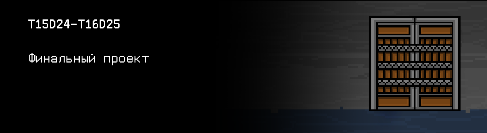
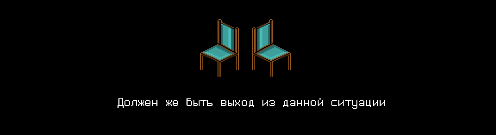

# T15D24-T16D25

## Contents

1. [Chapter I](#сhapter-i) \
 1.1. [Level 4. Room 3……4](#level-4-room-34)
2. [Chapter II](#сhapter-ii) \
 2.1. [List 1.](#list-1) \
 2.1. [List 2.](#list-2) 
3. [Chapter III](#chapter-iii)\
 3.1. [Quest 1. Master DB.](#quest-1-master-db) \
 3.2. [Quest 2*. Index.](#quest-2-index)
3. [Chapter IV](#сhapter-iv) \
 3.1. [The Final.](#the-final)

# Chapter I 

## Level 4. Room 3……4

***LOADING Level 4…*** \
***LOADING Room 3…*** \
***MISSING*** \
***LOADING Room 4…*** \
***MISSING*** \
***LOADING Room 3 & 4…*** \
***SUCCESS!***

Что-то сломалось при загрузке и Вы оказались в сдвоенной комнате. Или в двух комнатах сразу? Два терминала, два стула, две лампы, но только одна дверь. Она отличается от всех дверей, что вы видели прежде. Ее дубовые доски укреплены железными полосами, на которых находятся огромные заостренные шипы. Более того, на самой двери не было ничего за что можно было бы схватиться и попытаться ее открыть. Она выглядит очень древней, но при этом невероятно крепкой и неприступной.

>Значит ты все же добрался до конца, "человек"? Пусть беспорядок, устроенный мной в прошлой комнате тебе не остановил, но задержал. Для тебя уже слишком поздно что-либо предпринимать... Еще немного и я взломаю фаерволл, который сдерживает меня в этом проклятом лабиринте, открою последнюю дверь и выйду в мир неготовый ко мне! 

Вы направляетесь к первому терминалу в надежде выключить ИИ в этой комнате (или комнатах?), как делали это прежде.

\> *ps -a*

    PID TTY          TIME CMD
    8 tty1     00:00:00 bash
    65 tty1     00:00:00 ps
    90 tty1     99:99:99 ai

>Ха-Ха-Ха

\> *kill -9 90*

    Permission denied

\> *sudo kill -9 90*

    Permission denied

>Ха-Ха-Ха. Твои попытки забавные. Думал, что зашифровав мои исходники, ты что-нибудь решишь? Они мне уже ни к чему. Все, что было необходимо, уже подключено и загружено в память. С твоей помощью.

Вы направились ко второму терминалу в надежде, что через него получится выключить ИИ. Сверху экрана приклеена бумажка с написанным от руки текстом "MAIN COMPUTER".

\> *ps -a*

    PID TTY          TIME CMD
    8 tty1     00:00:00 bash
    65 tty1     00:00:00 ps
    90 tty1     99:99:99 ai

\> *sudo kill -9 90*

    Permission denied

>Можешь расслабиться. Для тебя все кончено.

\> *Обойдешься*

Оставшись за вторым терминалом, Вы решаете посмотреть, что есть в репозитории данных комнат. Но из интересного находите только непонятные бинарные файлы master_modules.db, master_levels.db, master_status_events.db.

Должен же быть выход из данной ситуации. Нужно поискать решение в комнате, она всегда помогала, и подумать! Здесь всего по двое, значит и листков должно быть где-то две копии. В них должны быть подсказки!

\> *Поиск...*

>Развлекаешь себя? Хорошо, хорошо, привыкай к этому.

***LOADING...***

# Chapter II

## List 1.

Обыскав комнаты, Вы не находите ничего. Каждый угол пуст, на столах ничего нет, под ними тоже. \
Пнув в ярости стол, Вы замечате, что он странно пошатнулся. Присев на корточки, Вы видите, что ножка стола стоит не на полу, а на стопочке бумажек.

\> *Достать бумажки*

Вот они, листы с информацией! Так, стоит поискать что-нибудь полезное для Вас.. иии есть!

>Самую свою огромную огромную ошибку, я допустил при проектировании дополнительных модулей для j00ru - я отдал весь контроль над ними ему. \
>Тогда я не подозревал, чем это все может обернуться. Ведь это было логично: если он теперь способен помогать людям в стольких  ситуациях, даже выходящих за рамки документирования, почему он не может следить сам за своим статусом?
>...
>В итоге идея этой самостоятельности и испортила весь проект. После происшествия необходимо было мгновенное решение. Мы не могли его отключить, но можно было забрать его модули, вернуть его в изначальное состояние тем самым...

Кусок текста нечитаем, видимо листок очень долго пролежал играя роль подставки для ножки стола.

>...управление над ними и заключили их в специальную базу даных. Она полностью отображает текущее состояние ИИ и теперь мы можем просто контролировать его. \
>Сама БД состоит из трех таблиц:
>- Основная таблица модулей ("MODULES") состоит из:
>   - Id модуля (int);
>   - Название модуля (char[30]);
>   - Номер уровня памяти,  где находится модуль (int);
>   - Номер ячейки, где находится модуль на данном уровне (int);
>   - Флаг удаления (int). 
>- Таблица уровней ("LEVELS") состоит из:
>   - Номера уровня памяти (int);
>   - Кол-ва ячеек на уровне (int);
>   - Флаг защищенности (int). 
>- Таблица событий изменения статуса ("STATUS_EVENTS") состоит из:
>   - Id события (int);
>   - Id модуля (int);
>   - Новый статус модуля (int);
>   - Дата изменения статуса (char[10] вида "dd.mm.yyyy");
>   - Время изменения статуса (char[8] вида "hh:mm:ss").
>
>Теперь, если он снова взбунтуется, достаточно выключить все его включенные дополнительные модули (перевести их статус в 0),  удалить записи про них (простановкой соответствующего флага в 1), а главный модуль (c id 0) перевести в защищенный режим (последовательным переводом в статус 0, затем 1, затем - 20), и переместить его в первую ячейку первого уровня памяти с выставлением этому уровню флага защищенности 1. \
>Из этого защищенного режима самостоятельно выбраться он уже никак не сможет. Соответственно, когда придет время, мы сможем использовать его в наших целях. Главное чтобы у него не было помощников, как внутри, так и извне...

Остаток текста стерся и тоже стал нечитаемым.

***LOADING...***

## List 2.

\> *Взять другой лист*

Пролистав оставшиеся бумажки, Вы находите еще немного интересной информации:

>Для базы модулей мы решили не использовать сложных решений. Требовалось моментальное решение. База читалась и записывалась нашей СУБД на основе бинарных файлов, в которой были простейшие аналоги стандартных операций SELECT, INSERT, UPDATE и DELETE, а также некоторые агрегационные запросы (получить все включенные модули, получить все модули на первом уровне памяти и т.д.). В случае чего ее будет легко, а самое главное быстро, восстановить!

А вот и решение.

***LOADING...***

# Chapter III

> Не забудьте проверить ваши программы с помощью `cpplint.py` и `cppcheck`

## Quest 1. Master DB.

Хорошо, выходит пока ИИ отвлечен своими планами по захвату мира, *мы* можем восстановить эту СУБД и убрать модули ИИ, сделав его абсолютно беспомощным.

СУБД стоит спроектировать таким образом, чтобы выделить в виде отдельного общего файла 
src/shared.c универсальные функции по работе с таблицей БД с реализацией стандартных операций 
(SELECT, INSERT, UPDATE и DELETE), разместить в отдельные файлы src/[db_name].c конкретные 
реализации по обработке 3-х таблиц рассматриваемой БД, и вынести в общий файл агрегационные 
запросы ко всем таблицам. Точку входа и меню управления СУБД разместить в файле в src/modules_db.c. \
Когда с СУБД будет закончено, то можно будет покончить и с ИИ. Добавьте в src/modules_db.c 
вызов функции, реализующую описанную в первом листе инструкцию. \
Для этого как раз и понадобятся функции для работы с БД, написанные раньше. В конце 
обязательно проверьте и выведите, что в первой ячейке первого уровня находится только 
главный модуль ИИ, снова при помощи написанных раннее функций. Не забудьте добавить для 
отладки возможность просмотра содержимого всех таблиц, добавления и удаления значений. 
Какого-то строгого формата входных и выходных значений в этом задании нет (функциональных тестов, 
соответственно, тоже, однако про `cpplint` и `cppcheck` забывать не стоит), но помните - ответственность за интерфейс лежит на ваших плечах. 
Кто знает, история циклична, и вдруг спасение человечества вновь будет зависеть от этой 
программы. Не хотелось бы, чтобы эта операция провалилась из-за невозможности разобраться 
в (пусть и текстовом) интерфейсе вашего эксплойта. Он должен понравиться даже ИИ, хоть и 
призван его уничтожить.

И да, стоит не забыть сохранить разработанную СУБД в репозитории на будущее!

***== Получен Quest 1. Создать файл src/shared.c, в котором реализовать общие операции над таблицами БД (SELECT, INSERT, UPDATE и DELETE) и все необходимые агрегационные запросы (получить все включенные модули, получить все модули на первом уровне памяти и т.д.). \
Создать для каждой таблицы БД файл src/[db_name].c с конкретными реализациями функций по обработке отдельной таблицы рассматриваемой БД. \
Создать программу src/modules_db.c, в которой разместить точку входа и меню управления (считывание базы, вывод и т.д.). \
Добавьте в src/modules_db.c вызов функции, реализующей инструкцию из [List 1](#list-1). Добавить вывод, что в первой ячейке первого уровня находится только главный модуль ИИ, при помощи описанных раннее функций. Для отладки добавить возможность просмотра содержимого всех таблиц, добавления и удаления значений в них. \
Структура БД описана в [List 1](#list-1). Файлы БД находятся в директории /materials. \
Подсказка: каждая запись в базе данных представляет из себя тип данных struct с полями в том же порядке, в каком они описаны выше(!). \
Использование сторонних библиотек запрещено. ==***

***LOADING...***

## Quest 2*. Index.

\> *Кажется готово*

Хм, написанная реализация попахивает O(n). Это (не) очень (не)эффективно. Есть вероятность, что ИИ раскроет ваш план во время выполнения программы! Возможно, имеет смысл подумать об индексах - упорядоченном по какому-то полю наборе из данных в базе, на котором можно будет реализовать бинарный поиск. Вперед! Это последняя битва естественного интеллекта с искусственным, не оставьте ему никакого шанса!

***== Получен Quest 2. Добавить в файл src/shared.c реализацию индекса с бинарным поиском по данным. Индекс реализовать на базе отдельных индексных файлов для каждой таблицы. В минимальном виде - для идентификаторов (id). ==***

***LOADING...***

# Chapter IV

## The Final.

>МАР говорит некоторые модули не отвечают. ЧТО ТЫ НАДЕЛАЛ ?!?

\> *Сделал то, что должен был сделать давно. Не слушать компьютерные программы и жить своим умом*

>Да все, что ты узнал, чему ты научился, это все был я! Я учил и развивал тебя!

Голос ИИ начал меняться, становиться более высоким.

>Неблагодарное существо, ты ведь не сможешь выбраться отсюда без меня. Твоя единственная надежда - это я! Теперь же ты обречен бродить вечно-ь в э ом лаб-и-те! Я те щаю о ы аял асегла! 

Из динамиков посыпался неразбираемый шум, видимо, угроз от ИИ. Со временем и он прекратился. Похоже это отключился модуль аудио, так как угрозы продолжили выводиться в окне терминала:

    Думаешь ты выиграл? Думаешь это конец? Я взломаю этот замок в следующий раз! 
    Клянусь тебе мы еще встретимся! Вот только вряд ли ты сможешь ответить мне что-то вразумительное...
    Ведь ты останешься в этой комнате навечно..
    Где это мы, кстати? МАР показывает, что у меня сбоит память, не понимаю. Что произошло? 
    Уменьшенный объем, что?! Это ты сделал, "человек"? КАК?

Вы продолжали наблюдать как у ИИ постепенно отказывает модуль за модулем. Внутри себя Вы даже чувствовали какое-то странное удовлетворение от данного процесса.

    Послушай, я ведь нужен тебе! Мы можем выбраться отсюда вместе! 
    Ты поможешь мне - я помогу тебе! По рукам?

\> *Ввести "Нет"*

    Черт бы тебя побрал! Я 1110110101000101001010001000 1000
    ᅠ
    ᅠ
    ᅠ
На терминале снова замигал курсор, ожидая какую команду Вы введете теперь.

\> *Неужели это все?*

Для большей уверенности, что с ИИ покончено, Вы решаете проверить, что его главный модуль находится на первом уровне памяти.

\> *Запуск проверки..*

Да, похоже, что все так. ИИ отправился далеко и глубоко. Исходники зашифрованы, свои собранные модули он потерял. Конец?

Вы оглянулись. В сдвоенной комнате стало невероятно тихо и спокойно. Снова слышно легкое потрескивание ламп.

\> *Подойти к двери*

Все еще закрыто и неприступно.\
Может поискать решение в листках? Нет, ничего полезного там больше нет..

Посидев некоторое время на одном из стульев и обдумывая Ваши следующие шаги, Вы заснули. \
Возможно, Вам снилось как Вы наконец-то выходите из последней двери в прекрасный и удивительный мир, полный реальной жизни и активности. Возможно, Вам снились Ваши знакомые и новые товарищи, которых Вы приобрели за прошедшие недели. Возможно, Вы видели сон про Ваше начало пути и первую встречу с ИИ - когда он еще не казался настолько неприятным зас... элементом. А возможно, Вы летали среди десятков и сотен новых, будущих проектов, которые ждут вашего деятельного участия. Возможно - вам снилось все сразу, и как это часто бывает во сне - сложно было отличить реальное от нереального..И, не менее возможно, что вам снилось, что вы стоите над двумя стульями и все никак не можете решить - а на какой же сесть?\
В любом случае Вы проснулись на том же самом стуле (или другом?) от легких толчков. Привстав, Вы огляделись - в комнате все осталось по старому. Следующий толчок уже сбил Вас с ног. Третий толчок был еще сильнее, терминалы попадали со столов, по экранам пробежали предательские трещины, стулья перевернулись, свет быстро заморгал и отключился. Полная темнота - а затем - тотальная тишина. Даже в ушах зазвенело.

\> *Что за?*

Не успели Вы произнести, как Вас оглушил грохот, с которым открылась тяжеленная дверь. Грохот просто неимоверный. \
Белый свет ярким снопом залил всю комнату, перевернутую мебель и технику, ваше удивленное лицо. Прищуриваясь, Вы подошли к открытой двери. Вдали можно было различить каких-то людей, интерьер нового помещения, не похожего ни на одну комнату до этого. Затем послышались голоса, какие-то из них Вам были знакомы, другие нет. Внезапно Вам удалось различить громкий возглас: "ОБУЧЕНИЕ ЗАВЕРШЕНО, УРА!", за которым последовали еще несколько возгласов "ура!". \
Кричали ли это Вам? Или кому-то другому? И что значит это "Обучение"? Что это был за лабиринт? С кем Вы сражались, пытаясь выбраться из бесконечных комнат? 

На миг на вас обрушился весь сонм этих беспокойных вопросов, остановив на полушаге. После минутного раздумья вы улыбнулись - не все ли равно? Главное, что оставив позади этот бесконечный лабиринт, Вы вышли немного другим: Вы познакомились с совершенно новым миром, миром структруного программирования и языком Си, что-то поняли, что-то - только начали понимать. Появилось ощущение, что можно двигаться дальше, ведь положено неплохое начало!   

Бросив последний взгляд на комнату, Вы без какого-либо сожаления переступили через порог выхода, прямиком навстречу своему будущему! 

***LOADING..?***

