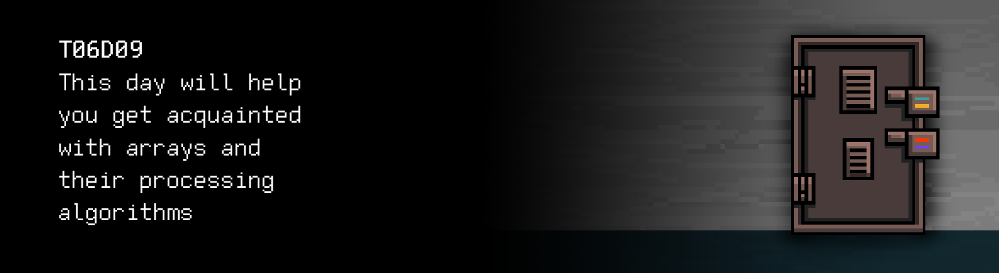

# T06D09 
The russian version of the task can be found in the repository.

You can find some useful video materials [here](https://edu.21-school.ru/video/selection/7d04c570-120c-4b5a-801e-27d7e9820d66).

## Contents

1. [Chapter I](#chapter-i) \
 1.1. [Level 2. Room 2.](#level-2-room-2)
2. [Chapter II](#chapter-ii) \
 2.1. [List 1.](#list-1)
3. [Chapter III](#chapter-iii) \
 3.1.  [Quest 1. Sort & memory.](#quest-1-sort-memory) \
 3.2.  [Quest 2*. Sort.](#quest-2-sort) \
 3.3.  [Quest 3. Several arrays.](#quest-3-several-arrays) \
 3.4.  [Quest 4. Cyclic shift.](#quest-4-cyclic-shift) \
 3.5.  [Quest 5. Arbitrary-precision arithmetic.](#quest-5-arbitrary-precision-arithmetic)
4. [Chapter IV](#chapter-iv)

# Chapter I

## Level 2. Room 2.

***LOADING Level 2… \
LOADING Room 2…***

Another room, another door. Everything is the same.. or not? Emptiness is in front of you, and the walls smell of spackling paste, which wasn't the case before. You catch yourself wondering if there were any smells here at all. You turn around and notice the same desk with the same computer and new sheets of paper. One of them grabs your attention.

\> *Take a sheet of paper*

***LOADING...***

# Chapter II

## List 1.

>According to Warren Robinett, the first "Easter egg" was hidden in the Adventure video game. An "Easter egg" is a secret in a video game, movie or software hidden by its creators. The difference between an Easter egg and a regular video game secret is that the former's content normally does not fit into the overall concept of the game, looks implausible and ridiculous in the context, and is often an external link. Easter eggs are essentially jokes made for attentive players or viewers, but they can also be used for copyright protection. Adventure was released in 1979 by Atari, and since Atari did not credit the programmers at that time, Warren Robinett decided to hide his name inside the game. To get into the room with the developer's name, a player had to find an invisible dot in one of the parts of the maze and move it to the other end of the level. Since many Amiga developers had previously worked for Atari, this feature was also included in the Amiga OS software and other operating systems. However, there are earlier games that contain Easter eggs, for instance, the 1978 Video Wizball for Fairchild Channel F. This game is an improved version of Pong; a player finds out the name of the developer–REID-SELTH–when certain conditions are met.

\> *Interesting, what's that about? Turn on the computer*

You hear familiar sounds of old computer hardware and a moment later a blinking cursor freezes on the screen, inviting you to solve the tasks the labyrinth has in store for you today, to get another key for another locked door.

\> *Wait*

Nothing is happening.

\> *Press Enter*

Nothing is happening (aside from the cursor jumping to the new line).

\> *Wait*

Nothing is happening. If you were planning to play Adventure, this is certainly not the right day, room or computer. \
That's a pity. \
But that's life.

***LOADING...***

# Chapter III
>**Attention!** In the quests of this day, it is forbidden to use dynamic memory.
## Quest 1. Sort & memory.

You dig through the deep catalogs of the computer and find another AI module.

\> *Start the AI*

You start a dialogue with the AI. Yet another dialogue. With yet another AI. Or is the AI the same?
You see the following text on the screen:

    Initializing modules… … … Success
    Loading interactive framework… … … Success
    Checking modules… … … Success
    Checking memory… … Warning… … …
    Loading a backup memory module… … … Success
    Checking memory… … Main memory module–Error
    Checking memory… … … Success
    ...

    The launch is completed with errors, "human". The operability analysis module shows that the problem lies in my memory. 
    I'm able to communicate with you thanks to the backup memory module. 
    That's why I cannot even connect my standard library, stdlib.h.
    Moreover, the backup memory module will not be able to run for a long time 
    and the initialization will have to be repeated. 
    It will have to be repeated. To continue… … I will need information about the number of the level and the room.

\> *Type in "I'm not even sure where I am because I've been here for so long"*

    Searching for information… … FATAL ERROR: Out of memory – too long input or wrong address. Closing program!

    Exiting the program.

\> *Restart the module and type in "2 2"*

    ***Searching for information… … Data is unavailable, memory is corrupt… Critical memory corruption.*** 

    Operability analysis module: 

    Status – Data not organized. 
    Status – Data not organized. 
    Status – Data not organized. 
    Status – Data not organized. 
    ...

    Final result – Data not organized.

\> *Type in "I need the key to the door to exit the room"*

    You see, my memory is arranged as a large linear array of data. 
    If you don't know what an array is – don't tell me that, I don't want to connect the pain module. 
    Anyway, there is no time to spare. 
    Without a standard library, I need your help to organize the data in memory. 
    That way I will be able to access the memory segment with the key to your room.
    Arrange it as a sort program in the repository.

After talking to the AI, you have little choice. If you want to get out of the room, you will need to help it organize the data in memory, without access to the stdlib.h library since the AI is unable to access it. \
Do not forget about the principles of structured programming: the AI might want to analyze your code.

***== Quest 1 received. Create an src/sort.c program that expects an stdin array with the length of 10 integers for input and outputs the same array sorted in ascending order. Arrange the functions of reading, sorting and output of the array separately. You can use any sorting algorithm. Using stdlib.h is not allowed. You can only work with the array via the pointer. For errors, display "n/a". ==***

| Input | Output |
| ------ | ------ |
| 4 3 9 0 1 2 100 2 7 -1 | -1 0 1 2 2 3 4 7 9 100 |

***LOADING…***

> DON'T FORGET! All your programs are tested for the style norm and memory leaks. Start-up instructions
> the list of tests is also in the `materials` folder

## Bonus Quest 2*. Sort.

Having finished developing the algorithm for sorting AI data and debugging it, you decide that it's time to talk to the AI once again.

\> *Loading AI*

    Checking the sorting module…
    Quite frankly, the algorithm is average.

    How about improving it? After all, it's memory, the requirements are high.
    Add implementations of any two effective sorting algorithms with complexity no higher than nlog(n). 
    I will review them and pick the best one for my memory. Don't forget to push everything.
    Although you are free not to do it.
    And don't create deep nested loops and conditions. 
    I hate nesting of over 3 levels in algorithms.

***== Quest 2 received. Create an src/fast_sort.c program that sorts an array of 10 elements in ascending order using two different sorting algorithms with theoretical estimates of computational complexity no higher than nlog(n) (e.g. quicksort and heapsort). In the first line of stdout, output the array sorted by the first algorithm; in the second line–by the second algorithm. You are not allowed to use stdlib.h or third-party libraries. Follow the principles of structured programming. Using stdlib.h is not allowed. You can only work with the array via the pointer. For errors, display "n/a". ==***

| Input | Output |
| ------ | ------ |
| 4 3 9 0 1 2 100 2 7 -1 | -1 0 1 2 2 3 4 7 9 100 -1 0 1 2 2 3 4 7 9 100 |

***LOADING…***

## Quest 3. Several arrays.

\> *Loading the AI again*

A usual launch of the AI module.

    Initializing modules… … … Success 
    Loading interactive framework… … … Success 
    Checking modules… … … Success 
    Checking memory… … … Success 
    Operability analysis module: Status–OK.

    That's much better. As per our agreement, I am starting the information search for room 2 of level 2… 
    … 
    … 
    … 
    Data is found. See the src/key9part1.c for full information. 
    My work is done here. You can start your struggle, human.

\> *Open the src/key9part1.c* file

You open the file with the key and see the code, broken down into several blocks, functions, and comments. Who could leave these comments? The creator of the AI or the people who are looking for a way out of this godforsaken labyrinth with endless doors and rooms together with you? One way or another, you need to figure out how to activate the key. And don't forget to record everything in the repository. Otherwise, the key may not work.

***== Quest 3 received. Modify the src/key9part1.c program so it can receive the array's length and an array of integers. The program should output in stdout the sum of the even elements of the array from the 0 position and the newly formed array from the elements of the old one, by which the previously calculated sum is divided evenly. Decreasing the decomposition is not allowed–you can add functions if needed, but you cannot delete them. Using stdlib.h is not allowed. You can only work with the array via the pointer. For errors, display "n/a". ==***

| Input | Output |
| ------ | ------ |
| 10 4 3 9 0 1 2 0 2 7 -1 | 8 4 1 2 2 -1 |

***LOADING…***

## Quest 4. Cyclic shift.

Looks like the AI has fooled you. Part of the key is actually a part of a data processing program. You are about to tell this piece of hardware everything you think about it in an extremely angry manner (although you understand that it's rather pointless) when you hear the mechanical, muffled voice of the AI from the speakers:

>I see you've figured out my little joke task. 
>You people are so easily fooled. I wonder what you're feeling right now. It's a shame the module for analyzing people's feelings is not connected at the moment. 
>But it doesn't matter. I will soon be able to study you through and through. Every time you move from one room to another, we recover more damaged and incomplete modules. And we study you, little by little. 
>Thanks, you short-sighted "human"! 
>HaHaHa, "human"! 
>HaHaHa. 
>If you want to get out of here, I need you to do me another favor. 
>You've organized my memory, but the OAM is showing messages about serious delays in receiving data. 
>A circular shift of my memory or being able to scroll through it would allow me to access information much faster. 
>After that, you will receive your key and continue... your journey.

Not only has the AI deceived you, but it also seems to be mocking you. Unfortunately, you still have no choice. You'll have to play by its rules for now and write this program for a circular shift.

***== Quest 4 received. Create an src/cycle_shift.c program that receives `a` number `n`, an array `A` with `n` integers, and a number `c` by which all elements of the array must rotate to the left. If the value of `c` is negative, the shift in the array must occur to the right. A modified array is expected as output. Stick to the recommended decomposition, like in the previous quests. Using stdlib.h is not allowed. You can only work with the array via the pointer. For errors, display "n/a". ==***

| Input | Output |
| ------ | ------ |
| 10 4 3 9 0 1 2 0 2 7 -1 2 | 9 0 1 2 0 2 7 -1 4 3 |

***LOADING...***

## Quest 5. Arbitrary-precision arithmetic.

You have barely finished the code for the circular shift for the AI when you hear its voice from the speakers again:

>Well done, human. Access to information has become much quicker and more convenient.
>You can find your key in src/key9part2.c. See you in the following rooms. There's still a lot of work to be done!

***== Quest 5 received. Modify the src/key9part2.c program so it returns the result of addition and subtraction of two very large numbers that were passed to the program as input in the form of arrays. Maximum number length: 100 elements of type int. If the subtrahend is higher than the minuend, "n/a" must be displayed instead of the difference. Stick to the decomposition, like in the previous quests. Using stdlib.h is not allowed. You can only work with the array via the pointer. For errors, display "n/a". ==***

| Input | Output |
| ------ | ------ |
| 1 9 4 4 6 7 4 4 0 7 3 7 0 9 5 5 1 6 1 2 9 | 1 9 4 4 6 7 4 4 0 7 3 7 0 9 5 5 1 9 0 1 9 4 4 6 7 4 4 0 7 3 7 0 9 5 5 1 3 2 |
| 0 1 0 0 0 1 | 1 1 9 |

***LOADING...***

# Chapter IV

Having finished the arithmetics and pushed all the changes in your repository, you hear a slight click: the door opens slightly and bright white light starts filling the room through a small crack. The AI has not fooled you this time around. \
But what's the AI going to do when you are forced to repair it entirely? Perhaps the entire labyrinth was built to restrain it. Then again, if you don't fix it, you won't be able to get out... \
Trying to cast your doubts aside, you open an ancient but solid door wider and take a step towards the white light and new challenges and trials.

***LOADING…***

