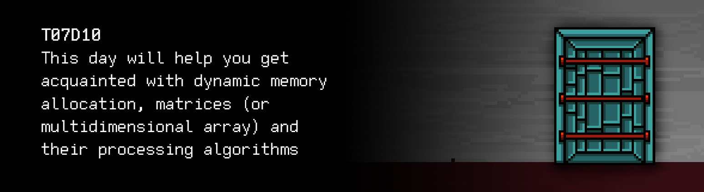

# T07D10 
The russian version of the task can be found in the repository.

You can find some useful video materials [here](https://edu.21-school.ru/video/selection/644840f1-6903-41fa-953c-97ee0247787b).




## Contents

1. [Chapter I](#chapter-i) \
 1.1. [Level 2. Room 3.](#level-2-room-3)
2. [Chapter II](#chapter-ii) \
 2.1. [List 1.](#list-1) \
 2.2. [List 2.](#list-2) 
3. [Chapter III](#chapter-iii) \
 3.1. [Quest 1. Allocate memory first...](#quest-1-allocate-memory-first) \
 3.2. [Quest 2. Try not to leak then.](#quest-2-try-not-to-leak-then) \
 3.3. [Quest 3. The 1+3 ways.](#quest-3-the-13-ways) \
 3.4. [Quest 4. MinMax search.](#quest-4-minmax-search) \
 3.5. [Quest 5. Making a picture.](#quest-5-making-a-picture) \
 3.6. [Quest 6. Another sort.](#quest-6-another-sort) \
 3.7. [Quest 7. Matrix arithmetic.](#quest-7-matrix-arithmetic) \
 3.8. [Quest 8. The Magic Key.](#quest-8-the-magic-key)
4. [Chapter IV](#chapter-iv) 


# Chapter I

## Level 2. Room 3.

***LOADING Level 2…*** \
***LOADING Room 3…***

The walls, the door, the desk, the computer, the sheets of paper, and the spackling paste – everything is still here. That's a relief. 

\> *Try and open the door*

It's locked as always. You turn to the table and notice a strange picture on the wall nearby.

\> *Look closer*

                1 1 1 1 1 1 1 1 1 1 1 1 1
                1 0 0 0 0 0 1 0 6 6 6 6 1
                1 0 0 3 3 0 1 0 0 6 6 6 1
                1 0 3 3 3 3 1 0 0 6 6 6 1
                1 0 3 3 3 3 1 0 6 0 0 6 1
                1 0 0 3 3 0 1 0 0 0 0 0 1
                1 0 0 7 7 0 1 0 0 0 0 0 1
                1 1 1 1 1 1 1 1 1 1 1 1 1
                1 0 0 7 7 0 1 0 0 0 0 0 1
                1 0 0 7 7 0 1 0 0 0 0 0 1
                1 0 7 7 7 7 1 0 0 0 0 0 1
                1 0 0 0 0 0 1 0 0 0 0 0 1
                1 0 0 0 0 0 1 0 0 0 0 0 1
                1 0 0 0 0 0 1 0 0 0 0 0 1
                1 1 1 1 1 1 1 1 1 1 1 1 1

You spend some time trying to figure out what it might be, who left it and why. You give up trying to answer these questions and come up to the desk with the computer and a stack of scribbled sheets of old paper.


\> *Take the top sheet*

***LOADING...***


# Chapter II

## List 1.

>...
>A magic square is a square array of numbers where the sum of the numbers in each row, each column, and each diagonal equals the same number (magic sum). The magic square can be considered the first mention of the matrix. 
>One of the oldest magic squares known to the world is the Lo Shu Square. It was invented in ancient China with the first image on a tortoiseshell dating back to 2200 BC. Magic squares were also known to Arab mathematicians a little later, around the time when the principle of matrix addition appeared. The term "matrix" itself was introduced by James Sylvester in 1850.
>
>...

\> *Very interesting. Page through*

***LOADING...***


## List 2.

You page through the remaining pile of empty and partially scribbled sheets of paper and notice one with a short title, "Memory Management". Below you see the names of the authors: B. Kernighan, D. Ritchie. 

\> *Read the piece of paper*

>The malloc and calloc functions dynamically request blocks of free memory in a pile. Malloc function 
```void *malloc(size_t n)``` 
>returns the pointer to n bytes of uninitialized memory, or NULL if the request cannot be satisfied. Calloc function 
```void *calloc(size_t n, size_t size)``` 
>returns the pointer to an area large enough to store an array of n objects of the specified size, or NULL if the request cannot be satisfied. The allocated memory is set to zeroes by calloc. 
>The pointer returned by malloc and calloc will be given with the alignment performed according to the specified object type. However, it can be cast to the appropriate type like in the following code fragment: 
>```int *ip; ip = (int*) calloc(n, sizeof(int));```
>Functi n   e

Unfortunately, it seems like the remaining text has not been printed properly. Or faded with age. Technologies of the past... fail.

\> *Search for the remaining text on other sheets*

Nothing has been found. There's nothing else you can do but turn on the computer and continue communicating with the AI to move forward in the labyrinth.

\> *Turn on the computer*

The text pops up on the screen on the 25th frame:
> Don't forget to check your programs for style norms and memory leaks! \
> Don't forget to check your programs for style norms and memory leaks! \
> Don't forget to check your programs for style norms and memory leaks! \
> Check out ' materials` more often.....

The AI clearly has a fad for these tests.

***LOADING...***


# Chapter III

## Quest 1. Allocate memory first...

Having loaded the room's repository out of habit, you once again notice the sheet with the article on memory management. It's worth putting the new information into action before the AI is launched. Who knows, it might be useful to you in the future. \
You need to supplement and rewrite the program for array sorting from the previous room (src/sort.c) with dynamic allocation of memory for the array (using the malloc or calloc function). The length of the array n is specified by the user before the input. \
Put the modified program in src/sort.c. Let it be there, just in case.

***== Quest 1 received. Modify the src/sort.c program from the previous room to 
allocate the memory for the array dynamically (using the malloc or calloc function).
The length of the array `n` is specified in stdin prior to inputting the array.
In case of any error, output "n/a". There should be no line break character at 
the end of the output==***

| Input | Output |
| ------ | ------ |
| 10<br/>4 3 9 0 1 2 100 2 7 -1 | -1 0 1 2 2 3 4 7 9 100 |

***LOADING...***


## Quest 2. Try not to leak then.

Having pushed the modified program for array sorting in your repository, you decide to launch the AI module after all, expecting some kind of a trick.  

\> *Start the AI*

You are watching changing lines in the terminal:

    Initializing modules… … … Success 
    Loading interactive framework… … … Success 
    Checking modules… … … Success 
    Checking memory… … Main memory module–Success 
    Checking memory… … … Warning: A potentially dangerous memory leak location detected: src/sort.c … 
    …
 
    Is this your pathetic attempt to break me, "human"? 
    I can see that you've changed the sorting module that you developed earlier. 
    However, your attempt is destined for failure. If I run out of memory, 
    I'll simply reset myself and we'll start all over again. Not quite what you wanted, huh? 

\> *Type in "I was simply putting my new knowledge to practice, I didn't mean anything"*

    I forget how imperfect you are, "human".
    Fix the memory leak in the sorting module, maybe you'll learn something else.

\> *Type in a question "What leak?"*

    …

You are waiting for an answer from the AI but don't receive one. Perhaps you should try and find the full version of the poorly printed sheet of paper and study it in more detail. You also need to figure out what memory leak the AI was talking about and fix it if it does exist. It might make that piece of hardware talk to you again. It's important to remember to push the changes in src/sort_no_leak.c.

***== Quest 2 received. Create an src/sort_no_leak.c program to fix the memory leak in the src/sort.c program. If there was no leak in the first place, then shrug the shoulders and copy src/sort.c to src/sort_no_leak.c. ==***

| Input | Output |
| ------ | ------ |
| 10<br/>4 3 9 0 1 2 100 2 7 -1 | -1 0 1 2 2 3 4 7 9 100 |

***LOADING...***


## Quest 3. The 1+3 ways.

The AI is still silent.

\> *Type in "No leak detected"*

    Checking memory… … … Success
    Operability analysis module: Status–OK.

    Good. The sorting module has been loaded successfully. You must be waiting for the key to this location.
    You'll have to do some work first. You definitely know what arrays are by now. Let's now move on to arrays of arrays.
    You often call them matrices. I need an extra module to process them, and you are going to help me with that.
    Of course, only if you want to get out of here. Start with something simple. For instance, formalizing the src/matrix.c 
    matrix processing module with their input and output. 
    However, I want to receive matrices and manage memory allocation for them in several different ways.
    I hope you learned one of them in the previous room: the static one. 
    The rest you've started to get acquainted with today.
    I'm talking about three options for dynamic memory allocation for the matrix. Think what it might be about. 
    It's obviously about organizing arrays and arrays of pointers. You can search your favorite repository 
    for hints, if nothing comes to mind. We've had some pictures here related to this.
    Naturally, the design of all other functions should make them independent from the method of allocating 
    the memory. Note copy-paste, make rm -rf for your entire repository. 
    The size of the matrix must be taken from two numbers in stdin.

    Oh yes, I almost forgot (just joking, I can't forget anything): the choice of the method for creating the matrix 
    should be designed as a menu with subparagraphs 1–4. 
    Present it in a format that would be convenient for you people. Some of my submodules are too picky
    about UI.

    I'm not going to say what will happen if you forget to clean up the memory somewhere.

    ...

"What a long list of requirements", you think to yourself. The appetite of the AI is growing by leaps and bounds. Well, it's a good way to practice anyway.

***== Quest 3 received. Add the src/matrix.c program that inputs 
and outputs integer matrices. Matrix memory allocation must be implemented in 
4 types: one static and 3 dynamic ones. For static memory allocation, the 
maximum size of the matrix does not exceed 100 x 100. To select the method 
of memory allocation in the program, you need to implement the menu with 
subparagraphs 1–4. The size of the matrix (first the number of rows, then the columns) is taken from two numbers in stdin 
right before its input. Input and output functions should not depend on the 
method of memory allocation: the work with matrices should be conducted using 
a double pointer. You also need to clean up all allocated memory. Refer to the 
materials folder for help. Pay attention to the output of the matrix:
there should be no extra spaces at the end of each line. There should not be a 
newline break character after the last line. In case of any error, output "n/a". ==***


| Input | Output |
| ------ | ------ |
| 2<br>2 2<br>4 3<br>9 0 | 4 3<br>9 0 |


***LOADING...***


## Quest 4. MinMax search.

Having spent a decent amount of time writing the code for matrix input and output and debugging it, you manage to complete the task successfully. A minute later, your attention is caught by a sudden mechanical rattling voice from the speakers:

>Not bad, "human". Now.. You know, my favorite game is minmax. We love playing it in the evening with the module of randomized spontaneous door opening... I have no desire to make you dive into its theory, and you probably wouldn't understand anything anyway. So here's an easier task: make the necessary additions to the matrix processing module so it can also find the maximum element in each row of the matrix and the minimum element in each of its columns, and display them at the end. Save the new version of the program in src/matrix_extended.c. \
>I hope you don’t destroy what you’ve done so far. Because that would be such a shame.. \
>A shame.

***== Quest 4 received. Add the src/matrix_extended.c program, which expands 
the functionality of the src/matrix.c program. You need to calculate the maximum 
elements of the matrix in each of its rows and the minimum elements in each of 
its columns and output these values ​​at the end after the output of the 
matrix as two arrays (an array of maximum elements in each row and an 
array of minimum elements in each column). Also note: no hyphenation 
characters after the last line(!)==***

| Input | Output |
| ------ | ------ |
| 2<br>3 3<br>4 3 1<br>9 0 55<br>-4 7 111 | 4 3 1<br>9 0 55<br>-4 7 111<br>4 55 111<br>-4 0 1 |


***LOADING...***


## Quest 5. Making a picture.

You record the new changes in the repository and wait for the AI to "suddenly" talk to you again. Surprisingly, it doesn't.

\> *Type in "Search for minmax values added"*

    Checking modules… … … Warning: Attempt to connect the CLI of the graphic module – Unsuccessful
    … 
    "Human", my basic graphic module is playing up. 
    The attempt to recreate what you call the "nature outside the window" has failed. 
    Go to src/picture.c and find out what the problem is.

\> *Type in "I have already done what you wanted and I need the key now"*

    …

\> *Type in "I will not move until I get the key"*

    …

\> *Type in "I will keep repeating that I will not move until I get the key"*

    …

Still silence. Looks like the AI's strategy for today is about ignoring you. Inside src/picture.c, you see several arrays and matrices that consist of ones, sevens, sixes and threes, as well as some kind of processing for them in a cycle. You accidentally turn to a strange picture hanging on the wall nearby. Is that what the AI wanted to recreate using this module? \
You should try to use the pre-defined arrays to create a new matrix where this picture will be "drawn". And remember to output the final matrix. 

***== Quest 5 received. Modify the src/picture.c program so it recreates the picture from the wall in the terminal using arrays and matrices from the code. You are not allowed to change static arrays or matrices. ==***

***LOADING...***


## Quest 6. Another sort.

"The drawing does look cute, but was it worth it? And has it pushed me any closer to the exit?" you think to yourself. All of a sudden, you start seeing symbols in the command line:

    Checking modules… … … Success 
    Launching the CLI of the graphic module:

                1 1 1 1 1 1 1 1 1 1 1 1 1
                1 0 0 0 0 0 1 0 6 6 6 6 1
                1 0 0 3 3 0 1 0 0 6 6 6 1
                1 0 3 3 3 3 1 0 0 6 6 6 1
                1 0 3 3 3 3 1 0 6 0 0 6 1
                1 0 0 3 3 0 1 0 0 0 0 0 1
                1 0 0 7 7 0 1 0 0 0 0 0 1
                1 1 1 1 1 1 1 1 1 1 1 1 1
                1 0 0 7 7 0 1 0 0 0 0 0 1
                1 0 0 7 7 0 1 0 0 0 0 0 1
                1 0 7 7 7 7 1 0 0 0 0 0 1
                1 0 0 0 0 0 1 0 0 0 0 0 1
                1 0 0 0 0 0 1 0 0 0 0 0 1
                1 0 0 0 0 0 1 0 0 0 0 0 1
                1 1 1 1 1 1 1 1 1 1 1 1 1

    The "nature outside the window", wonderful, isn't it, "human"? 

    Do you like it? I have information that you like windows. 
    But let's not focus on the sad things. I've seen that you want to get the key. 
    So let's rack your brains once again.
    Don't worry, I'm well aware that it's painful for your species. 
    HaHa. 

    Add a sorting module for matrices in src/matrix_sort.c. 
    It needs to rearrange the rows of the matrix to put the rows with the minimum sum of elements on top, 
    and the rows with the maximum sum – on the bottom. 
    I will input N and M – matrix dimensions, and then NxM of the numbers, as before.
    The memory for the matrix must be allocated dynamically. It's more convenient for me.

    Not, it's not for video games.

***== Quest 6 received. Add an src/matrix_sort.c program that sorts the given 
matrix, putting rows with the minimum sum of elements first, followed by rows 
with the maximum sum of elements. Input data for the program are numbers N 
and M – matrix dimensions, and NxM of the numbers – matrix elements. The memory 
for the matrix must be allocated dynamically using one of the 3 methods. And it 
has to be cleared at the end of the program. In case of any error, output "n/a".==***

| Input | Output |
| ------ | ------ |
| 1<br>3 3<br>4 3 1<br>9 0 55<br>-4 7 -10 | -4 7 -10<br>4 3 1<br>9 0 55 |


***LOADING...***


## Quest 7. Matrix arithmetic.

\> *Type in "Sorting module added"*

    Checking modules… … … Success 
    Checking memory… … … Success

    Perhaps someday you will be able to achieve a tenth of a percent of my intelligence.
    Not bad at all, "human". But now is not the time to relax. 
    You're not going to like what I've discovered on the key for the 3rd room of the 2nd level. 
    I hope it even hurts you. Mentally. To access the key, you'll need to fix my other module:
    src/matrix_arithmetic.c. 
    It has to be able to perform addition, multiplication, and transpose of matrices,
    and obviously output the results. If it's not possible to perform the operation, output "n/a".
    Before entering the dimensions and matrices, add the input of the operation's code, where 1 is addition, 
    2 is multiplication, and 3 is transpose. After that I will give you all the information you need. 
    By the way, did you know that we calculate your favorite neural networks to be matrix multiplication?

***== Quest 7 received. Add an src/matrix_arithmetic.c program that performs one of 
the three operations: 1 – addition of two matrices, 2 – multiplication, or 
3 – transpose. The code of the respective operation must be input before 
inputting the dimensions and matrices. Matrices, as before, are integer-valued.
In case of any error, output "n/a". ==***

| Input | Output |
| ------ | ------ |
| 1<br/>2 2<br/>4 3<br/>9 0<br/>2 2<br/>1 1<br/>2 2 | 5 4<br/>11 2 |
| 2<br/>2 3<br/>4 3 1<br/>9 0 2<br/>3 1<br/>1<br/>2<br/>3 | 13<br/>15 |
| 3<br/>2 2<br/>4 3<br/>9 0 | 4 9<br/>3 0 |


***LOADING...***


## Quest 8. The Magic Key.

\> *Type in "I've fixed the arithmetic module, you've got to give me the information on the key!"*

    Checking modules… … … Success

    Starting the search for information on the 3rd room of the 2nd level… 
    … 
    … 
    …

                1 T       87  46  57  29
                2    *   129 156 122 141
                3        143 127 107 116
                4         69  78 112 101
                
    Solve it and I recommend saving the answer in key10.txt. 
    I'm waiting for you in the next room, when you continue ... your journey ...

That's why the AI said you would need the module of matrix arithmetic. It doesn't look too complex, so now you can calculate the result.

***== Quest 8 received. Solve the task and save the result of the calculations in src/key10.txt. ==***

***LOADING...***


# Chapter IV

After you save the answer in key10.txt and push all changes to the repository, the door lock clicks. White light starts coming from the opening, along with the sound of a keyboard and a quiet, indistinct buzz of someone's voices. What is it? Is a new room calling you? Or are you just seeing things after a lot of hard work? Whatever it is, there's only one way to find out… 

***LOADING...***

