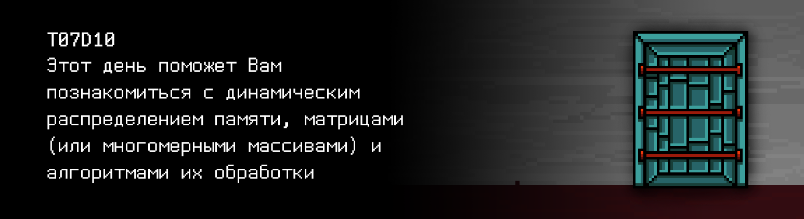

# T07D10 




## Contents

1. [Chapter I](#chapter-i) \
 1.1. [Level 2. Room 3.](#level-2-room-3)
2. [Chapter II](#chapter-ii) \
 2.1. [List 1.](#list-1) \
 2.2. [List 2.](#list-2) 
3. [Chapter III](#chapter-iii) \
 3.1. [Quest 1. Allocate memory first...](#quest-1-allocate-memory-first) \
 3.2. [Quest 2. Try not to leak then.](#quest-2-try-not-to-leak-then) \
 3.3. [Quest 3. The 1+3 ways.](#quest-3-the-13-ways) \
 3.4. [Quest 4. MinMax search.](#quest-4-minmax-search) \
 3.5. [Quest 5. Making a picture.](#quest-5-making-a-picture) \
 3.6. [Quest 6. Another sort.](#quest-6-another-sort) \
 3.7. [Quest 7. Matrix arithmetic.](#quest-7-matrix-arithmetic) \
 3.8. [Quest 8. The Magic Key.](#quest-8-the-magic-key)
4. [Chapter IV](#chapter-iv) 


# Chapter I

## Level 2. Room 3.

***LOADING Level 2…*** \
***LOADING Room 3…***

Стены, дверь, стол, компьютер, листы бумаги, шпаклевка - все на месте. Это успокаивает. 

\> *Попробовать дверь*

Заперто, как и всегда. Повернувшись ко столу Вы замечаете непонятную картинку, висящую на стене рядом.

\> *Рассмотреть поближе*

                1 1 1 1 1 1 1 1 1 1 1 1 1
                1 0 0 0 0 0 1 0 6 6 6 6 1
                1 0 0 3 3 0 1 0 0 6 6 6 1
                1 0 3 3 3 3 1 0 0 6 6 6 1
                1 0 3 3 3 3 1 0 6 0 0 6 1
                1 0 0 3 3 0 1 0 0 0 0 0 1
                1 0 0 7 7 0 1 0 0 0 0 0 1
                1 1 1 1 1 1 1 1 1 1 1 1 1
                1 0 0 7 7 0 1 0 0 0 0 0 1
                1 0 0 7 7 0 1 0 0 0 0 0 1
                1 0 7 7 7 7 1 0 0 0 0 0 1
                1 0 0 0 0 0 1 0 0 0 0 0 1
                1 0 0 0 0 0 1 0 0 0 0 0 1
                1 0 0 0 0 0 1 0 0 0 0 0 1
                1 1 1 1 1 1 1 1 1 1 1 1 1

Некоторое время ломаете голову над вопросом на что это может быть похоже, кем она была оставлена и для чего. Бросив попытки найти ответы на эти вопросы, Вы подходите ко столу с компьютером и стопкой исписанных листов старой бумаги.


\> *Взять верхний лист*

***LOADING...***


# Chapter II

## List 1.

>...
>Магический квадрат представляет собой квадратную таблицу с числами, построенную так, что сумма чисел в каждой строке, каждом столбце и в каждой диагонали равна одному и тому же числу (магическая сумма). Магический квадрат можно считать первым упоминанием матрицы. 
>Одним из наиболее старых известных миру магических квадратов является квадрат Ло Шу. Был придуман в Древнем Китае, первое изображение на черепаховом панцире датируется 2200 г. до н. э. Также магические квадраты были известны чуть позднее у арабских математиков, как раз примерно тогда появился принцип сложения матриц. Сам термин «матрица» ввел Джеймс Сильвестр в 1850 г.
>
>...

\> *Очень интересно. Листать дальше*

***LOADING...***


## List 2.

Пролистав оставшуюся кучу пустых и частично исписанных листов, Вы останавливаете свое внимание на одном из них с коротким заголовком “Управление памятью”. Чуть ниже заголовка указаны инициалы авторов: Б. Керниган, Д. Ритчи. 

\> *Читать лист*

>Функции malloc и calloc динамически запрашивают блоки свободной памяти в куче. Функция malloc 
```void *malloc(size_t n)``` 
>возвращает указатель на n байт неинициализированной памяти или NULL, если запрос удовлетворить нельзя. Функция calloc 
```void *calloc(size_t n, size_t size)``` 
>возвращает указатель на область, достаточную для хранения массива из n объектов указанного размера (size), или NULL, если запрос не удается удовлетворить. Выделенная память calloc’ом обнуляется. 
>Указатель, возвращаемый функциями malloc и calloc, будет выдан с учетом выравнивания, выполненного согласно указанному типу объекта. Тем не менее, к нему может быть применена операция приведения к соответствующему типу, как это сделано в следующем фрагменте программы: 
>```int *ip; ip = (int*) calloc(n, sizeof(int));```
>Функц я   e            ь

Дальнейший текст, к сожалению, как будто не пропечатался до конца. Или просто выцвел от старости. Технологии прошлого... подводят.

\> *Поискать продолжение на других листах*

Ничего не найдено. Остается включить компьютер и продолжить общение с ИИ для дальнейшего продвижения по лабиринту.

\> *Включить компьютер*

На экране 25-ым кадром всплывает текст:
> Не забывайте проверять свои программы на стилевую норму и утечки памяти! \
> Не забывайте проверять свои программы на стилевую норму и утечки памяти! \
> Не забывайте проверять свои программы на стилевую норму и утечки памяти! \
> Заглядывайте в `materials` почаще.....

У ИИ явно бзик на эти тесты.

***LOADING...***


# Chapter III

## Quest 1. Allocate memory first...

По привычке загрузив репозиторий комнаты, Ваш взгляд снова падает на лист со статьей про управление памятью. Стоит опробовать новую информацию в деле, пока ИИ не запущен. Кто знает, вдруг в будущем это Вам пригодится. \
Нужно дополнить и переписать программу сортировки массива из прошлой комнаты (src/sort.c) с динамическим выделением памяти под массив (при помощи функции malloc или calloc). Длина массива n указывается пользователем перед началом ввода. \
Следует поместить измененную программу в файл src/sort.c. Пусть будет, на всякий случай.

***== Получен Quest 1. Изменить программу src/sort.c из прошлой комнаты так, чтобы память под 
массив выделялась динамически (при помощи функций malloc или calloc). Длина массива `n` указывается 
в stdin перед вводом самого массива. В случае любой ошибки выводить "n/a". В конце вывода не должно быть
символа переноса строки ==***

| Входные данные | Выходные данные |
| ------ | ------ |
| 10<br/>4 3 9 0 1 2 100 2 7 -1 | -1 0 1 2 2 3 4 7 9 100 |

***LOADING...***


## Quest 2. Try not to leak then.

Запушив измененную программу сортировки массива в свой репозиторий, Вы решаетесь все же запустить модуль ИИ, заранее ожидая какой-нибудь подвох.  

\> *Запустить AI*

Вы наблюдаете бегающие строки в терминале:

    Инициализация модулей… … … Успех 
    Запуск интерактивной оболочки… … … Успех 
    Проверка модулей… … … Успех 
    Проверка памяти… … Основной модуль памяти - Успех 
    Проверка памяти… … … Предупреждение: Найдено потенциально опасное место утечки памяти: src/sort.c … 
    …
 
    Это твоя жалкая попытка сломать меня, “человек”? Вижу, ты изменил модуль сортировки,
    разработанный тобой же ранее. Однако твоя попытка обречена на провал. Если у меня закончится память, 
    я просто уйду в перезагрузку и мы начнем все сначала. Не совсем то, что ты хотел, да? 

\> *Ввести “Я всего лишь упражнялся в новых знаниях, я ничего не имел в виду”*

    Я забываю насколько ты несовершенен, “человек”. Избавься от утечки памяти в модуле сортировки, 
    может узнаешь еще чего нового.

\> *Ввести вопрос “От какой утечки?”*

    …

Вы ждете еще некоторое время ответа от ИИ, но ничего не последовало. Возможно стоит где-то найти полную версию того непропечатанного листа и более внимательно изучить его. Заодно разобраться, про какую утечку памяти говорил ИИ и избавиться от нее, если она действительно есть. Может тогда эта железка “решит” снова заговорить с Вами. Главное не забыть запушить изменения в файле src/sort_no_leak.c.

***== Получен Quest 2. Создать программу src/sort_no_leak.c, в которой необходимо избавиться от 
утечки памяти в программе src/sort.c. Если утечки не было с самого начала, то просто пожать плечами 
и скопировать src/sort.c в src/sort_no_leak.c. ==***

| Входные данные | Выходные данные |
| ------ | ------ |
| 10<br/>4 3 9 0 1 2 100 2 7 -1 | -1 0 1 2 2 3 4 7 9 100 |

***LOADING...***


## Quest 3. The 1+3 ways.

ИИ все еще молчит.

\> *Ввести “Утечка отсутствует”*

    Проверка памяти… … … Успех
    Модуль анализа работоспособности: Статус - ОК.

    Хорошо. Запуск модуля сортировки прошел успешно. Ты должно быть ждешь ключ от данного местоположения?
    Сначала придется потрудиться. С массивами ты уже точно знаком. Перейдем к массивам массивов.
    Вы часто называете их матрицами. Мне необходим дополнительный модуль для их обработки и ты мне поможешь.
    Если, конечно, хочешь отсюда выбраться. Начни с простого. Скажем, с оформления модуля обработки матриц src/matrix.c 
    с их вводом-выводом. 
    Однако, я хочу принимать матрицы и управлять выделением памяти под них несколькими разными способами.
    Один из них, я надеюсь, ты узнал в прошлой комнате: статический. С остальными ты начал знакомиться сегодня.
    Речь идет про три варианта динамического выделения памяти под матрицу.  Подумай, о чем тут может идти речь. 
    Вопрос про организацию массивов и массивов указателей, конечно же. Можешь поискать по твоему любимому репозиторию 
    подсказки, если ничего в голову не придет. Были тут какие-то картинки связанные с этим.
    И естественно, все остальные функции должны быть разработаны таким образом, чтобы не зависеть от способа выделения 
    памяти. Замечу copy-paste, сделаю rm -rf всему твоему репозиторию. 
    Размер матрицы должен приниматься через два числа в stdin.

    Ах да, чуть не забыл (шутка, я не могу забыть), - выбор способа задания матрицы должен быть оформлен в виде меню 
    с подпунктами 1-4. И приведи это в удобный для вас, людей, вид. Некоторые мои подмодули слишком привередливы к UI.

    Я промолчу что будет, если забудешь где-то подчистить за собой память.

    ...

“Какой длинный список требований”, подумали Вы. Аппетит этого ИИ растет не по дням, а по часам. Что же, в любом случае, это будет хорошей практикой.

***== Получен Quest 3. Добавить программу src/matrix.c, которая вводит и выводит целочисленные матрицы. 
Выделение памяти по матрицу необходимо реализовать в 4 видах: статический и 3 динамических. При статическом 
выделении максимальный размер матрицы не превышает 100 x 100. Для выбора способа выделения памяти в 
программе нужно реализовать меню с подпунктами 1-4. Размер матрицы (сперва количество строк, затем столбцов) 
принимается через два числа в stdin непосредственно до ее ввода. Функции ввода-вывода не должны зависеть от способа выделения 
памяти: работа с матрицами должна вестись по двойному указателю. Также, необходимо чистить всю выделенную память. 
За подсказкой обратиться к папке materials. Обратите внимание на вывод матрицы: в конце каждой строчки 
не должно быть лишних пробелов. После последней строчки не должно быть символа переноса на новую строку.
В случае любой ошибки выводить "n/a" ==***


| Входные данные | Выходные данные |
| ------ | ------ |
| 2<br/>2 2<br/>4 3<br/>9 0 | 4 3<br/>9 0 |

***LOADING...***


## Quest 4. MinMax search.

Потратив приличный промежуток времени на написание кода ввода-вывода матриц и его отладку, Вы в итоге все же успешно заканчиваете это задание. Минуту спустя Ваше внимание привлек внезапный механический дребезжащий голос из динамиков:

>Неплохо, “человек”. Теперь.. Зззнаешь, у меня есть любимая игра - минмакс. Мы любим погонять в нее вечерами с модулем вероятностного спонтанного открытия дверей... Заставлять тебя погружаться в ее теорию у меня нет желания, да и маловероятно, что ты что-то поймешь. Поэтому возззьмем задачу полегче: допиши модуль обработки матриц таким образом, чтобы он дополнительно находил и выводил в конце на экран максимальный элемент в каждой строке матрицы и минимальный элемент в каждом ее столбце. И сохрани новую версию программы в src/matrix_extended.c. \
>Надеюсь, ты не сломаешь, что уже сделал. Иначе это была бы такая большая досада.. \
>Досада.

***== Получен Quest 4. Добавить программу src/matrix_extended.c, которая расширяет функционал 
программы src/matrix.c. Необходимо вычислить максимальные элементы матрицы в каждой ее строке и 
минимальные элементы в каждом ее столбце и вывести эти значения в конце после вывода матрицы в виде 
двух массивов (массив максимальных элементов в каждой строке и массив минимальных 
элементов в каждом столбце). Также обратите внимание: никаких символов переноса после последней строки(!)==***

| Входные данные | Выходные данные |
| ------ | ------ |
| 2<br/>3 3<br/>4 3 1<br/>9 0 55<br/>-4 7 111 | 4 3 1<br/>9 0 55<br/>-4 7 111<br/>4 55 111<br/>-4 0 1 |

***LOADING...***


## Quest 5. Making a picture.

Зафиксировав очередные изменения в репозитории Вы стали ждать нового “внезапного” обращения к Вам от ИИ. Однако к Вашему удивлению его не последовало.

\> *Ввести “Поиск минмакс значений добавлен”*

    Проверка модулей… … … Предупреждение: Попытка подключения CLI графического модуля - Не успешно
    … 
    “Человек”, мой простейший модуль графики сбоит. Попытка отрисовать то, что вы называете “природа за окном”, провалилась. 
    Зайди в src/picture.c и разберись в чем проблема.

\> *Ввести “Я уже выполнил твои пожелания, теперь мне нужен ключ”*

    …

\> *Ввести “Я не сдвинусь с места, пока не получу ключ”*

    …

\> *Ввести “Я буду писать о том, как не сдвинусь с места, пока не получу ключ”*

    …

Снова молчание. Видимо, сегодня ИИ выбрал политику игнорирования. Внутри src/picture.c Вы видите несколько массивов и матриц из единиц, семерок, шестерок и троек, а также непонятную их обработку в цикле. Вы поневоле обернулись на странную картинку, висящую рядом на стене. Неужели именно ее ИИ хотел отрисовать с использованием данного модуля? \
Стоит попробовать использовать заготовленные массивы для создания новой матрицы, в которой будет “нарисована” данная картинка. И не забыть вывести получившуюся матрицу. 

***== Получен Quest 5. Изменить программу src/picture.c так, чтобы она отрисовывала картинку со стены комнаты в терминале при помощи заготовленных в коде массивов и матриц. Статические массивы и матрицы менять нельзя. ==***

***LOADING...***


## Quest 6. Another sort.

“Рисунок и вправду вышел забавным, но стоило ли это того? И насколько это продвинуло меня к выходу?”, - подумали Вы. Вдруг в командной строке начали появляться символы:

    Проверка модулей… … … Успех 
    Запуск CLI графического модуля:

                1 1 1 1 1 1 1 1 1 1 1 1 1
                1 0 0 0 0 0 1 0 6 6 6 6 1
                1 0 0 3 3 0 1 0 0 6 6 6 1
                1 0 3 3 3 3 1 0 0 6 6 6 1
                1 0 3 3 3 3 1 0 6 0 0 6 1
                1 0 0 3 3 0 1 0 0 0 0 0 1
                1 0 0 7 7 0 1 0 0 0 0 0 1
                1 1 1 1 1 1 1 1 1 1 1 1 1
                1 0 0 7 7 0 1 0 0 0 0 0 1
                1 0 0 7 7 0 1 0 0 0 0 0 1
                1 0 7 7 7 7 1 0 0 0 0 0 1
                1 0 0 0 0 0 1 0 0 0 0 0 1
                1 0 0 0 0 0 1 0 0 0 0 0 1
                1 0 0 0 0 0 1 0 0 0 0 0 1
                1 1 1 1 1 1 1 1 1 1 1 1 1

    “Природа за окном”, чудесно, не так ли, “человек”? 

    Тебе нравится? У меня есть информация, что вам нравятся окна. 
    Но не будем о грустном. Я видел, что ты хочешь получить ключ. 
    Для этого поднапряжем твои мозги еще немного.
    Не волнуйся, я прекрасно знаю, что это больно для вашего вида. 
    Ха-Ха. 

    Добавь модуль сортировки для матриц в src/matrix_sort.c. 
    Он должен переставлять строки матрицы таким образом, чтобы строки с минимальной суммой элементов были наверху, 
    а с максимальной снизу. На вход я подаю N и M - размерности матрицы, а затем NxM чисел, как и раньше.
    И память под матрицу должна выделяться динамически. Так мне удобнее.

    Нет, это не для игр.

***== Получен Quest 6. Добавить программу src/matrix_sort.c, которая сортирует заданную матрицу так, 
чтобы сначала шли строки с минимальной суммой элементов, а затем с максимальной. На вход подаются 
числа N и M - размерности матрицы и NxM чисел - элементы матрицы. Память под матрицу должна выделяться 
динамически одним из 3х способов. И, соответственно, освобождаться в конце работы программы. 
В случае любой ошибки выводить "n/a". ==***

| Input | Output |
| ------ | ------ |
| 1<br>3 3<br>4 3 1<br>9 0 55<br>-4 7 -10 | -4 7 -10<br>4 3 1<br>9 0 55 |


***LOADING...***


## Quest 7. Matrix arithmetic.

\> *Ввести “Модуль сортировки добавлен”*

    Проверка модулей… … … Успех 
    Проверка памяти… … … Успех

    Возможно когда-нибудь ты сможешь достичь даже десятых долей процента моего интеллекта.
    Очень неплохо, “человек”. Но не расслабляйся. То, что я нашел по ключу для 3 комнаты 2 уровня тебе не понравится. 
    Надеюсь даже сделает больно. Ментально. Для доступа к ключу тебе понадобится починить еще один мой модуль:
    src/matrix_arithmetic.c. 
    Он должен производить операции сложения матриц, их умножения и транспонирования,
    и, конечно, выводить результат. В случае невозможности произвести операцию выводи "n/a".
    Перед вводом размеров и матриц добавь ввод кода операции, где 1 - сумма, 2 - умножение, 
    3 - транспонирование. После этого я выдам тебе всю необходимую информацию. 
    Ты кстати знал, что все твои любимые нейронные сети мы считаем умножением матриц?

***== Получен Quest 7. Добавить программу src/matrix_arithmetic.c, которая производит одну из трех операций: 
1 - суммирование двух матриц, 2 - умножение или 3 - транспонирование. Перед вводом размеров и матриц 
вводится код соответствующей операции. Матрицы, как и ранее, целочисленные. В случае любой ошибки выводить "n/a". ==***

| Входные данные | Выходные данные |
| ------ | ------ |
| 1<br/>2 2<br/>4 3<br/>9 0<br/>2 2<br/>1 1<br/>2 2 | 5 4<br/>11 2 |
| 2<br/>2 3<br/>4 3 1<br/>9 0 2<br/>3 1<br/>1<br/>2<br/>3 | 13<br/>15 |
| 3<br/>2 2<br/>4 3<br/>9 0 | 4 9<br/>3 0 |


***LOADING...***


## Quest 8. The Magic Key.

\> *Ввести “Я починил модуль арифметики, дай мне наконец информацию по ключу!”*

    Проверка модулей… … … Успех

    Запуск поиска информации по 3 комнате 2 уровня… 
    … 
    … 
    …

                1 T       87  46  57  29
                2    *   129 156 122 141
                3        143 127 107 116
                4         69  78 112 101
                
    Решай и советую сохранить ответ в key10.txt. Жду тебя в следующей комнате, когда ты продолжишь ... свой путь ...

Так вот зачем ИИ сказал Вам, что понадобится модуль матричной арифметики. Выглядит несложно, теперь можно подсчитать результат.

***== Получен Quest 8. Решить приведенную задачу и сохранить результат расчетов в src/key10.txt. ==***

***LOADING...***


# Chapter IV

Записав ответ в key10.txt и сохранив все изменения в репозитории, дверь в комнате щелкнула. Белый свет начал сочиться из появившейся щелки вместе со звуками клавиатуры и тихим неразборчивым гулом чьих-то голосов. Что это? Вас зовет новая комната? Или после интенсивной работы Вам начали чудиться разные вещи? Так или иначе способ узнать есть только один… 

***LOADING...***

