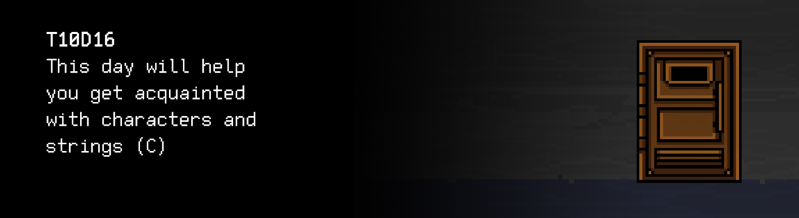

# T10D16
The Russian version of the task can be found in the repository.

You can find some useful video materials [here](https://edu.21-school.ru/video/selection/925365ef-066d-4be6-81a9-2667102d8da9).

## Contents

1. [Chapter I](#chapter-i) \
 1.1. [Level 3. Room 2.](#level-3-room-2)
2. [Chapter II](#chapter-ii) \
    2.1. [List 1.](#list-1) \
    2.2. [List 2.](#list-2) 
3. [Chapter III](#chapter-iii) \
 3.1. [Quest 1. Strlen.](#quest-1-strlen) \
 3.2. [Quest 2. Strcmp.](#quest-2-strcmp) \
 3.3. [Quest 3. Strcpy.](#quest-3-strcpy) \
 3.4. [Quest 4. Strcat.](#quest-4-strcat) \
 3.5. [Quest 5. Strchr.](#quest-5-strchr) \
 3.6. [Quest 6. Strstr.](#quest-6-strstr) \
 3.7. [Quest 7. Strtok.](#quest-7-strtok) \
 3.8. [Quest 8. Width.](#quest-8-width) 
4. [Chapter IV](#chapter-iv) 

# Chapter I

## Level 3. Room 2.

***LOADING Level 3… \
LOADING Room 2…***

You find yourself in a room with wonderful furniture and a lot of bookshelves. Wherever you look, there are books. There are books by the door. Even the computer is standing on a stack of books.

\> *Sit down at the computer, start the module and press Enter*

You see the following lines on the screen:

    1111111111111111111111111111111111111111111111111111111111111111111111111111111111111111111
    1111111111111111111111111111111111111111111111111111111111111111111111111111111111111111111

    Emergency message: standard string.h library calls are unavailable. 
    The linguistics module cannot work.

\> *find -O3 -L / -name "string.h"*

You wait for n hours and realize that this library simply **does not exist** on the computer.

\> *Pull the door handle*

It doesn't open.

\> *Great, looks like now I'll have to recover this library!*

You look at all the books in the room. You notice that the names of the books on the covers are arranged in alphabetic order.\
They look like old computer books and printed-out manuals. \
Something tells you to search for a book related to the string.h library

\> *Search...*

Failure.

\> *Search...*

Failure.

\> *Search...*

Success. You find a book called "The String.h - Linux manual. Complete edition."

\> *Open the book*

It looks a lot like a man printout. Even the font is the same as in the terminal. 

***LOADING...***

# Chapter II

## List 1.

\> *Read the book*

    PROLOG
       This manual page is part of the POSIX Programmer's Manual.  The Linux
       implementation of this interface may differ (consult the
       corresponding Linux manual page for details of Linux behavior), or
       the interface may not be implemented on Linux.
    NAME 
       string.h — string operations
    SYNOPSIS
       #include <string.h>
    DESCRIPTION
       Some of the functionality described on this reference page extends
       the ISO C standard. Applications shall define the appropriate feature
       test macro (see the System Interfaces volume of POSIX.1‐2008, Section
       2.2, The Compilation Environment) to enable the visibility of these
       symbols in this header.

       The <string.h> header shall define NULL and size_t as described in
       <stddef.h>.

       The <string.h> header shall define the locale_t type as described in
       <locale.h>.

       The following shall be declared as functions and may also be defined
       as macros. Function prototypes shall be provided for use with ISO C
       standard compilers.

            Chapter 1 - size_t   strlen(const char *);
            Chapter 2 - int      strcmp(const char *, const char *);
            Chapter 3 - char    *strcpy(char *restrict, const char *restrict);
            Chapter 4 - char    *strcat(char *restrict, const char *restrict);
            Chapter 5 - char    *strchr(const char *, int);
            Chapter 6 - char    *strstr(const char *, const char *);
            Chapter 7 - size_t   strnlen(const char *, size_t);
            Chapter 8 - int      strncmp(const char *, const char *, size_t);
          
            ...

       Inclusion of the <string.h> header may also make visible all symbols
       from <stddef.h>.

You wonder how many functions this library has... Perhaps you should go the iterative route and try to restart the program module after adding each function. Maybe it doesn't need all the functions.. 
Otherwise, you can get stuck here for a long time.

\> *Come up to the computer again*

You come up to the computer and notice another open book next to it. Somehow you missed it the first time. The book is open on the "Module Testing: Part 2" chapter

\> *Skim read*

***LOADING...***

## List 2.

>Module testing (unit testing) is a process in computer programming that helps check the correctness of specific modules of source code, 
>sets of one or more software modules, together with the associated control data, and procedures for use and processing.
>The idea is to create tests for every non-trivial function or method. This allows you to quickly check if the new 
>changes in the code have caused a regression, i.e. errors in parts of the program that have already been tested, and facilitates the detection and elimination of such errors.
>The purpose of module testing is to isolate parts of the program and show that they can work individually, minimizing the number of states of the system.

***LOADING...***

# Chapter III

## Quest 1. Strlen.

Perhaps you should also create tests for every new function to make sure they work absolutely correctly. Who knows how broken code can affect the linguistics module that is already not working. And you still need to get out of this room. Plus, if something goes wrong, it will be easier to find the error with the tests. 

For each added function in src/s21_string.h, add a test developed based on the idea of unit testing to the src/s21_string_test.h file, with the name of the function and the test_ prefix which checks the function using a set of test data (minimum 3): normal values, abnormal values, boundary values, etc. For each test, the input, output, and test result (SUCCESS/FAIL) must be output to stdout. 

> DON'T FORGET! All your programs are tested for the style norm and memory leaks. Start-up instructions
> the list of tests is also in the `materials` folder

***== Quest 1 received. Create src/s21_string.h and src/s21_string.c files and add declaration and definition of the s21_strlen function to them. Create a test program, src/s21_string_test.c, that should include the s21_strlen_test function for checking the s21_strlen function with a set of test data (minimum 3): normal values, abnormal values, boundary values, etc. For each test, the input, output, and test result (SUCCESS/FAIL) must be output to stdout. Add the launch of this function to main. When developing the s21_strlen function, only use language features. Using string.h and other libraries is not allowed. Build the program using the Makefile. Name of the build stage: strlen_tests. The executable file should be stored at the root in the build folder. It should be named Quest_1. ==***

***LOADING...***

## Quest 2. Strcmp.

\> *The first function is ready.*

\> *Restarting the module*

    1111111111111111111111111111111111111111111111111111111111111111111111111111111111111111111
    11111111111111111111111111111111111111111111111111111111111111111111111111111111111

    Emergency message: standard string.h library calls are unavailable. The linguistics module cannot work.

Let's continue..

***== Quest 2 received.  Add declaration and definition of the s21_strcmp function to src/s21_string.h and src/s21_string.c files. Add the s21_strcmp_test function to the src/s21_string_test.c file for checking the s21_strcmp function using a set of test data (minimum 3): normal values, abnormal values, boundary values, etc. For each test, the input, output, and test result (SUCCESS/FAIL) must be output to stdout. Add the launch of this function to main. When developing the s21_strcmp function, only use language features. Using string.h and other libraries is not allowed. Build the program using the Makefile. Name of the build stage: strcmp_tests. The executable file should be stored at the root in the build folder. It should be named Quest_2. ==***

***LOADING...***

## Quest 3. Strcpy.

\> *The second one is ready.*

\> *Restart*

    1111111111111111111111111111111111111111111111111111111111111111111111111111111111111111111
    1111111111111111111111111111111111111111111111111111111111111111
    
    Emergency message: standard string.h library calls are unavailable. The linguistics module cannot work.

***== Quest 3 received.  Add declaration and definition of the s21_strcpy function to src/s21_string.h and src/s21_string.c files. Add the s21_strcpy_test function to the src/s21_string_test.c file for checking the s21_strcpy function using a set of test data (minimum 3): normal values, abnormal values, boundary values, etc. For each test, the input, output, and test result (SUCCESS/FAIL) must be output to stdout. Add the launch of this function to main. When developing the s21_strcpy function, only use language features. Using string.h and other libraries is not allowed. Build the program using the Makefile. Name of the build stage: strcpy_tests. The executable file should be stored at the root in the build folder. It should be named Quest_3. ==***

***LOADING...***

## Quest 4. Strcat.

\> *Checking module*

    1111111111111111111111111111111111111111111111111111111111111111111111111111111111111111111
    11111111111111111111111111111111111111
    
    Emergency message: standard string.h library calls are unavailable. The linguistics module cannot work.

***== Quest 4 received. Add declaration and definition of the s21_strcat function to src/s21_string.h and src/s21_string.c files. Add the s21_strcat_test function to the src/s21_string_test.c file for checking the s21_strcat function using a set of test data (minimum 3): normal values, abnormal values, boundary values, etc. For each test, the input, output, and test result (SUCCESS/FAIL) must be output to stdout. Add the launch of this function to main. When developing the s21_strcat function, only use language features. Using string.h and other libraries is not allowed. Build the program using the Makefile. Name of the build stage: strcat_tests. The executable file should be stored at the root in the build folder. It should be named Quest_4. ==***

***LOADING...***

## Quest 5. Strchr.

\> *Yet another boring module check*

    1111111111111111111111111111111111111111111111111111111111111111111111111111111111111111111
    11111

    Emergency message: standard string.h library calls are unavailable. The linguistics module cannot work.

***== Quest 5 received. Add declaration and definition of the s21_strchr function to src/s21_string.h and src/s21_string.c files. Add the s21_strchr_test function to the src/s21_string_test.c file for checking the s21_strchr function using a set of test data (minimum 3): normal values, abnormal values, boundary values, etc. For each test, the input, output, and test result (SUCCESS/FAIL) must be output to stdout. Add the launch of this function to main. When developing the s21_strchr function, only use language features. Using string.h and other libraries is not allowed. Build the program using the Makefile. Name of the build stage: strchr_tests. The executable file should be stored at the root in the build folder. It should be named Quest_5. ==***

***LOADING...***

## Quest 6. Strstr.

\> *Checking...*

    1111111111111111111111111111111111111111111111111111111111111111111111111111
    
    Emergency message: standard string.h library calls are unavailable. The linguistics module cannot work.
    
How many calls does this module use?
    
***== Quest 6 received. Add declaration and definition of the s21_strstr function to src/s21_string.h and src/s21_string.c files. Add the s21_strstr_test function to the src/s21_string_test.c file for checking the s21_strstr function using a set of test data (minimum 3): normal values, abnormal values, boundary values, etc. For each test, the input, output, and test result (SUCCESS/FAIL) must be output to stdout. Add the launch of this function to main. When developing the s21_strstr function, only use language features. Using string.h and other libraries is not allowed. Build the program using the Makefile. Name of the build stage: strstr_tests. The executable file should be stored at the root in the build folder. It should be named Quest_6. ==***

***LOADING...***

## Quest 7. Strtok.

\> *Again*

    11111111111111111111111111111111
    111111111
    111
    
    Loading...
    Uploading...
    Paging...
    Done.
    
    Module data has been loaded successfully, the module is ready for launch.

Finally!

\> *Confirm module launch*

    Launching reference module...
    OK!
    
    Reference module at your service, how can I help you?

\> *Type in "I need to move further"*

    Question breakdown – failure
    
    Emergency message: extended string.h library calls are unavailable – the strtok function is not found.
    
Oh, for god's sake. Looks like I have to add this function to the library as well.

***== Quest 7 received. Add declaration and definition of the s21_strtok function to src/s21_string.h and src/s21_string.c files. Add the s21_strtok_test function to the src/s21_string_test.c file for checking the s21_strtok function using a set of test data (minimum 3): normal values, abnormal values, boundary values, etc. For each test, the input, output, and test result (SUCCESS/FAIL) must be output to stdout. Add the launch of this function to main. When developing the s21_strtok function, only use language features. Using string.h and other libraries is not allowed. Build the program using the makefile. Name of the build stage: strtok_tests. The executable file should be stored at the root in the build folder. It should be named Quest_7. ==***

***LOADING...***

## Quest 8. Width.

\> *Restarting the module*

    Launching reference module...
    OK!
    
    Reference module at your service, how can I help you?
    
\> *Type in "I need to move further"*

    Moving further – identified
    Searching for information in the database... ... ...
    
    Information on the key for room 3–2:
    To unlock the door in the room 3–2, you need to make a contribution to the word processor
    under development. Scanning available tickets......
    ..............................................................
    ..............................................................
    ..............................................................
    Ticket found. Create an src/text_processor.c program with full word processor functionality. 
    Sources of inspiration: MS Word, LibreOffice, OpenOffice.

\> *Type in "Ok. This is too much."*

    Analyzing the answer.... Answer analyzed.
    Answer characteristics: sarcasm, pain, discouragement, distrust, fear, rejection.
    Searching for a compromise....
    Compromise found: implement part of the task instead of the whole task.
    Create an src/text_processor.c program that runs in one mode only 
    with the -w switch (formatting–justified), taking a number and text of up to 100 characters via stdin.
    As a result, it should create and output justified text. 
    The width of a text line in characters is determined by the first number. 
    The task is final and conclusive.
    After updating the room's remote repository, the door will be unlocked.
    
Ok. It's not the worst thing you've done to get the doors to open.

***== Quest 8 received. Create an src/text_processor.c program that takes a number (line width) and text of up to 100 characters, ending with a line break, as input to stdin, when launched with the -w command-line switch. For any other switches, the program should output "n/a". The compiled file must be named Quest_8. When launched with the -w switch, the program justifies the input text and outputs it to stdout, mimicking the behavior of a word processor. The text should be divided into several lines, each having a specified number of characters. Lines cannot start with a space and cannot end with a space, the last line must not end with a line break. A word can be split to jump to a new line through the symbol '-' only if it does not fit on one line entirely. In all other cases, it must remain intact. The words in a line must be distributed evenly, filling the gaps between them with spaces. Using string.h is not allowed. ==***

| Terminal arguments | Input | Output |
| ------ | ------ | ------ |
| -w | 10 hello how are you | hello how are you |
| -w | 5 ab abcd ab abcd ab abcdefgh | ab abcd ab abcd ab a- bcde- fgh |

***LOADING...***

# Chapter IV

\> *Type in "Can I leave now?"*

    All exit conditions: fulfilled.
    One more left.
    Let's talk.

\> *Type in "Maybe next time...?"*

    Your answer was predicted by the predictive algorithm with 91% accuracy.
    Thank you for this insightful discussion and for helping validate predictive linguistic analytics.
    Take care.
    Opening the door....

You hear a click and the door is wide open, as if it has a spring. It's time to go! 

***LOADING...***

