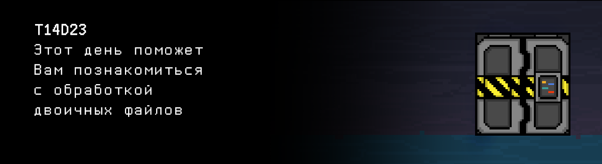

# T14D23

## Contents

1. [Chapter I](#chapter-i) \
 1.1. [Level 4. Room 2.](#level-4-room-2)
2. [Chapter II](#chapter-ii) \
 2.1. [Quest 1. Back to sort.](#quest-1-back-to-sort) \
 2.2. [Quest 2. And search.](#quest-2-and-search) \
 2.3. [Quest 3. Clear data.](#quest-3-clear-data)
3. [Chapter III](#chapter-iii)

# Chapter I

## Level 4. Room 2.

***LOADING Level 4…*** \
***LOADING Room 2…***

Кажется, проделка во вчерашней комнате удалась. Пока никаких следов ИИ - динамик молчит и в терминале пусто. Есть вариант проскочить и пусть ИИ сам справляется тут.

\> *Открыть дверь*

Заперто. Варианта больше нет.

\> *Посмотреть в терминал*

    Дверь не может быть открыта по причине невалидного состояния файла datasets/door_state.
    Обратите внимание, что записи в файле должны быть отсортированы по возрастанию. 
    В файле хранится информация в виде подряд записанного массива структур с целочисленными полями: 
    год, месяц, день, час, минута, секунда, статус (0/1), код.

    Сообщение сгенерировано автоматически. Не пытайтесь на него отвечать.

***LOADING...***

# Chapter II

## Quest 1. Back to sort.

\> *Сортировка записей - это просто*

Вы замечаете, что файл datasets/door_state достаточно объемный. Такие записи нельзя выгружать целиком в оперативную память, особенно на этих древних терминалах. Сортировка должна производиться без выгрузки в оперативную память файла целиком, прямо по файлу на диске. Выгружать в оперативную память одновременно можно только несколько записей. Саму программу для сортировки разместите в src/state_sort.c. Для отладки предусмотреть возможность указания пути к файлу, вывода содержимого файла на экран, добавления записей.

\> *А вот это уже будет непросто..*

***== Получен Quest 1. Создать программу src/state_sort.c, которая сортирует записи в бинарном файле datasets/door_state_1 по возрастанию их даты. Сам файл состоит из массива структур с целочисленными полями: год, месяц, день, час, минута, секунда, статус (0/1), код. Программа должна принимать путь к файлу. Также должно быть реализовано меню, где пункт 0 - вывод содержимого файла в консоль, пункт 1 - сортировка содержимого файла и вывод на экран, пункт 2 - добавление записи, сортировка и вывод на экран. Выгружать сразу весь файл в память нельзя. Рассмотреть абстракцию, что бинарный файл - массив на диске. Разработать для этой абстракции вспомогательные функции. Eсли входной файл оказался пустым, и после этого в него не добавляются новые записи, или если возникла любая ошибка, выводить n/a. Сборка проекта должна осуществляться при помощи Makefile. Имя стадии - state_sort. Имя исполняемого файла - Quest_1. ==***

| Входные данные | Выходные данные |
| ----- | ----- |
| datasets/door_state_1 0| 2020 9 1 12 0 0 0 153 2020 3 25 19 37 56 1 951 2020 4 3 1 53 26 1 393 ...  1991 6 28 10 50 57 0 732 1924 11 22 2 24 10 1 398 |
| datasets/door_state_1 1| 1920 2 24 7 39 14 0 112 1920 4 26 0 32 33 0 926 1920 7 5 18 8 7 1 216 ...  2020 5 30 16 51 40 1 147 2020 9 1 12 0 0 0 153 |
| datasets/door_state_1 2 2020 12 21 23 54 26 1 768| 1920 2 24 7 39 14 0 112 1920 4 26 0 32 33 0 926 1920 7 5 18 8 7 1 216 ...  2020 5 30 16 51 40 1 147 2020 9 1 12 0 0 0 153 2020 12 21 23 54 26 1 768 |

> Перед отправкой задания, убедитесь, что никакие лишние записи на экране не выводятся. Должен быть только ответ на задачу

***LOADING...***

## Quest 2. And search.

> НЕ ЗАБЫВАЙ! Все твои программы тестируются на стилевую норму и утечки памяти. Инструкция по запуску 
> тестов все также лежит в папке `materials`

Файл отсортирован.

\> *Открыть дверь*

Все еще закрыто.

\> *Ну что там такое, так проскочить точно не выйдет..*

Команда не распознана.

\> *Посмотреть в терминал*

В терминале видите текст:
    
    Для осуществления проверки доступа определите код от 0*.*2.*0_0 и разместите его в файле code.txt.

\> *Видимо, нужен поиск по файлу*

Именно. И исходя из текста, нужен он по дате, в формате "ДД.ММ.ГГГГ". Разработанную программу нужно сохранить в src/state_search.c, а код стоит записать в src/code.txt. Для отладки предусмотреть ввод пути к файлу и поисковой строки по дате. Выгружать весь файл в память все еще не стоит.

***== Получен Quest 2. Создать программу src/state_search.c, которая производит поиск в бинарном файле по дате в формате "ДД.ММ.ГГГГ". При запуске, программа должна принимать путь к файлу и поисковую строку с датой. Выгружать весь файл в память нельзя. Записать найденный код в src/code.txt и вывести в консоль. Если входной файл пустой, запись не найдена или возникла любая ошибка выводить n/a. Сборка проекта должна осуществляться при помощи Makefile. Имя стадии - state_search. Имя исполняемого файла - Quest_2. ==***

| Входные данные | Выходные данные |
| ----- | ----- |
| datasets/door_state_2 01.09.2020 | 153 |

***LOADING...***

## Quest 3. Clear data.

\> *Готово. Ввести код.*

Проверка прошла успешно! Но дверь не открыта.

\> *Что?*

Закрыто.

\> *Посмотреть в терминал*

    Кофликт с данными от марта до мая 2020 года.
    Разрешите конфликт удалением нерелевантных данных.

Хорошо, добавим еще программу очистки данных из файла по заданным границам в формате "ДД.ММ.ГГГГ ДД.ММ.ГГГГ" с соответствующим уменьшением его размера. Она должна находиться в src/clear_state.c. Для отладки предусмотреть ввод пути к файлу. Все еще без выгрузки всего файла в память. Мы же не хотим сломать местные терминалы окончательно. Или... 

***== Получен Quest 3. Создать программу src/clear_state.c, которая выполняет удаление данных по конкретному временному промежутку в файле с соответствующим уменьшением его размера. При запуске, программа должна принимать путь к файлу и временной промежуток в формате "ДД.ММ.ГГГГ ДД.ММ.ГГГГ". Если входной файл пустой или возникла любая ошибка выводить n/a. Сборка проекта должна осуществляться при помощи Makefile. Имя стадии - clear_state. Имя исполняемого файла - Quest_3. ==***

| Входные данные | Выходные данные |
| ----- | ----- |
| datasets/door_state_3 21.09.1945 18.10.1945 | 1920 2 24 7 39 14 0 112 1920 4 26 0 32 33 0 926 1920 7 5 18 8 7 1 216 ...  2020 5 30 16 51 40 1 147 2020 9 1 12 0 0 0 153 |

***LOADING...***

# Chapter III

Конфликт решен, данные удалены, код введен. Пора уже выходить отсюда, пока не объявился ИИ.

\> *Открыть дверь*

Вы приготовились к тому, что она все еще останется запертой, но не тут то было. Дверь поддалась и легким движением руки Вы распахнули ее на полную. \
Нужно поспешить, ИИ наверняка вот-вот очнется!

\> *Ура. Мы почти у цели.*

Кто мы? У Вас множественное расщепление личности?

\> *Все, я ушел.*

***LOADING...***

