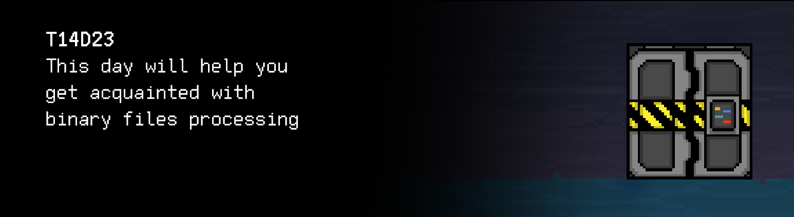

# T14D23 
The russian version of the task can be found in the repository.

## Contents

1. [Chapter I](#chapter-i) \
 1.1. [Level 4. Room 2.](#level-4-room-2)
2. [Chapter II](#chapter-ii) \
 2.1. [Quest 1. Back to sort.](#quest-1-back-to-sort) \
 2.2. [Quest 2. And search.](#quest-2-and-search) \
 2.3. [Quest 3. Clear data.](#quest-3-clear-data)
3. [Chapter III](#chapter-iii)

# Chapter I

## Level 4. Room 2.

***LOADING Level 4…*** \
***LOADING Room 2…***

Looks like your trick in yesterday's room was successful. So far, there are no traces of the AI: the speaker is silent and the terminal is empty. Perhaps you should try to sneak out quickly and leave the AI to it.

\> *Open the door*

It's locked.

\> *Check the terminal*

    The door cannot be opened due to the invalid state of the datasets/door_state file.
    Note that the records in the file must be sorted in ascending order. 
    The file contains information in the form of a consecutively written array of structures with integer fields: 
    year, month, day, hour, minute, second, status (0/1), code.

    This message has been generated automatically. Do not answer it.

***LOADING...***

## Quest 1. Back to sort.

\> *Sorting records is easy*

You notice that the datasets/door_state file is very big. Such records cannot be fully uploaded to RAM, especially on these ancient terminals. The sorting should be conducted directly in the file on the disk, without uploading the entire file to RAM. Only a few records can be uploaded to RAM at a time. Put the actual program for sorting in src/state_sort.c. For debugging, add the option of specifying the path to the file, displaying the contents of the file on the screen, adding records.

\> *And that is not going to be easy..*

***== Quest 1 received. Create an src/state_sort.c program that sorts records in the datasets/door_state_1 binary file in ascending order. The file itself contains an array of structures with integer fields: year, month, day, hour, minute, second, status (0/1), code. The program must accept a file path. Also, there must be a menu where item zero is the output of the file contents to the console, the first item is the output of the sorted file contents, the second item is adding a record and displaying the result on the screen. You cannot upload the entire file into memory at once. Consider the abstraction that the binary file is an array on the disk. Develop helper functions for this abstraction. Build the project using the Makefile. Stage name: state_sort. Executable file name: Quest_1. ==***

| Input | Output |
| ----- | ----- |
| datasets/door_state_1 0| 2020 9 1 12 0 0 0 153 2020 3 25 19 37 56 1 951 2020 4 3 1 53 26 1 393 ...  1924 11 22 2 24 10 1 398 1924 11 22 2 24 10 1 398 |
| datasets/door_state_1 1| 1920 2 24 7 39 14 0 112 1920 4 26 0 32 33 0 926 1920 7 5 18 8 7 1 216 ...  2020 5 30 16 51 40 1 147 2020 9 1 12 0 0 0 153 |
| datasets/door_state_1 2 2020 12 21 23 54 26 1 768| 1920 2 24 7 39 14 0 112 1920 4 26 0 32 33 0 926 1920 7 5 18 8 7 1 216 ...  2020 5 30 16 51 40 1 147 2020 9 1 12 0 0 0 153 2020 12 21 23 54 26 1 768 |

***LOADING...***

## Quest 2. And search.

> DON'T FORGET! All your programs are tested for the style norm and memory leaks. Start-up instructions
> the list of tests is also in the `materials` folder

The file has been sorted.

\> *Open the door*

Still locked.

\> *Whatever it is, I definitely won't be able to sneak out..*

Command not recognized.

\> *Check the terminal*

You see the following message in the terminal:
    
    To check access, determine the code from 01.09.2020 and put it in code.txt.

\> *Looks like file search is required*

Exactly. Based on the message, it needs to be a search by date, in the "DD.MM.YYYY" format. Save the developed program in src/state_search.c, and put the code from 01.09.2020 in src/code.txt. For debugging, create an input of the path to the file and the search string by date. You still shouldn't upload the entire file into RAM.

***== Quest 2 received. Create an src/state_search.c program that conducts a search by date in the binary file in the "DD.MM.YYYY" format. When launched, the program should receive the path to the file and the search string with a date. You cannot upload the entire file into RAM. Record the found code from 01.09.2020 in src/code.txt and output it to the console. Build the project using the Makefile. Stage name: state_search. Executable file name: Quest_2. ==***

| Input | Output |
| ----- | ----- |
| datasets/door_state_2 01.09.2020 | 153 |

***LOADING...***

## Quest 3. Clear data.

\> *Ready. Enter the code.*

The check has been successful! But the door is still locked.

\> *What?*

It's locked.

\> *Check the terminal*

    Conflict with data from March until May 2020.
    Resolve the conflict by deleting irrelevant data.

Ok, let's also add a program for clearing data from the file within the specified interval in the "DD.MM.YYYY DD.MM.YYYY" format with a corresponding reduction of its size. It must be placed in src/clear_state.c. For debugging, create an input of the path to the file. Still not uploading the entire file into the RAM. We don't want to totally break down these terminals. Or do we? 

***== Quest 3 received. Create an src/clear_state.c program that clears data for a specific time interval in the file with a corresponding reduction of its size. When launched, the program should receive the path to the file and the time interval in the "DD.MM.YYYY DD.MM.YYYY" format. Build the project using the Makefile. Stage name: clear_state. Executable file name: Quest_3. ==***

| Input | Output |
| ----- | ----- |
| datasets/door_state_3 21.09.1945 18.10.1945 | 1920 2 24 7 39 14 0 112 1920 4 26 0 32 33 0 926 1920 7 5 18 8 7 1 216 ...  2020 5 30 16 51 40 1 147 2020 9 1 12 0 0 0 153 |

***LOADING...***

# Chapter III

The conflict is resolved, the data is cleared, the code is entered. It's time to get out of here before the AI comes back.

\> *Open the door*

You were prepared for the door to still be locked, but that wasn't the case. You wide open the door with a subtle movement of your hand. \
You have to hurry, the AI can wake up any minute!

\> *Yay. We are almost there.*

"We?" Do you have a split personality?

\> *Ok, I'm off.*

***LOADING...***

