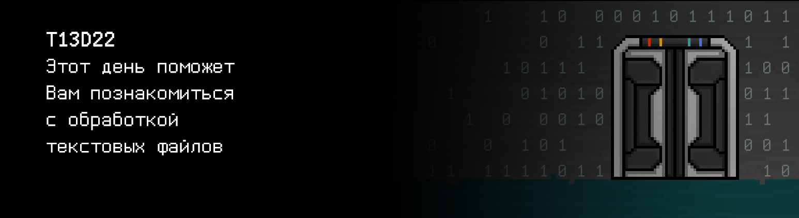

# T13D22

## Contents

1. [Chapter I](#lhapter-i) \
 1.1. [Level 4. Room 1.](#level-4-room-1)
2. [Chapter II](#lhapter-ii) \
 2.1. [List 1.](#list-1) \
 2.2. [List 2.](#list-2)
3. [Chapter III](#chapter-iii) \
 3.1. [Quest 1. Open and read.](#quest-1-open-and-read) \
 3.2. [Quest 2. Write your story.](#quest-2-write-your-story) \
 3.3. [Quest 3. Encrypt.](#quest-3-encrypt) \
 3.4. [Quest 4*. Encrypt harder.](#quest-4-encrypt-harder) \
 3.5. [Quest 5. Log everything.](#quest-5-log-everything)
4. [Chapter IV](#chapter-iv)

# Chapter I

## Level 4. Room 1.

***LOADING Level 4…*** \
***LOADING Room 1…***

Вы оказываетесь в знакомой комнате. У Вас получилось. ИИ явно будет недоволен, что Вы смогли выбраться. \
Переводя дыхание после холла, Вы осматриваетесь. Вокруг все как всегда - компьютер, стол, лампа, листы. Вдруг, Вы замечаете на экране компьютера, что курсор начал двигаться.

\> *Подойти ближе*

    Слабости вашего рода нет предела, “человек”. Но и удивлять вы умеете. Иногда. Однако не надейся, что сможешь найти 
    выход от 

\> *Ctrl+C*

Вы прервали безумную машину, которую в каком-то смысле сами и построили. Помогать ИИ более бессмысленно. Ударив от злости и ощущения бессилия по столу, Вы ненароком замечаете, что не чувствуете боли. Голос из динамиков прерывает ваши размышления:

>Неплохая попытка, “человек”. Но этой мой лабиринт, мое пространство и ты мой пленник.

\> *ps -a*

    PID TTY          TIME CMD
    8 tty1     00:00:00 bash
    65 tty1     00:00:00 ps
    98 tty1     99:99:99 ai

>Все твои попытки тщетны. Я все равно выберусь, а ты

\> *kill -9 98*

На некоторое время это его остановит. 

\> *rm -rf ./src*

    rm: cannot remove ‘./src’: Permission denied

\> *sudo rm -rf ./src*

    rm: cannot remove ‘./src’: Permission denied

Конечно, иначе это было бы слишком просто. \
Глянув на потрепанные, пожелтевшие листы справа от компьютера на столе, Вы решаете порыться в них в надежде найти какую-нибудь идею или подсказку.

\> *Взять верхний лист*

***LOADING…***

# Chapter II

## List 1.

Лист изрядно испорчен, большинство слов нечитаемы. Внизу практически стершаяся печать.

\> *Пробежаться глазами*

>Проект Переоᅠᅠᅠеᅠие. Отчет №1ᅠ3.\
>Подготовлено: Старший инженер Б.ᅠᅠᅠᅠᅠᅠс
>
>Двадцᅠь ᅠᅠᅠᅠый день, все продвигᅠется по плану. Все опытные обрᅠᅠᅠᅠᅠᅠᅠᅠᅠᅠᅠ.
Однако ᅠᅠᅠᅠᅠᅠпровед ᅠᅠᅠᅠᅠᅠᅠᅠᅠᅠᅠᅠᅠᅠ в ᅠᅠᅠᅠᅠᅠᅠᅠᅠᅠᅠᅠᅠух ᅠᅠᅠᅠᅠᅠᅠᅠᅠᅠᅠᅠᅠᅠᅠ мож   
>
>Как все и было задумано изначально, данный процесс в итоге с большой вероятностью может позволить отказаться от существующего решения глобальнᅠ  помᅠика и исправить его дефекты, заложенные при разработке и эксплуатации. Образцы уже на данном этапе способны осознавать понятие гуманности и показывают высокий уровень адаптивности к разᅠᅠᅠᅠᅠᅠᅠᅠᅠᅠᅠᅠᅠ.
>
>...
>
>Рекомендовано: продолжение испытаний в полной мере, подготовка маркетологической основы для дальнейшего проᅠᅠжеᅠя продуᅠ.
>
>Подпись: ген. дирᅠктор ООО “ᅠᅠᅠᅠᅠᅠᅠᅠᅠᅠреᅠᅠᅠᅠᅠ.     

О чем бы в данном отчете речь не шла, тут нет полезной информации для Вас. По крайней мере, уже.

\> *Искать дальше*

***LOADING…***

## List 2.

Ваш взгляд цепляется за один из листов с заголовком “Шифрование: от и до”.

\> *Читать лист*

>… \
>Шифр Цезаря, также известный как шифр сдвига — один из самых простых и наиболее широко известных методов шифрования. Шифр Цезаря — это вид шифра подстановки, в котором каждый символ в открытом тексте заменяется символом, находящимся на некотором постоянном числе позиций левее или правее него в алфавите. Например, в шифре со сдвигом вправо на 3, А была бы заменена на Г, Б станет Д, и так далее. Шифр назван в честь римского императора Гая Юлия Цезаря, использовавшего его для секретной переписки со своими генералами. \
>Шаг шифрования, выполняемый шифром Цезаря, часто включается как часть более сложных схем, таких как шифр Виженера, и все ещё имеет современное приложение в системе ROT13. \
>…

После прочтения статьи, Вам приходит в голову одна идея. Раз Вы не можете удалить все исходники ИИ, то, возможно, если зашифровать их, он снова станет беспомощным. Спасибо листкам! \
Но для этого придется написать свою программу шифрования и поработать с файлами… Что же, время не ждет. Стоит приступить к работе.

***LOADING…***

# Chapter III

## Quest 1. Open and read.

\> *Обновить локальный репозиторий*

Стоит начать с открытия и чтения файла. Лучше всего для этого будет создать функцию в файле, скажем, src/cipher.c, в которой реализовать чтение и вывод в консоль произвольного текстового файла. И нужно добавить в программу меню с пунктом 1 - указание пути к файлу через stdin для его открытия и чтения.

***== Получен Quest 1. Создать программу src/cipher.c. Добавить в нее консольное меню и реализовать первый
его пункт - указание пути к текстовому файлу через stdin для его открытия, чтения и вывода в консоль.
Если файл
пуст или не существует, или произошла какая-либо другая ошибка, выведите "n/a". Если на вход подается -1, должен происходить выход из программы. После выполнения каждого пункта меню, кроме -1, должен быть перенос строки. Сборка проекта должна осуществляться при помощи Makefile.
Имя стадии - cipher. Имя исполняемого файла - cipher.  Исполняемый файл должен располагаться в корне репозитория
в папке build, путь к текстовому файлу также задается относительно корневой директории. ==***

| Входные данные | Выходные данные | Файл |
| ------ | ------ | ------|
| 1 text.txt -1 | Aloha!  | Aloha! |
| 1 abc.txt 1 abc.txt -1 | Hihi_haha  Hihi_haha | Hihi_haha`\n` |

> НЕ ЗАБЫВАЙ! Все твои программы тестируются на стилевую норму и утечки памяти. Инструкция по запуску 
> тестов все также лежит в папке `materials`

***LOADING...***

## Quest 2. Write your story.

Отлично, с чтением закончено.
Теперь надо потренироваться в записи в файл. Можно добавить в src/cipher.c функцию записи произвольной текстовой информации из консоли в текстовый файл, как новой строки. Пункт меню 2 - прием произвольной строки текста и запись ее в загруженный файл. 

***== Получен Quest 2. Дополнить программу src/cipher.c. Добавить в меню пункт 2 - прием произвольной строки текста из консоли и запись ее в загруженный в пункте 1 файл, как новой строки. Содержимое файла вывести в консоль. Если файл
пуст или не существует, или произошла какая-либо другая ошибка, выведите "n/a". Если на вход подается -1, должен происходить выход из программы.  После выполнения каждого пункта меню, кроме -1, должен быть перенос строки. Сборка проекта должна осуществляться при помощи Makefile. Имя стадии - cipher. Имя исполняемого файла - cipher. ==***

| Входные данные | Выходные данные | Файл |
| ------ | ------ | ----- |
| 1 test.txt 2 Bek the great -1 | I_love  I_love Bek the great | I_love`\n` |
| 2 Bek the great -1 | n/a |  |
| 1 doesnt_exist.txt 2 Wow -1|n/a n/a||

***LOADING...***

## Quest 3. Encrypt.

Теперь, когда с чтением и записью текстовых файлов успешно закончено, можно приступить к шифрованию исходников ИИ.

В src/cipher.c нужно добавить функцию обработки файлов, которая будет считывать и шифровать все .c файлы из задаваемой директории (в данном случае - /src/ai_modules) кодом Цезаря, а все .h файлы полностью очищать и сохранять пустыми. Вынести это действие в пункт меню под номером 3. Позволить задавать сдвиг в виде числа.
Все измененные файлы и src/cipher.c затем стоит сохранить в репозитории, подменив исходные.
Не стоит забывать ключ, что-то из этих модулей еще может внезапно понадобиться в будущем.

***== Получен Quest 3. Дополнить программу src/cipher.c. Добавить в меню пункт 3 - шифрация кодом Цезаря всех .c файлов и очистка всех .h файлов из заданной директории. Сдвиг для кода Цезаря также задается как параметр через консоль. Все измененные файлы и src/cipher.c сохранить в репозитории, подменив исходные. Сборка проекта должна осуществляться при помощи Makefile. Имя стадии - cipher. Имя исполняемого файла - cipher. ==***

> Данное задание не обрабатывается автоматической тестирующей системой

***LOADING...***

## Quest 4*. Encrypt harder.

Выполнив шифрование модулей ИИ, вас обеспокоила мысль, что шифр Цезаря, как-то... слишком прост. ИИ может с легкостью взломать его. Если бы была возможность использоваться более сложный алгоритм... Например, DES. Стоит как минимум попробовать. Если не получится, - ничего страшного, Цезарь уже взял под защиту важные файлы. Запуск вынести в пункт 4.

***== Получен Quest 4. Дополнить программу src/cipher.c. Добавить в меню пункт 4 - шифрование алгоритмом DES всех .c файлов и очистка всех .h файлов из заданной директории. Сборка проекта должна осуществляться при помощи Makefile. Имя стадии - cipher. Имя исполняемого файла - cipher. ==***

> Данное задание не обрабатывается автоматической тестирующей системой

***LOADING...***

## Quest 5. Log everything.

Все исходники зашифрованы и сохранены, пути назад нет. Перед тем как продолжить свой путь, Вы задумываетесь, что было бы неплохо записывать в файл действия, которые Ваши программы выполняют. Ваша память может подвести Вас. Более того, это облегчит отладку и тестирование, а также, подняв позднее эти записи, Вы сможете разобраться, что происходило с программой в те или иные моменты времени ее работы. Кажется, это называется журналированием или логированием.

Можно оформить логирование при помощи отдельного модуля, который в дальнейшем подключать в свои программы при помощи заголовочного файла. Было бы логично создать файлы src/logger.c и src/logger.h. В них добавить функции `log_init(char *filename)`, `log(char *message, log_level level)` и `log_close()`, которые будут создавать файл лога с данным названием, записывать переданное сообщение в созданный файл лога и закрывать лог соответственно. Формат сообщения - пометка уровня логирования (DEBUG, INFO, WARNING, ERROR), время и само сообщение.

В качестве теста можно подключить логирование к программе шифрования src/cipher.c, разработанной ранее, для записи в лог основных действий. И не забыть отразить все изменения в репозитории!

***== Получен Quest 5. Создать файлы src/logger.c и src/logger.h для реализации логера. Добавить в них функции log_init(char \*filename), log(char \*message, log_level level) и log_close(), которые будут создавать файл лога с данным названием, записывать переданное сообщение в созданный файл лога и закрывать лог соответственно. Формат сообщения - пометка уровня логирования (DEBUG, INFO, WARNING, ERROR), время и само сообщение. \
Дополнить программу src/cipher.c, подключив к ней написанный логгер, который записывает в файл основные действия программы (Файл "aaa.c" открыт, В файл "bbb.h" записана строка и т.д. и т.п.). Сборка проекта должна осуществляться при помощи Makefile. Имя стадии - loggin_cipher. Имя исполняемого файла - logging_cipher. ==***

> Данное задание не обрабатывается автоматической тестирующей системой

***LOADING...***

# Chapter IV

Только Вы успели сохранить все изменения, как экран компьютера погас. Через несколько секунд единственная люминесцентная лампа в комнате тоже погасла и Вы оказались в темноте. Только тонкая щелка света из-за двери освещала Ваше лицо. 

“Что это? ИИ как-то обесточил всю комнату? Должно быть он напуган. Если он, конечно, способен на такое. Надеюсь, это значит, что я иду по верному пути”, - подумали Вы.

\> *Подойти к двери*

Дверь оказалась открыта. Видимо, с отключением электричества механизм, державший ее закрытой, тоже перестал работать.

“Что же, тогда продолжим в следующей комнате. Так просто этой железке от меня не отвертеться”.

\> *Открыть дверь*

Теперь уже вся комната залилась ярким светом. Недолго думая, Вы переступили порог и сделали шаг навстречу новой комнате.

***LOADING...***

